# Thread - 2024-02-16

**Original:** https://x.com/RiikonenMarko/status/1758510910220447794

---

### 1/4 - 2024-02-16 15:17 UTC

1/4. A surface display on 11 November 2023 in Norvalampi of Rovaniemi. This is already published in Taivaanvahti, but rather sparingly on the information side, so let's give some here.

I was excited about the 9° halo. First because of the rarity of it: sun gets easily too high. And second because this was the first visual surface 9° for me.

The four image collage has three versions of a 1133 frame stack and one single frame. The second image is 93 frame max stack.

Then some crystals. They didn't turn out very good. It is still a mystery to me why sometimes I get just milky, unfocused crystal photos. Maybe I am finally, though, homing in on the answer. Could be that the objective needs wiping. Possibly it has become fogged from my breathing, possibly it has touched or gotten a splash of the barbecue lighting fluid in which crystals are immersed.

Anyway, seems like there are quite a lot of pyramid angles present. The photos included in this thread are a small selection of all I took, but this should be well enough.

I just realized that mysteriously only 95 raw files of the display are stored. Well, no big loss, if any. In the end this is just another surface odd radii, not even 28° halo there.

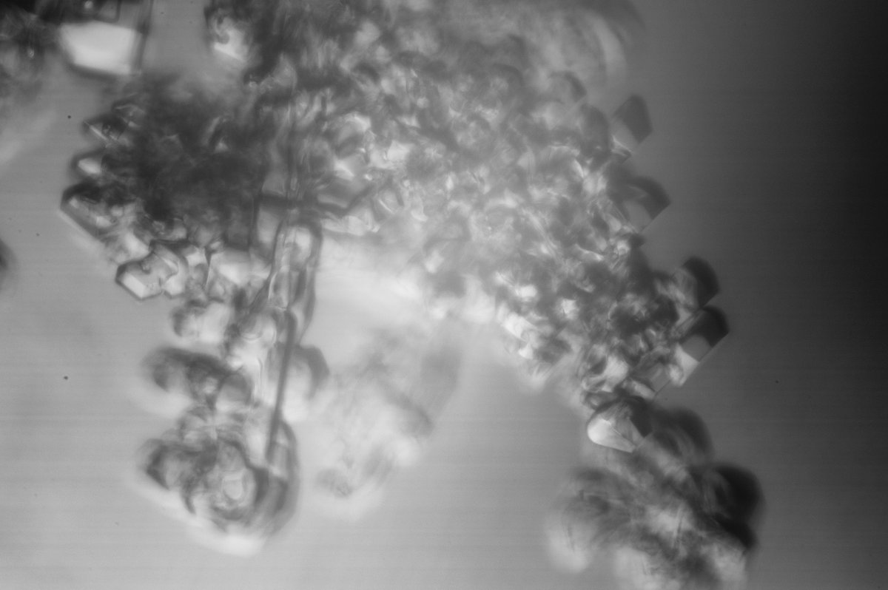

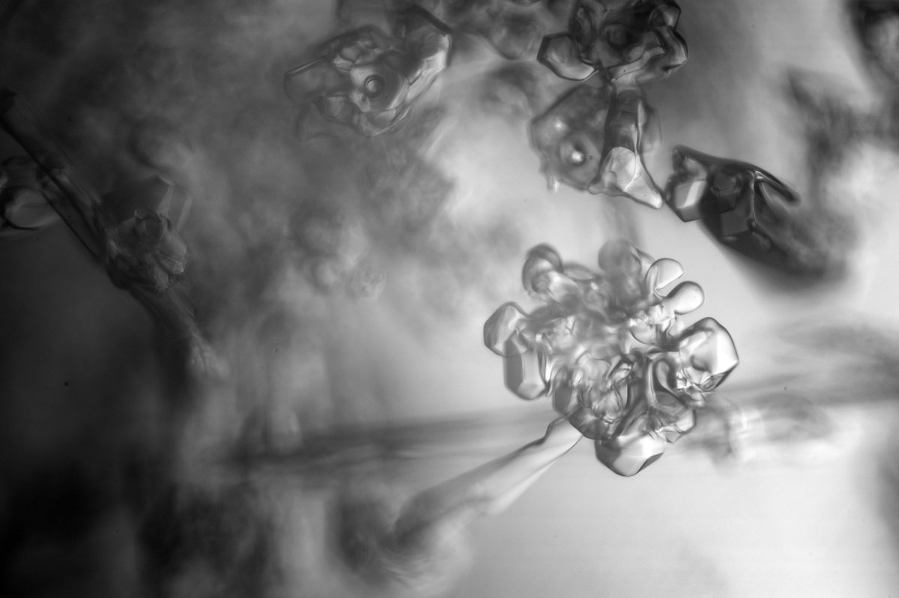

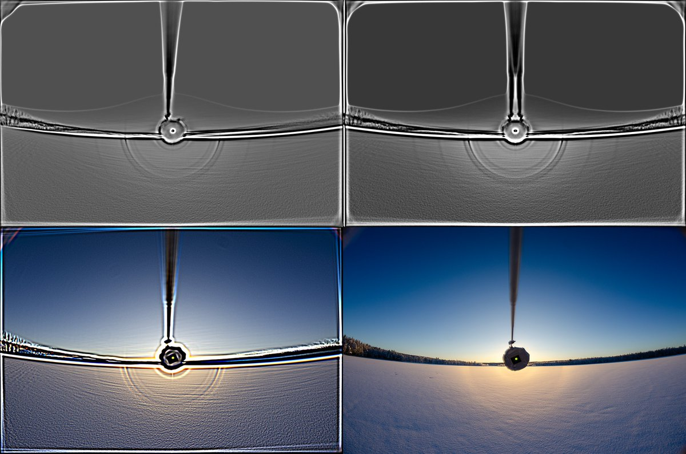

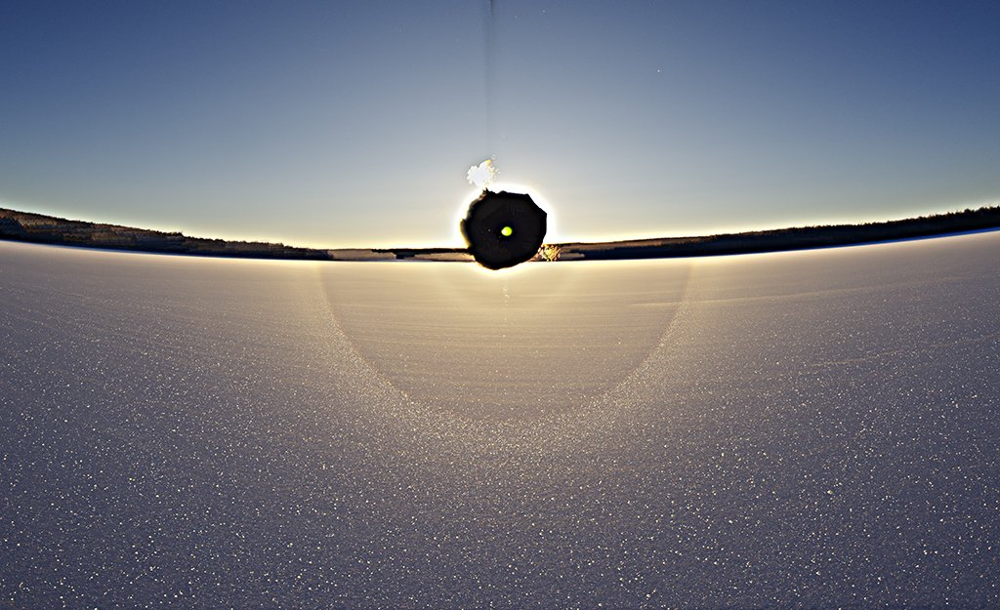

---

### 2/4 - 2024-02-16 17:49 UTC

2/4.

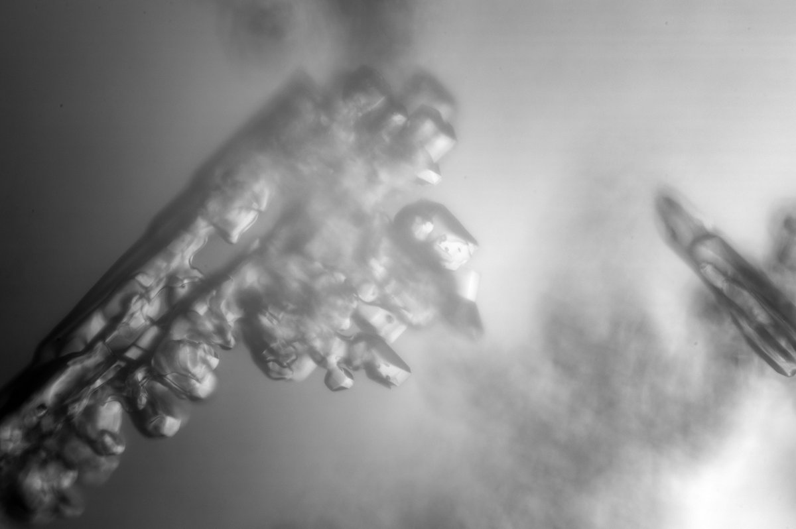

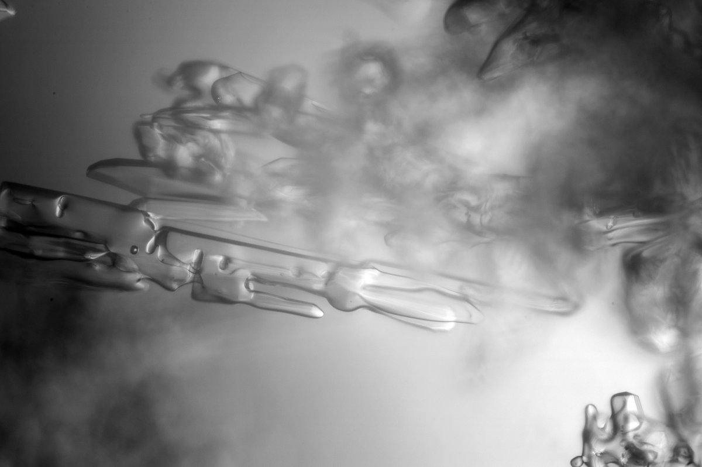

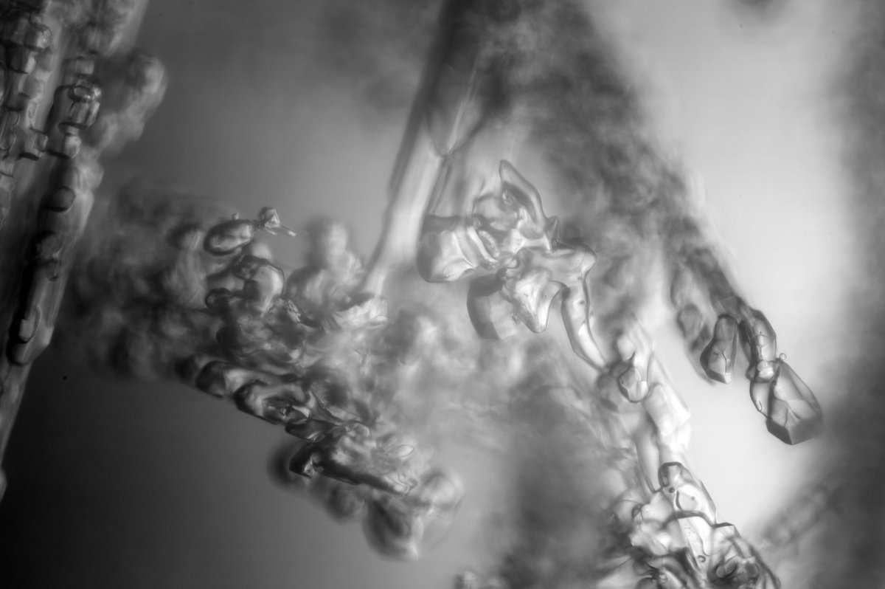

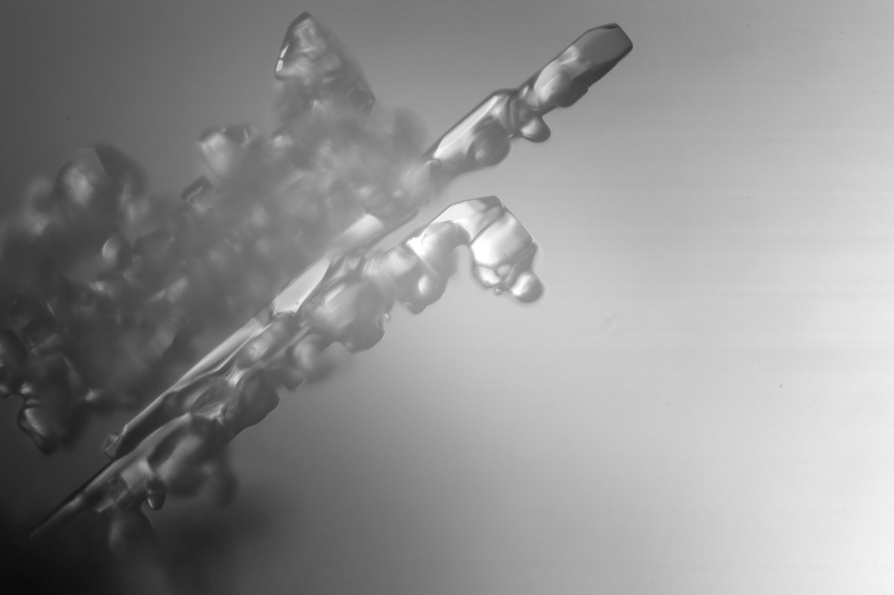

---

### 3/4 - 2024-02-16 17:50 UTC

3/4.

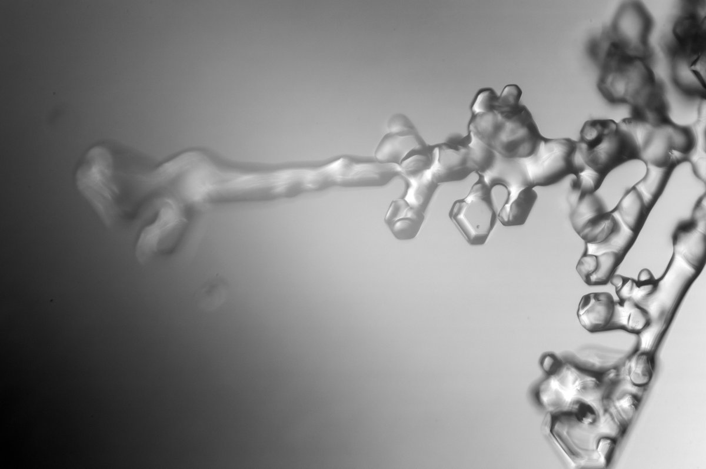

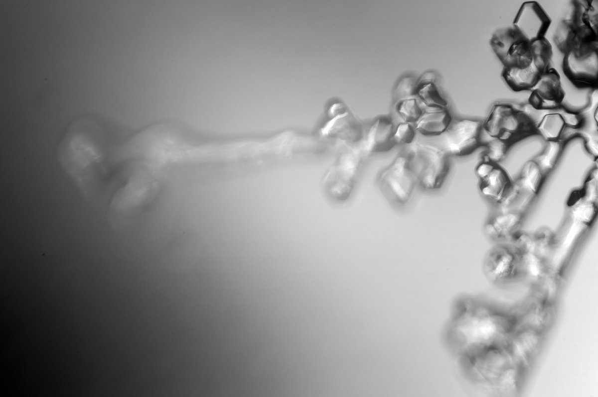

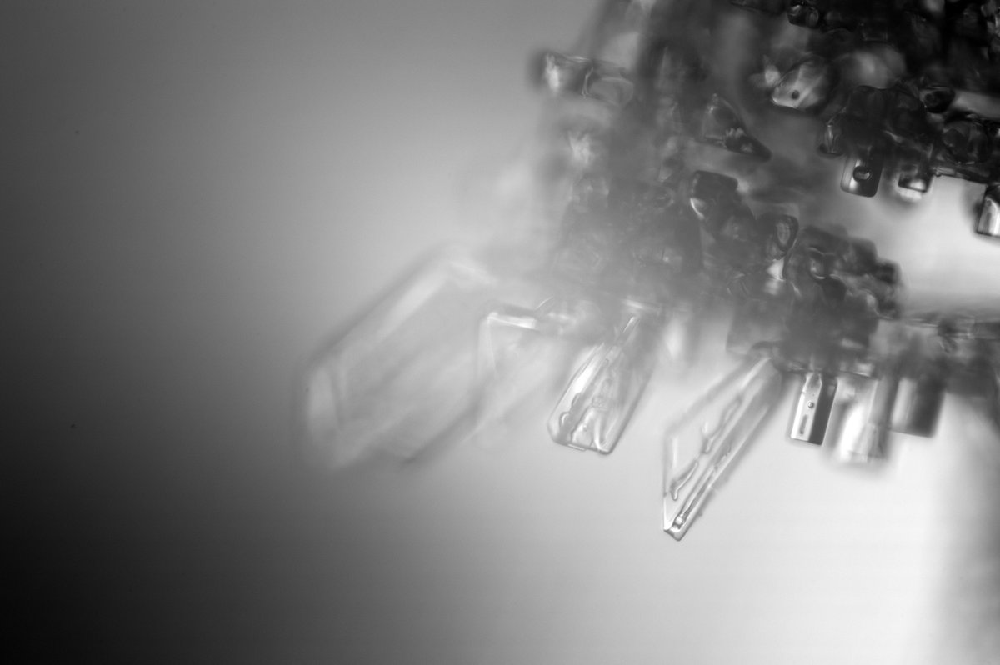

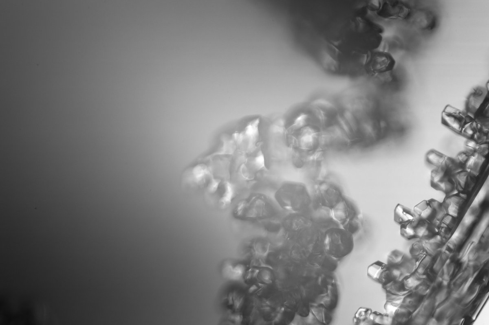

---

### 4/4 - 2024-02-16 18:01 UTC

4/4.

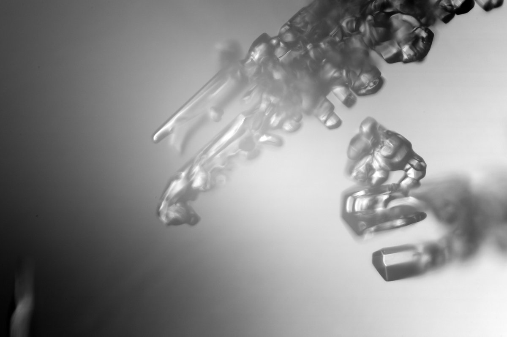

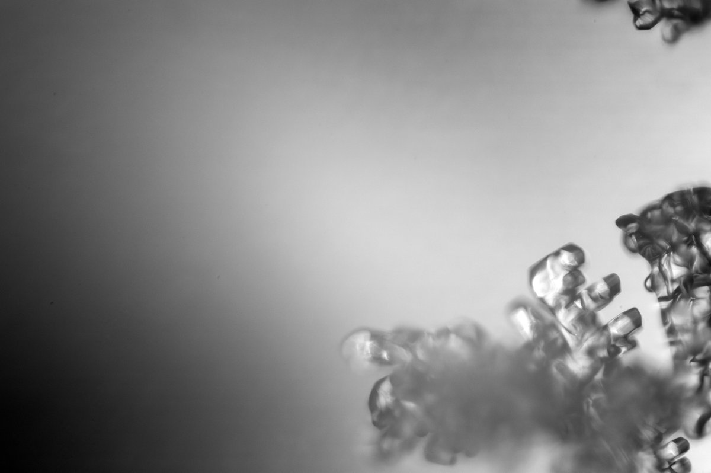

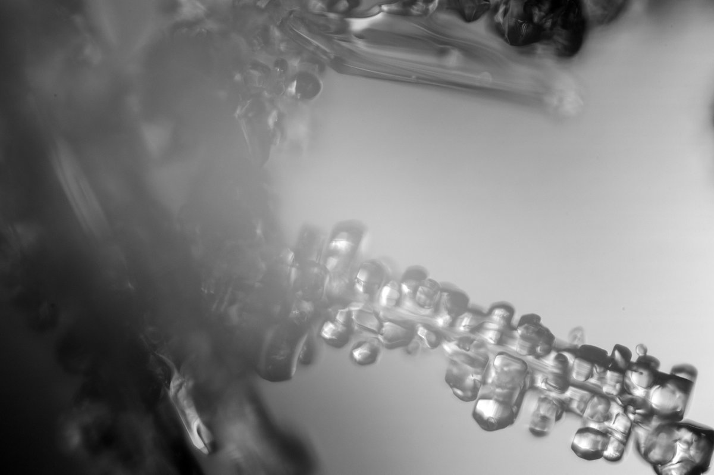

---

