# Thread - 2024-02-17

**Original:** https://x.com/RiikonenMarko/status/1758830150727106736

---

### 1/4 - 2024-02-17 12:26 UTC

1/n. Norvalampi, Rovaniemi, 12 December 2023. As the previous thread (https://t.co/gwpNxhioXq) stopped accepting anymore posts, I continue with a new thread.

The fourth image has arrows pointing at two crystals that look like could have funny angles.

I should note here, before I forget, that in this display I got also, for the first time, a weak visual of 18 and 20° halos. This is what I wrote (with typos) at the time to a colleague:  "In the big display I thought seeing 18 and 20 and indeed in the single photo I sent the seem to be present, much like I saw them. I was not sure of 35, but it seems it be in that photo, too, near the horizon."

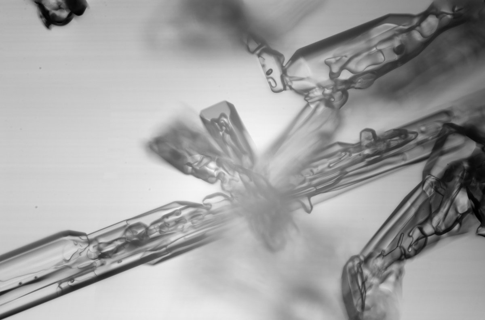

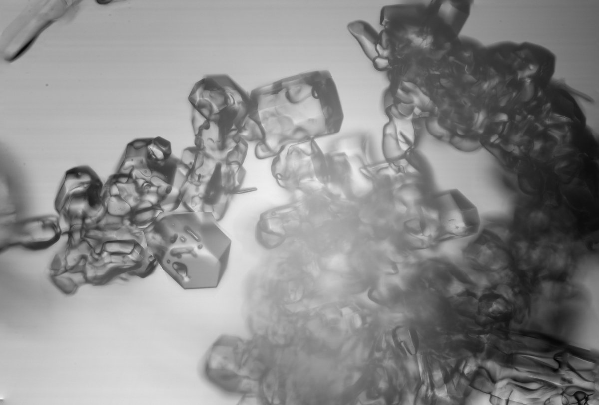

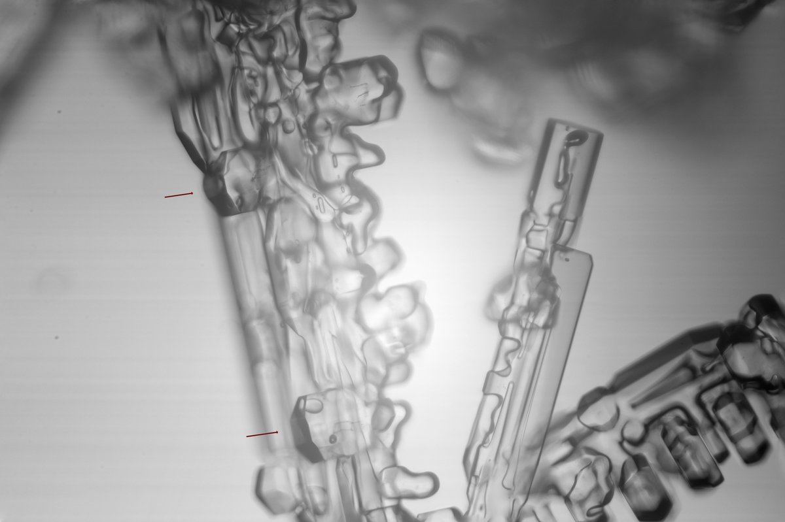

---

### 2/4 - 2024-02-17 12:26 UTC

2/n. Norvalampi, Rovaniemi, 12 December 2023.

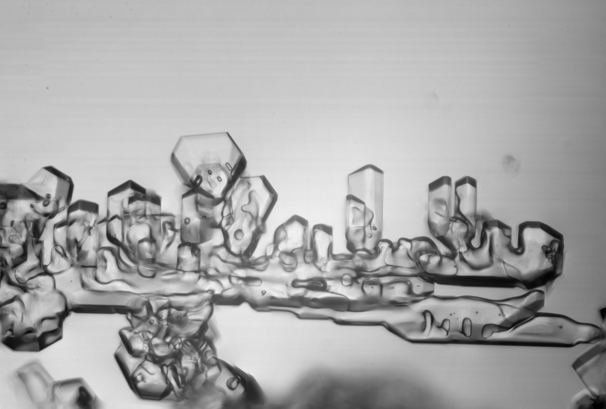

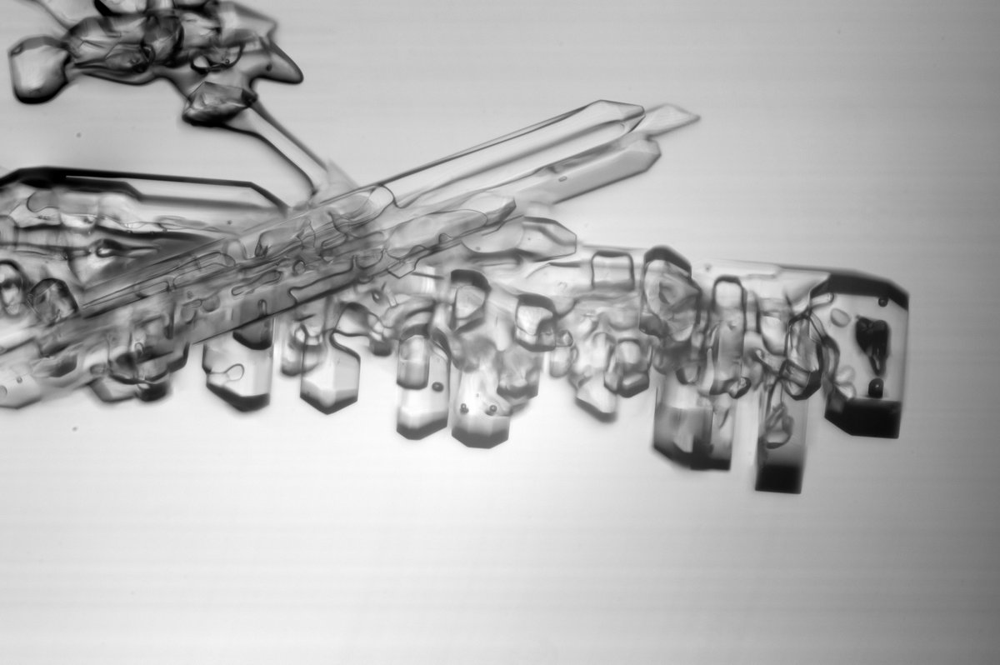

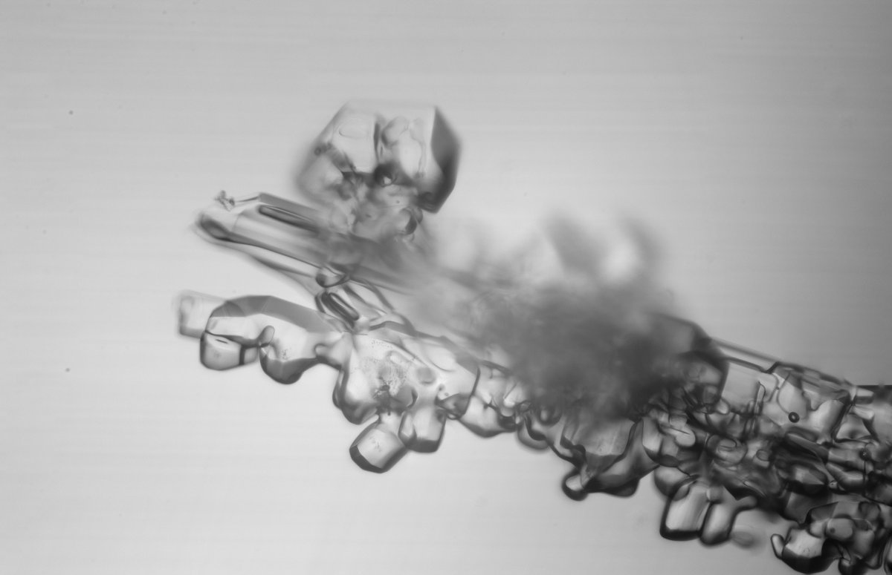

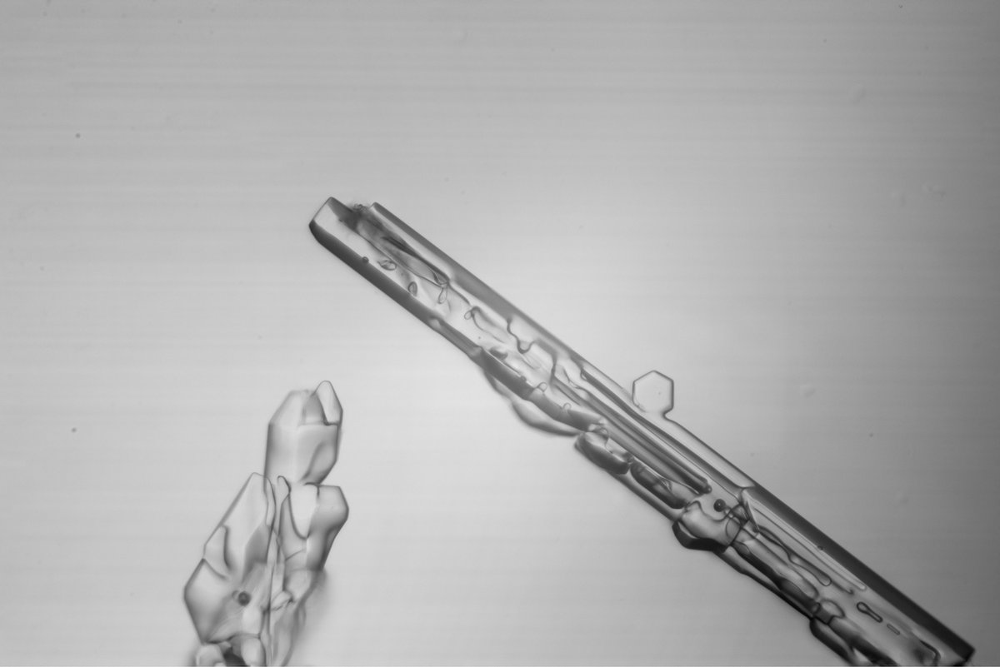

---

### 3/4 - 2024-02-17 12:27 UTC

3/n. Norvalampi, Rovaniemi, 12 December 2023.

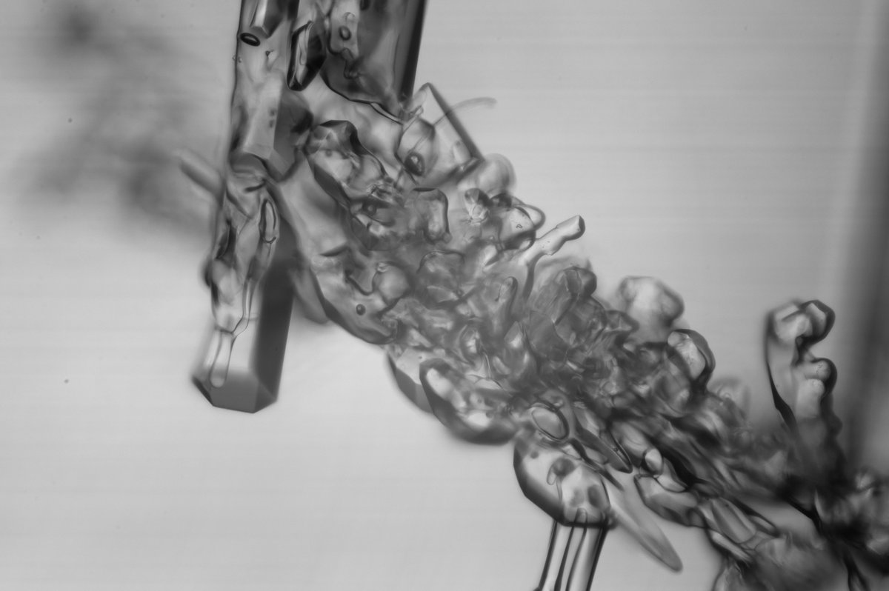

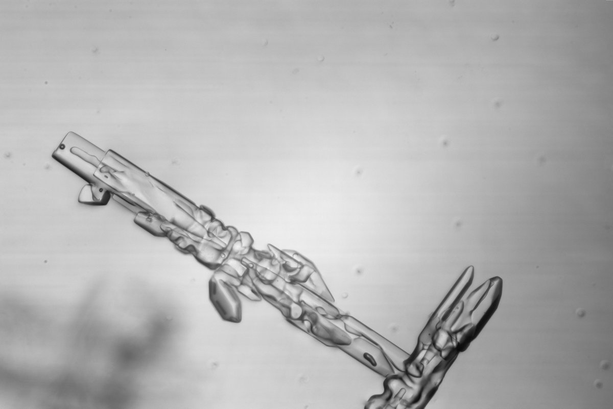

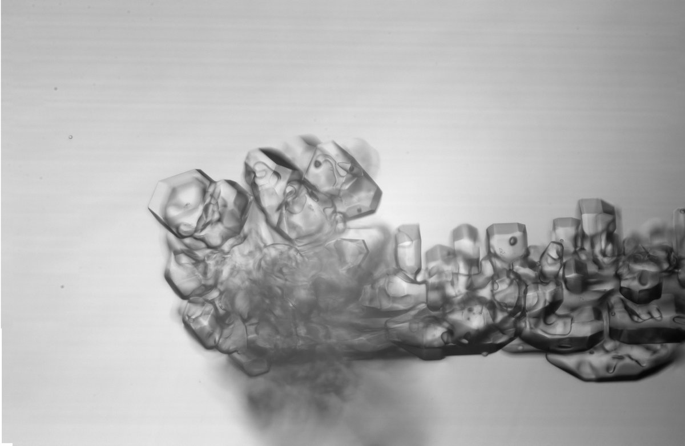

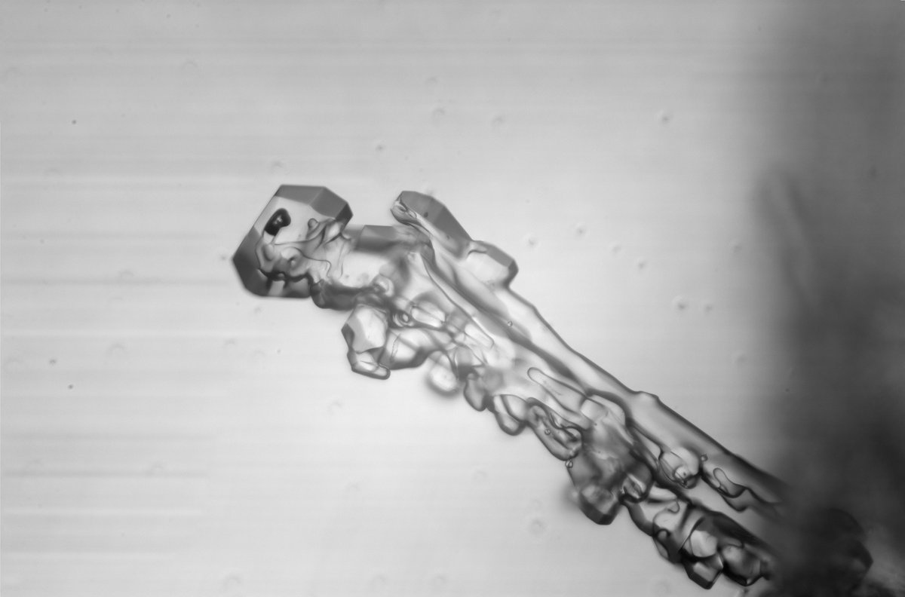

---

### 4/4 - 2024-02-17 12:27 UTC

4/n. Norvalampi, Rovaniemi, 12 December 2023.

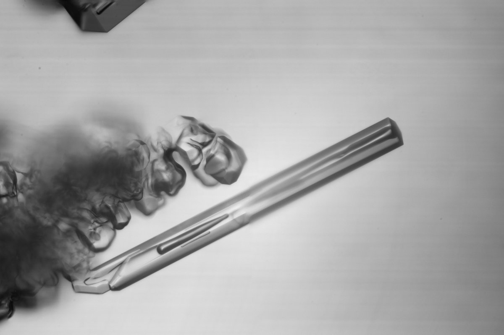

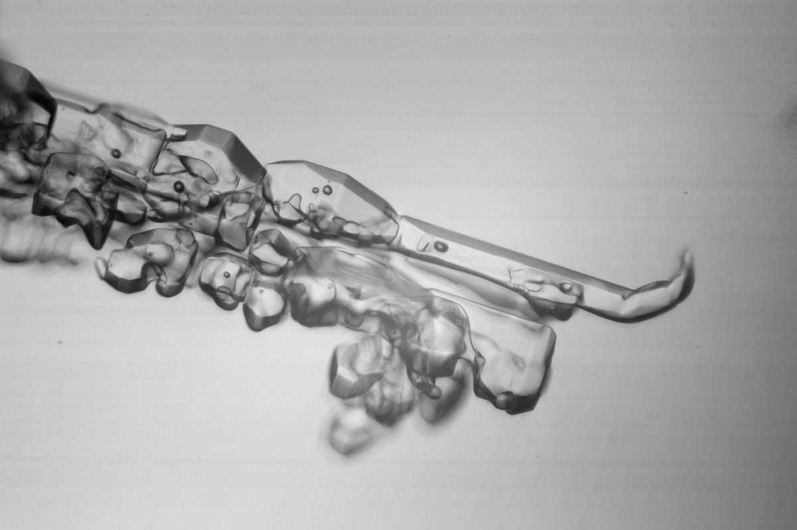

---

