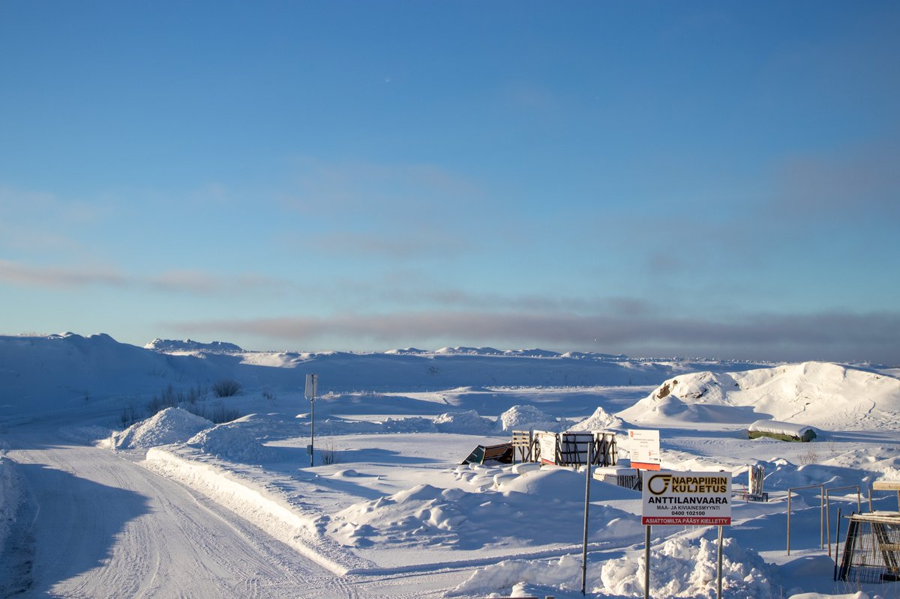
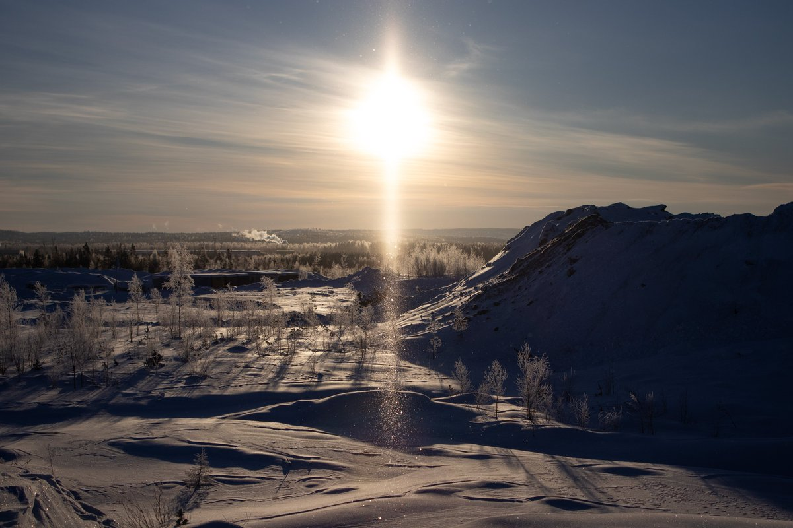
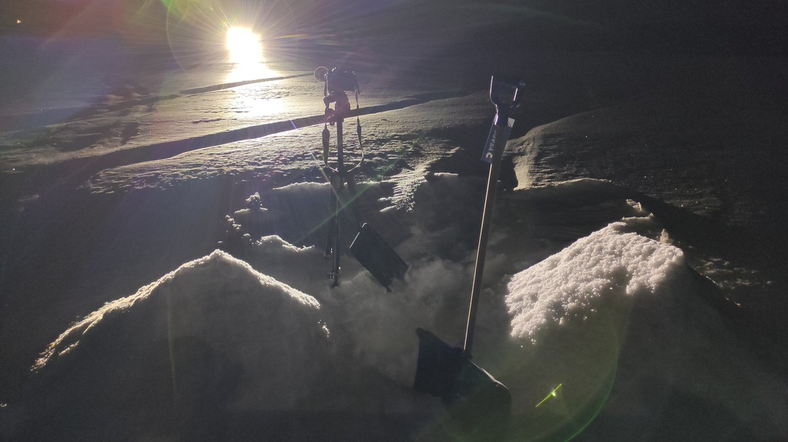
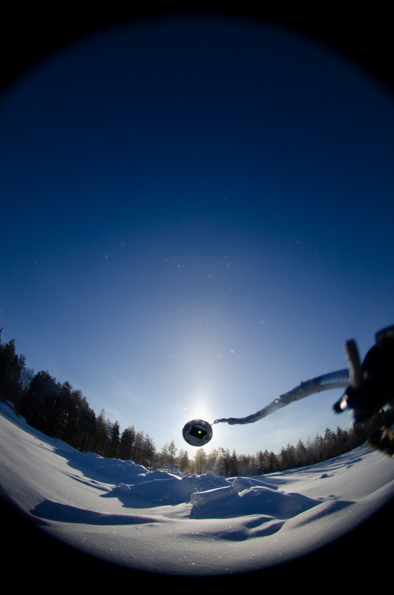

# Thread - 2024-02-20

**Original:** https://x.com/RiikonenMarko/status/1759990509940908258

---

### 1/1 - 2024-02-20 17:16 UTC

A little diary note on this last little cold snap. Got a lot of material. It inevitably piles on the back-log mountain that has build up since the start of the season.

On Sunday, 18 February, I bought from Prisma a cheap snow shovel to see if it eases up the snow-throw. Next night, 18/19 February, when wind had calmed down, I drove at midnight to a now abandoned snow deposit by the bog Isoaapa. Using the shovel to make snow piles beside the camera proved indeed a significant improvement (in the photo two first piles are ready to fly). Less sweat, less wasted frames. The display didn't appear to be that good, though. I have seen 9° halo always clearly already on the camera screen, now was not sure if it was there.

I returned to apartment 4 am and got three hours of sleep before the sunrise (19 February). I drove first to Anttilanvaara where I encountered a glittery swarm making strong pillar. However, the landfill proper and thus the elevated ground inside was verboten because both entry gates were closed. So I left the car on front of the other gate and trespassed in, wading through snow on top a little earth mound to photograph the pillar.

Between sun and the horizon the pillar was too bright to look any longer. And that invites again more thoughts on the "pillar cza" (https://t.co/CooQ7y1PKc). To make it, two populations are needed in simulations: one of thin and wobbly plates for the pillar and one of thick and well oriented plates for its cza – that's how both Lefaudeux and Jia Hao conjured the halo up in simulations independently of each other. But these populations are unlikely to exist together in nature because the conditions making them are not the same. The display here could be the simulations' thin and wobbly plate population, but the conditions that make these crystals would not make the "big display" crystals of the other population that are needed for the secondary cza. It is either or. So it doesn't bode too well for the discovery of this halo.

The Suosiola plume was traveling in the direction opposite of Anttilanvaara, leaving this swarm's origin to some speculation. Maybe it was those Stratus clouds shown in the third photo. They seemed stationary but after some time fragments started coming over. So maybe before that they just surreptitiously turned completely into ice crystals giving this display downwind. After the fragments started coming over also the display weakened which would make sense in the light of this explanation: the weakening happened because the nucleation process was less effective now, turning less of the clouds into ice.

So I drove north towards the airport to see what the Suosiola plant was up to. It was indeed precipitating crystals and the outcome was much like in Anttilanvaara. But now also cza made presence after a short while. Was that because of the higher sun elevation at this point or some difference in the swarm, I don't know. But I got excited because while the cza was there constantly, parhelia showed up only intermittently and weakly, though a high cloud in the background with its own parhelia confused the picture somewhat. However, later the picture was cleared with the high cloud leaving the stage.

Already before the microscopy it was evident that the crystals were snow stars, you just needed to look at the quite large crystals that fell on the car roof, for example. If cza without parhelia is already an interesting non-combo, even more interesting is the missing of parhelic circle which I didn't see in the display. The lacking of parhelia can be chalked up to something in these snow stars that makes the 60 degrees prisms ineffective for whatever reason. But by all reason, cza exit faces should allow always – no matter the crystal type – also for the simple external reflection that makes the parhelic circle. Let's see, maybe it will turn up in stacks. 

And maybe something more will turn up. All the while the display was going I thought of seeing another arc at the solar vertical (at the heat of the situation I send an SMS to a colleague about it). And when I took out the mirror I was even more convinced about it. Something like a very fuzzy and short uppercave Parry far above the sun. It seemed to occur at where the pillar stopped, so maybe it was nothing more than that, a pillar threshold. But why would pillar end so distinctly instead of gradually fading away? If there was an arc, however, it could create such illusion. Again, let's see about the stacks when I get to them. In a meanwhile I have attached here as the fourth photo a single frame of that situation. There is the cza but at least in this frame I don't see any additional arc.

When the display started to lose its juice I left the place (road Rekkatie) and drove east to photograph surface halos on river Kemijoki ice at where the tiny Lietesaari bank islands are located. This is one of the places further away from the city along this northern side road where you can leave your car to access the river. At this far in the winter lakes are everywhere spoiled by snow mobile tracks, but on this part of Kemijoki there are tracks only along the river banks, so you got a pristine snow surface towards the middle of the river (but you better just photograph from the tracks and not venture in the middle where ice is thinner). The display itself was very poor, it took some time before I could discern 46° halo, about the 22° halo I could not say for sure. But I expect it to come out in the stack. 

There was some 15 cm of fluffy snow on the river ice, wetted only very thinly at the bottom. So when darkness fell, I came back, 19/20 February night, to throw-snow. Now the 9° halo was visible in the camera screen. However, I could not see any certain pyramids upon crystal inspection.

All the while while on the river ice I saw low clouds in the Rovaniemi direction. And when I came back, it was foggy and pillars pretty much all over the place. Possibly this was something like natural precipitation, but in one area the action was boosted possibly thanks to the Suosiola plume (which was hidden in fog). I could see without the microscope that it was the same branched crystals as during the day and I should have turned on the spotlight for the higher precision and insight. But I was worn out and came to apartment instead. While I have been able to push resolutely this winter many times, these form-collapses always leave nagging. Next winter, if I am still here, a comrade-in-chase that straightens your spine when you start getting soft would be welcome. 

A note on the snow gunning. The guns were silent during this cold snap and it seems they have wrapped it up for the season. Had they still some snow to do, they should of done it now for the next two weeks forecast is very warm. And from the second week of March, as I have heard it told, it is already getting late because the air warms up at the daytime so much that they can run the guns only at night, rendering the operation too worksome.

---

