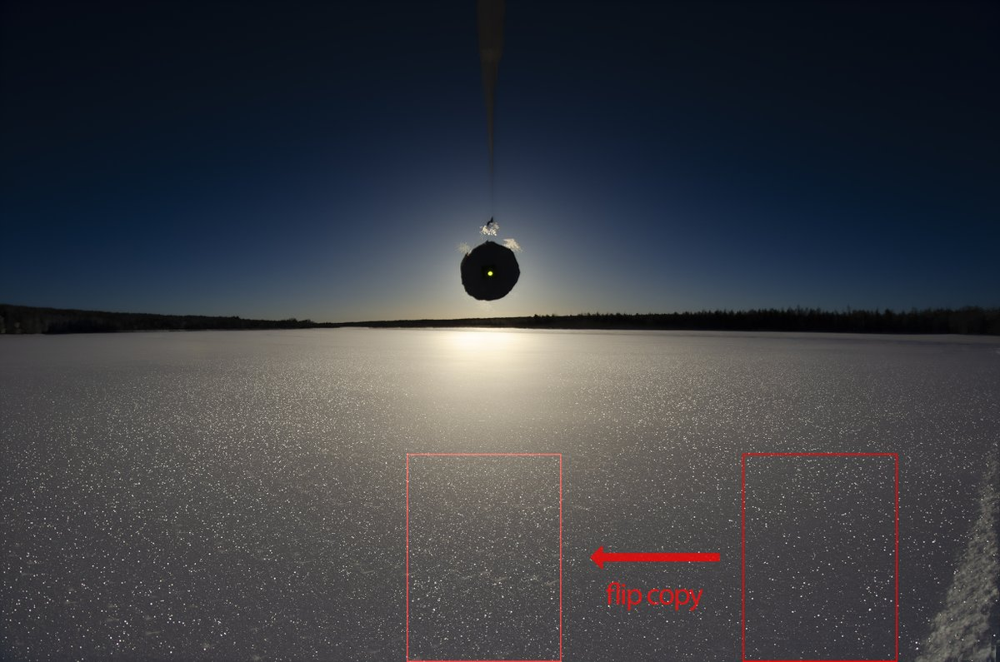
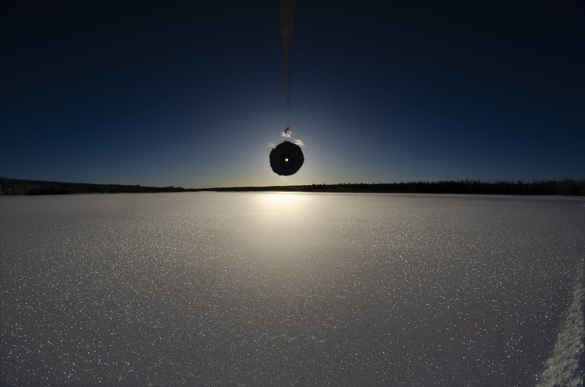
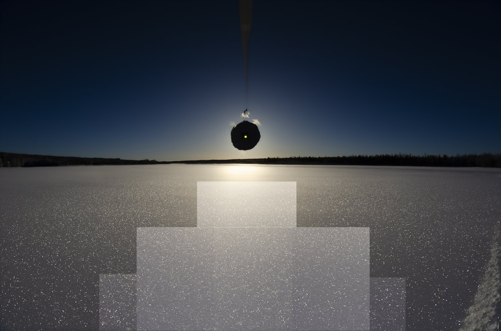

# Thread - 2024-02-28

**Original:** https://x.com/RiikonenMarko/status/1762757733420339574

---

### 1/1 - 2024-02-28 08:32 UTC

We have been changing some thoughts with Petri Martikainen on the issue of whether the kind of glitter that is seen in the first image should be regarded as a wide surface helic arc (lake Norvalampi, Rovaniemi, 18 February 2024, 35 frame max stack). Lately I have become to think it might be just that the glow in and around solar vertical washes out the glints which gives an illusion of helic arc. Martikainen on the other hand has been of the opinion that there is a real dearth of glints and consequently this could be a kind of helic arc.

The next image, in which I have (using Photoshop) copied blocks of the glittery parts from the sides, flipped horizontally and moved in lighten mode in the middle of the image would seem to substantiate Martikainen. If it was just for the glow, we might expect the glitter in the moved blocks largely disappear. So it looks the crystals responsible for the glints were in loose preferential orientations, contributing to the non-uniform glitter. (However, the lack of glints at the distance would seem to be due to overwhelming of the general glow. Actually, faraway glints also become part of the general glow due to perspective compression).

In the third image the copied blocks are shown and in the fourth image the principle of how it was done. The blocks were moved horizontally.

---

