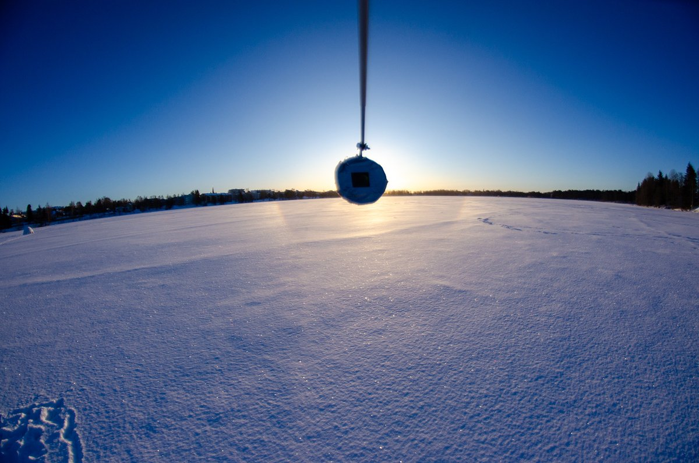

# Thread - 2024-03-17

**Original:** https://x.com/RiikonenMarko/status/1769311204059582476

---

### 1/1 - 2024-03-17 10:33 UTC

This morning's crop (17 March 2024, Harjulampi, Rovaniemi). Single frame. 22° halo was quite horizon-weighted. Outside it I thought of seeing also a patch of 24° halo and indeed this photo seems to corroborate that. Took some 500 photos for stack and had also look at the crystals. Will post here once I get to it. Temp around -20 C.

---

