# Thread - 2024-03-18

**Original:** https://x.com/RiikonenMarko/status/1769628978795442335

---

### 1/4 - 2024-03-18 07:36 UTC

Results of the odd radius display 17 March 2024 on lake Harjulampi, Rovaniemi. This time I recycled many of the stacks through Photoshop camera raw, applying dehaze. It is quite good. These are all 545 frame stacks. The first two images are max stacks, third is ave, last is min. Min stack is yet to prove to materialize anything that the other stacks wouldn't do, but it is curious for how well it isolates the 46° halo.

In the next post down are two flip-stacks. On some later day I will add also crystals.

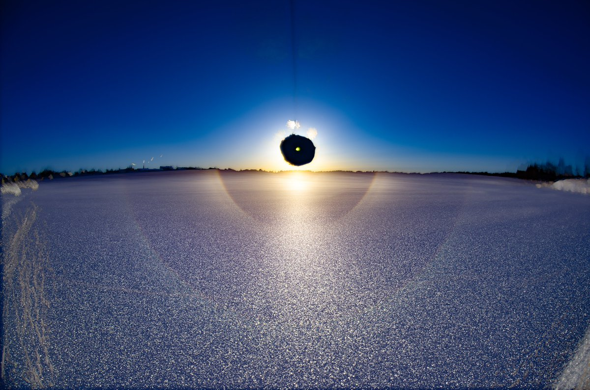

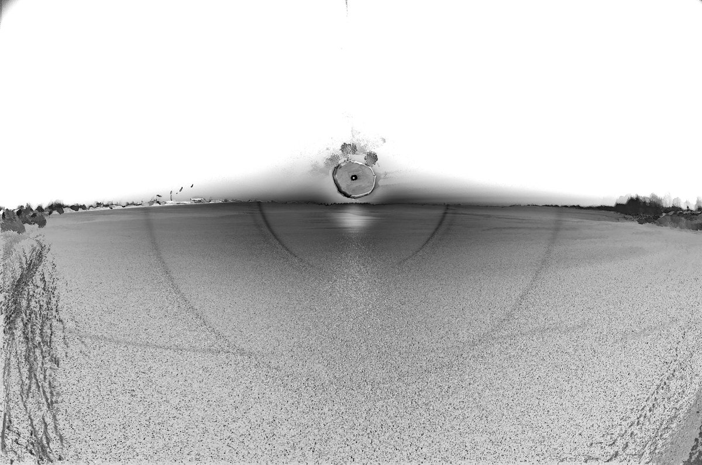

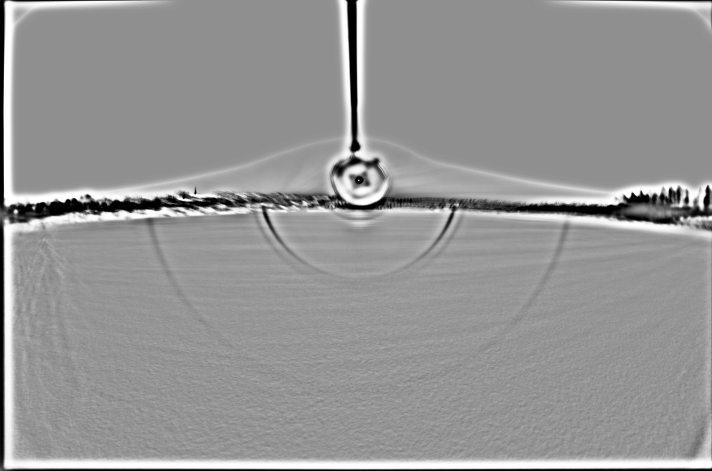

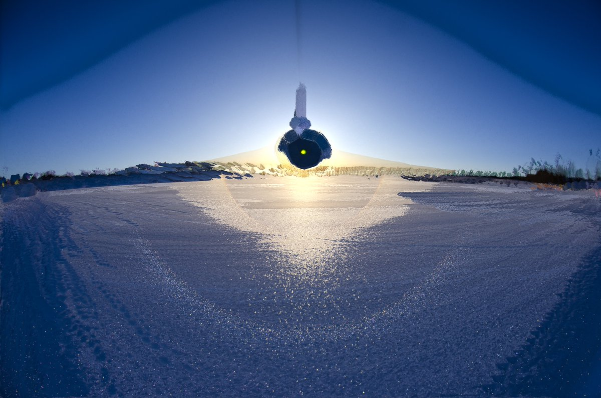

---

### 2/4 - 2024-03-18 07:36 UTC

17 March 2024, Harjulampi, Rovaniemi. Two first images are flip-stacks, the br version revealing that there was also the weakest of 35° halos. The collage has versions of a partial stack of 221 first frames. I did this to have a bit longer 9° halo (sun was climbing up as I took photos). I looked for it on the spot but couldn't see it. Knowing now it was there, I can maybe get sense of it also in single frames (bottom left in the collage).

28° halos have not made much number of themselves this winter. Only one in October. But there is still time as long lake ices are robust. The latest surface display that I have had on lake was on 19 April, and that was way more south in Joensuu. However, given how warm it has been since mid-February, the prospects are lakes will open early this year.

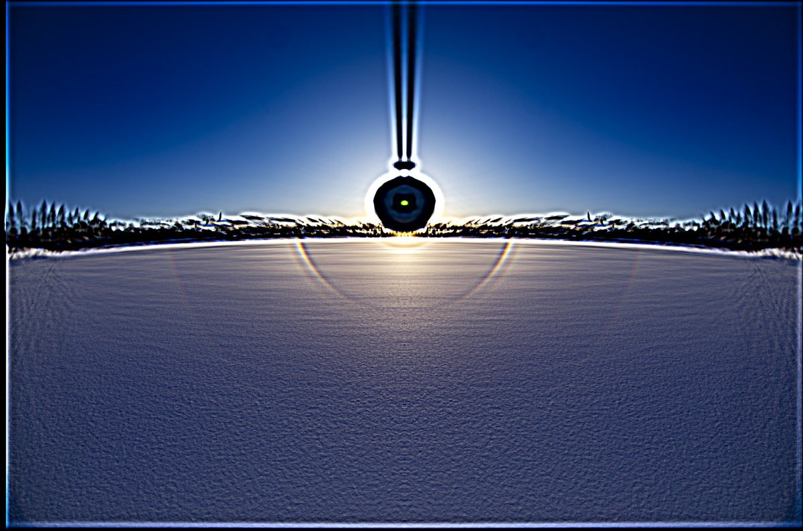

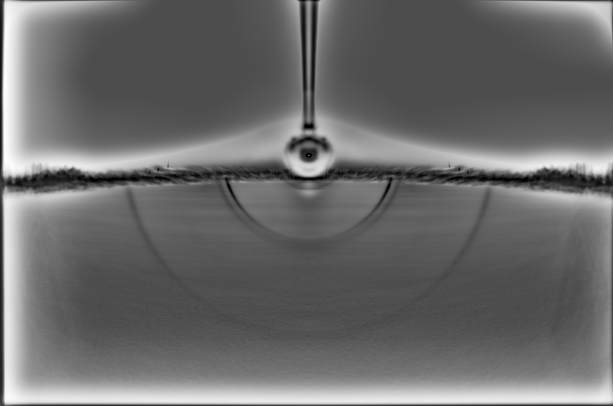

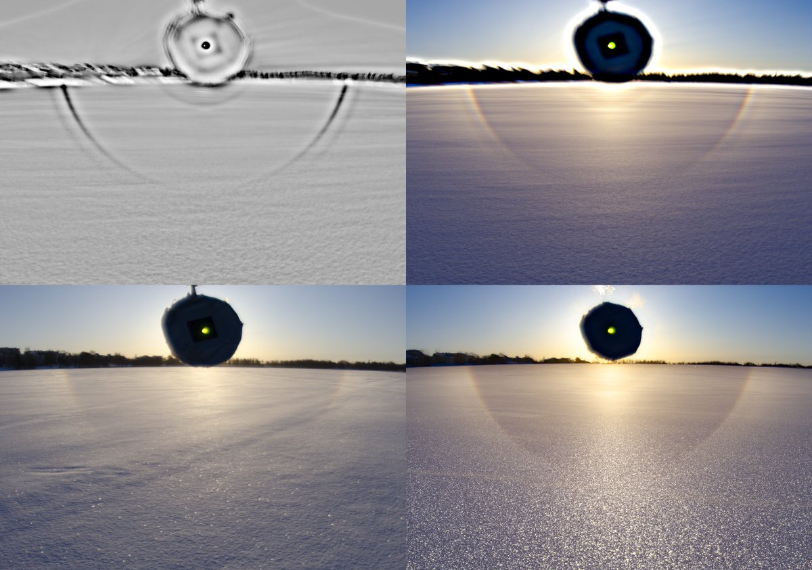

---

### 3/4 - 2024-03-21 06:24 UTC

17 March 2024, Harjulampi, Rovaniemi. I didn't take much crystals this time. Photos turned out quite milky. At times, like now, I find this baffling because when peering through the camera viewfinder I don't necessarily see this milky sheen. Applied plenty dehaze to try to remove the sheen. Anyway, I think one or two crystals with some pyramid faces are visible in these photos.

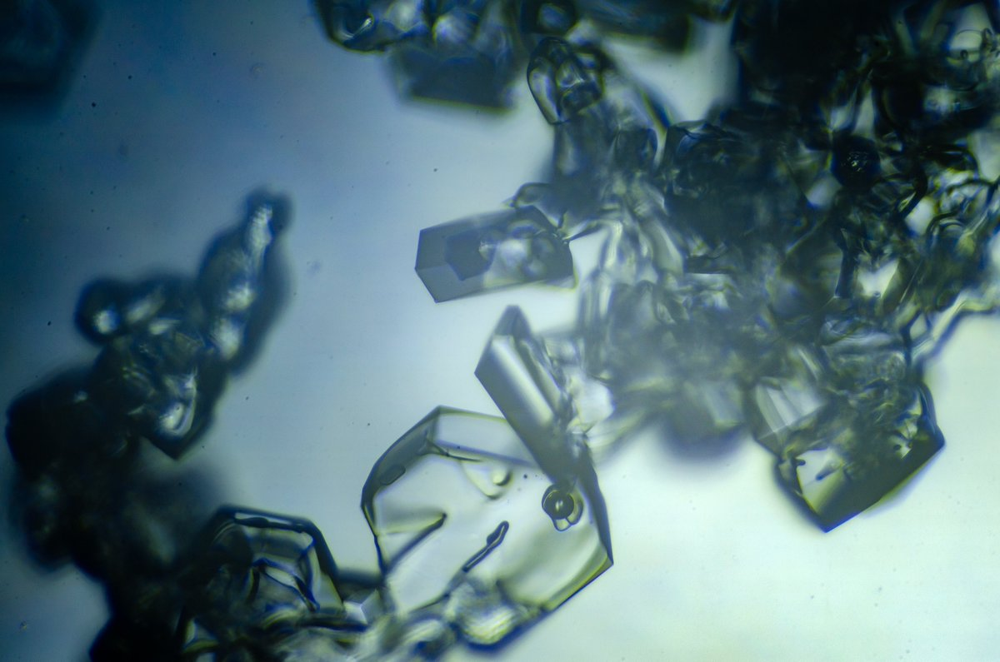

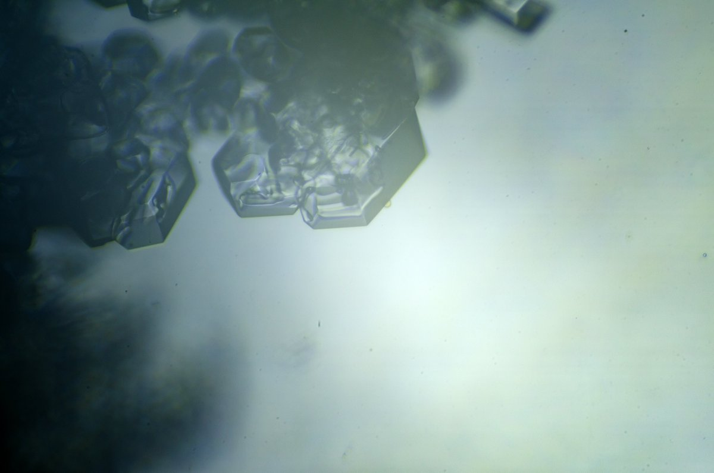

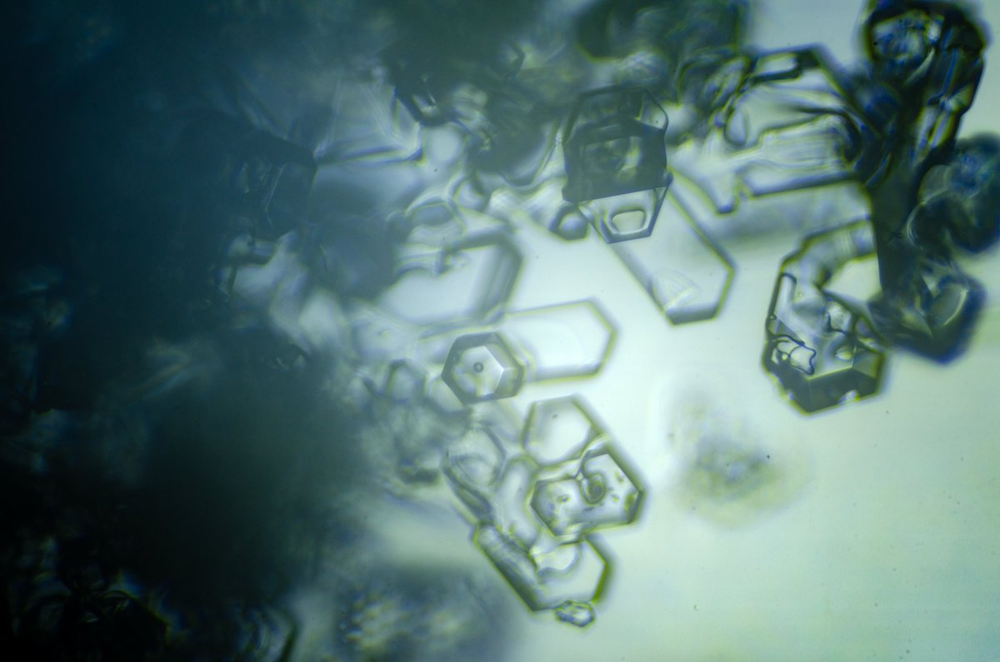

---

### 4/4 - 2024-03-21 06:24 UTC

17 March 2024, Harjulampi, Rovaniemi.

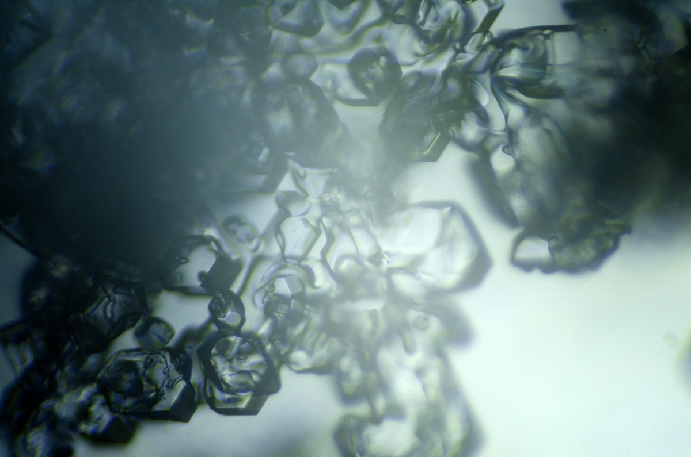

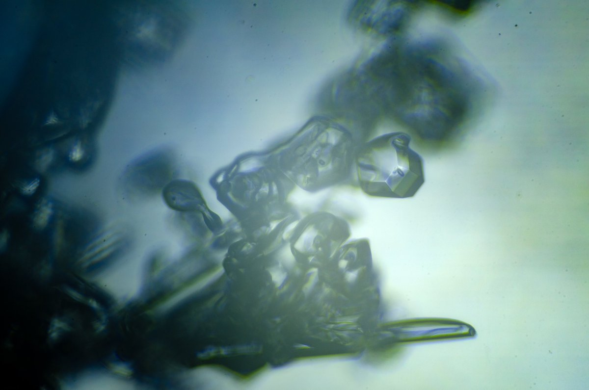

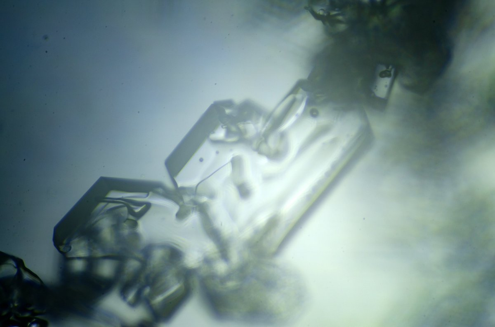

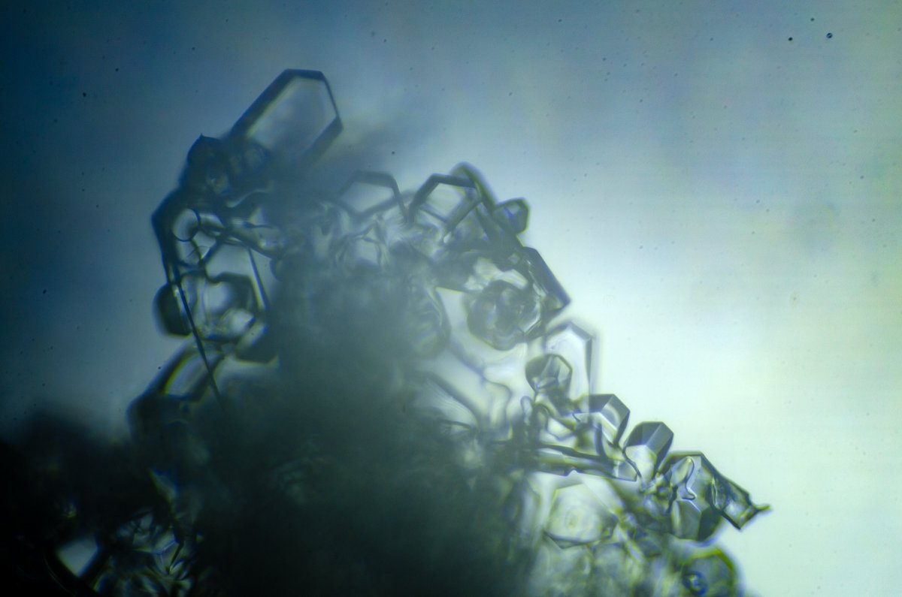

---

