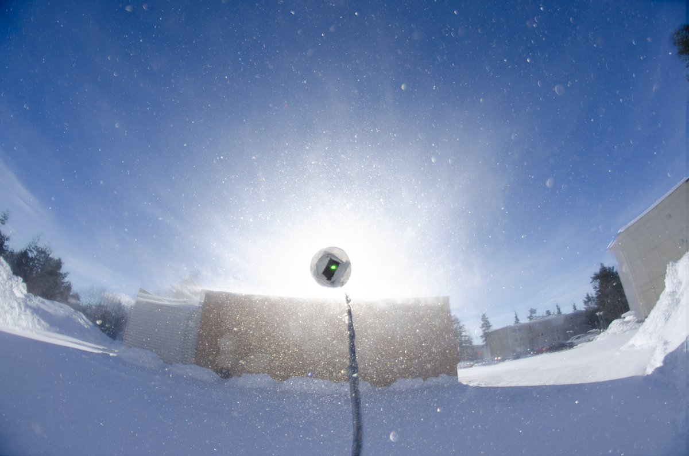

# Thread - 2024-03-19

**Original:** https://x.com/RiikonenMarko/status/1770060597352120505

---

### 1/1 - 2024-03-19 12:11 UTC

Yesterday, 18 March 2024 in Rovaniemi, I gave a try for snow-blow display. It got windy in the morning and snow was blowing off the roofs. The photo here is some 50 frame max stack (average stack was hopeless). There are colored glints and maybe they draw out against the building a very rudimentary 22° halo (circle shows the size). 

I should have been earlier at the scene, it had been going on already for some while. I felt like the loosest snow had been already blown away and conceivably also the crystals were more rounded at this stage.

Well, this is something to try on some upcoming occasion more properly. What's the most complex snow-blow display it is possible to have? I remember having seen in Taivaanvahti a stacked photo of subsun in crystals falling from tree branches but couldn't find it.

---

