# Thread - 2024-03-22

**Original:** https://x.com/RiikonenMarko/status/1771102225902838078

---

### 1/4 - 2024-03-22 09:10 UTC

Snow-pack display on the night of 19/20 February 2024 in Rovaniemi. This was on river Kemijoki east of the city at where the small Lietesaari islands are. A fluffy layer over the hard ice, with only thinnest wetting at the interface. All odd radius circular halo members are in attendance, the 23° halo visible in its top part. 67 frames stacked and then flip-stacked. Crystals downstream.

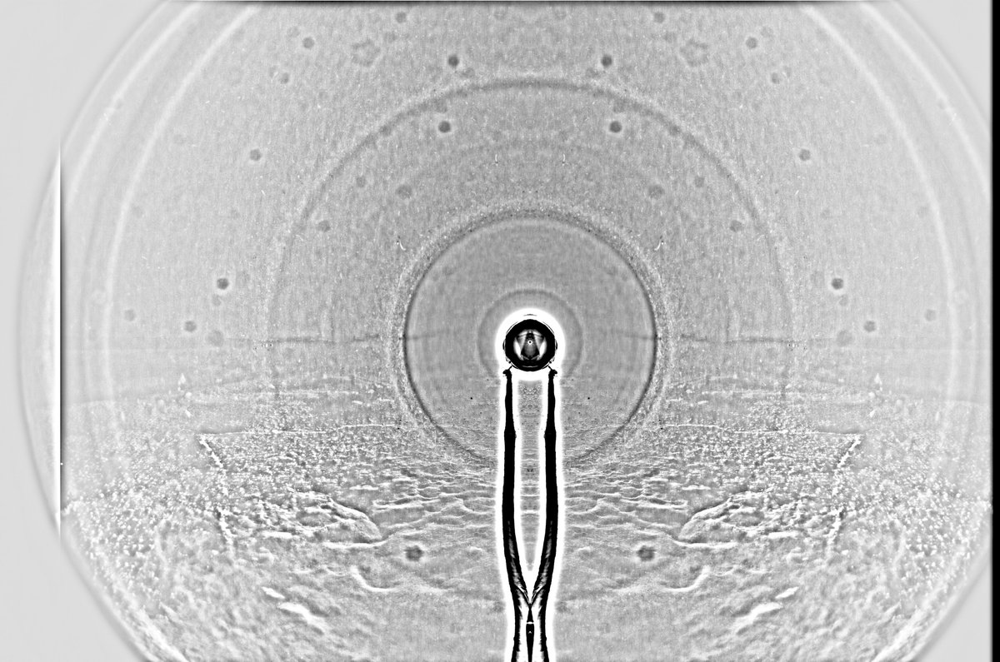

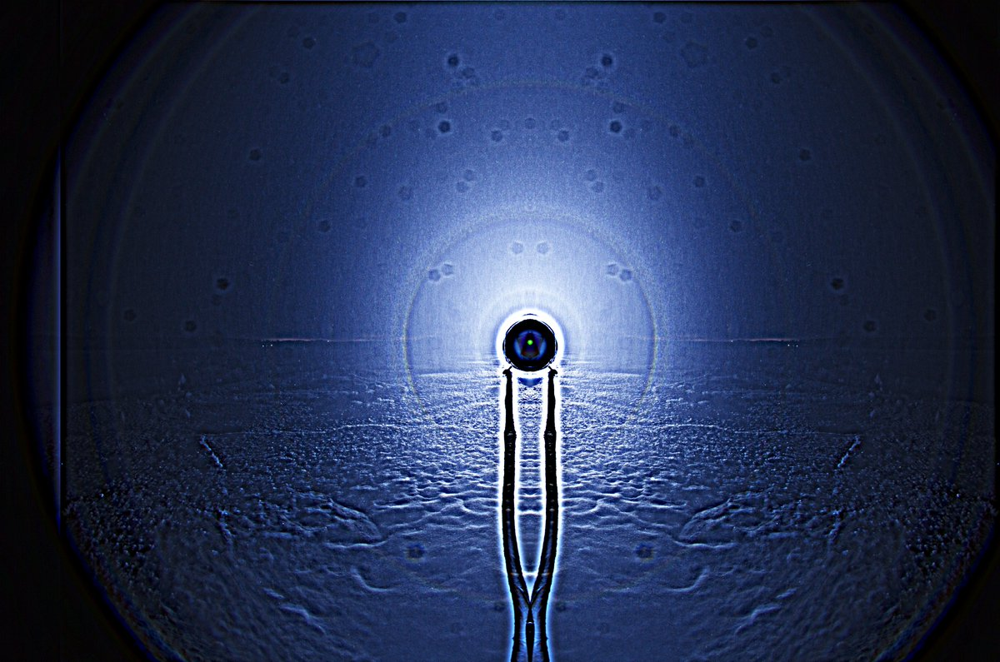

---

### 2/4 - 2024-03-22 09:10 UTC

19/20 February 2024, Rovaniemi

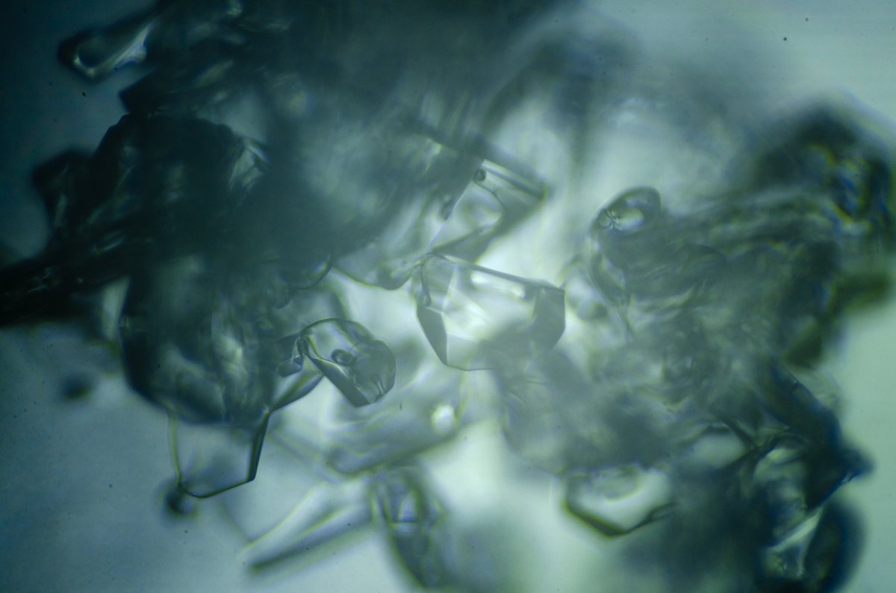

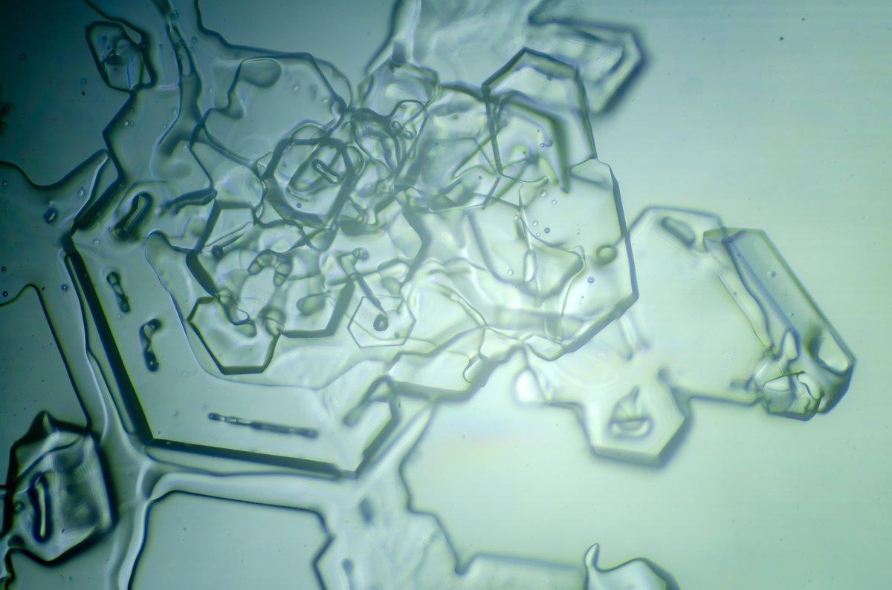

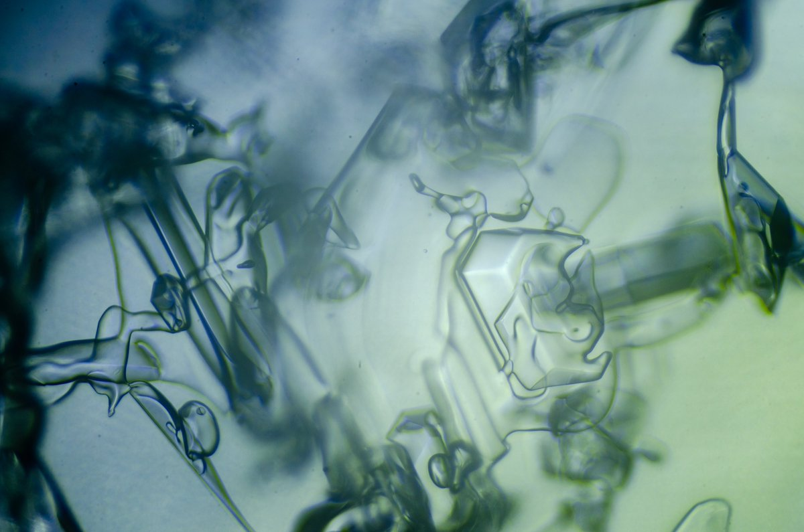

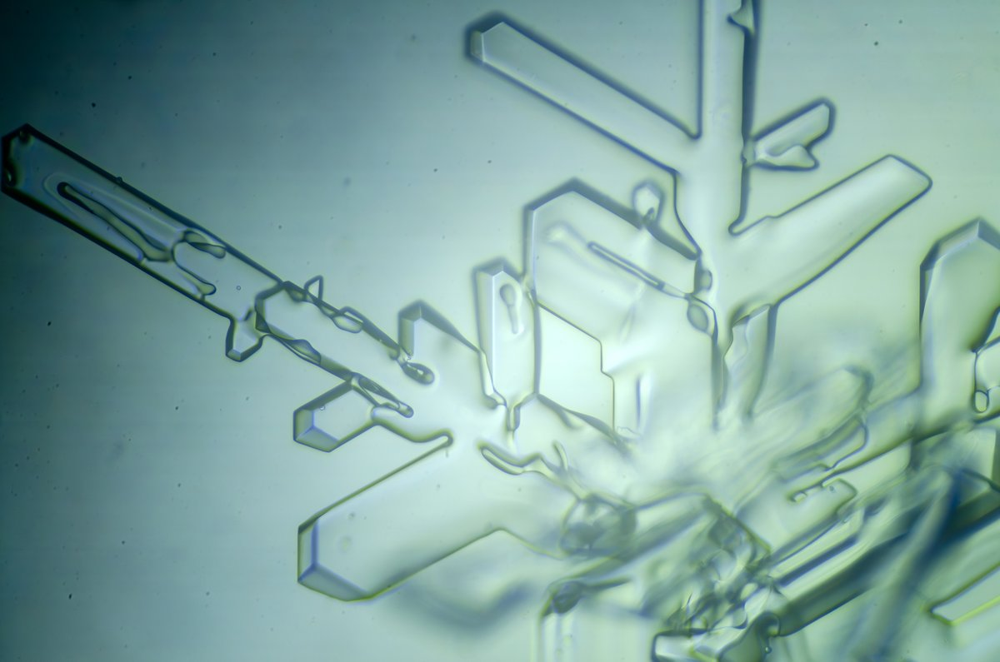

---

### 3/4 - 2024-03-22 09:10 UTC

19/20 February 2024, Rovaniemi

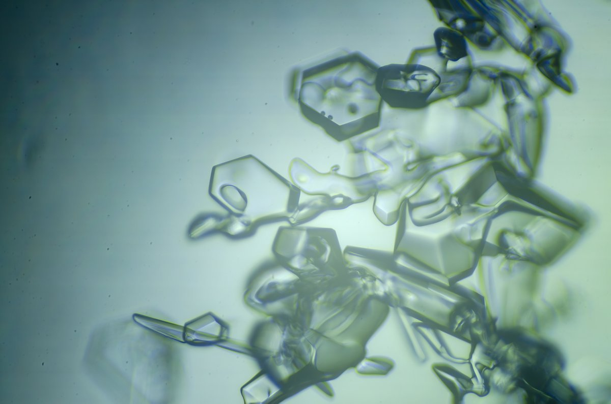

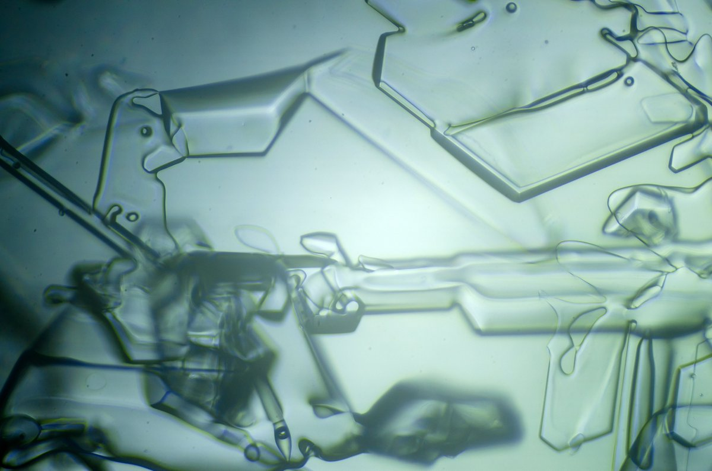

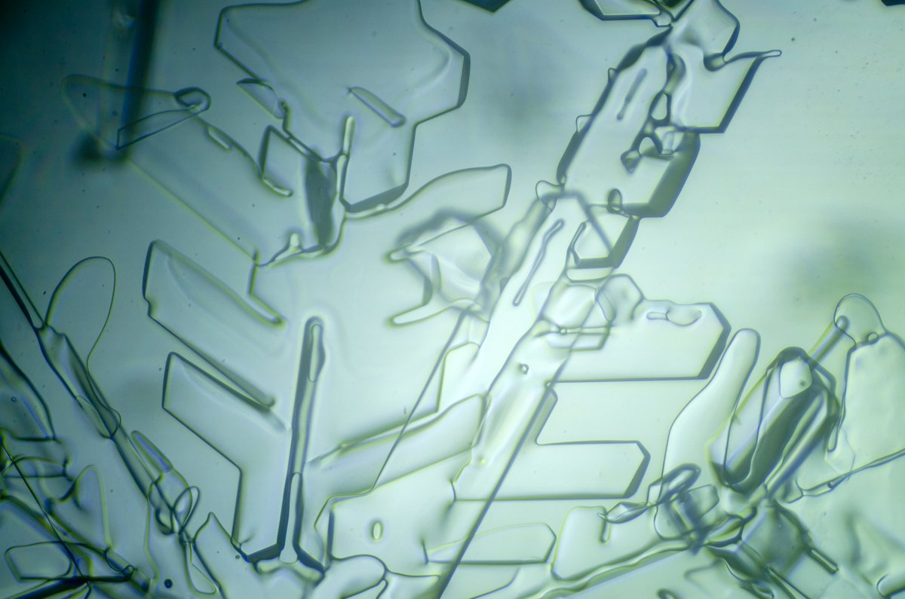

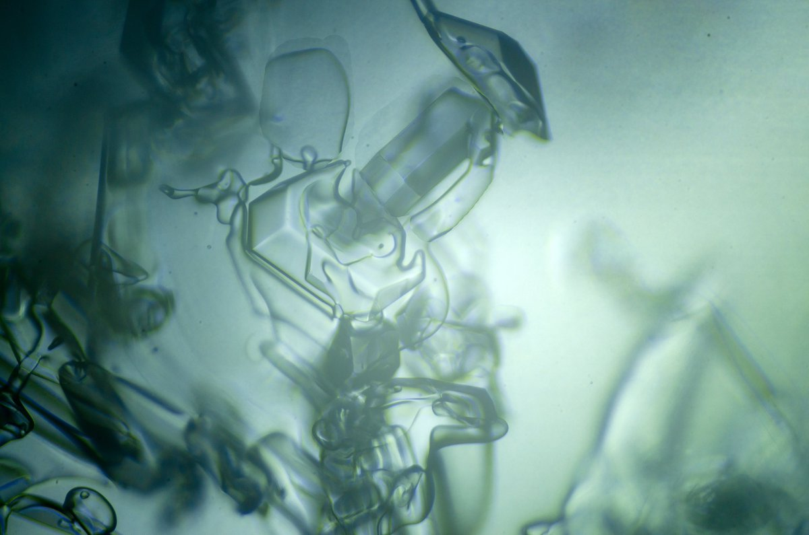

---

### 4/4 - 2024-03-22 09:10 UTC

19/20 February 2024, Rovaniemi

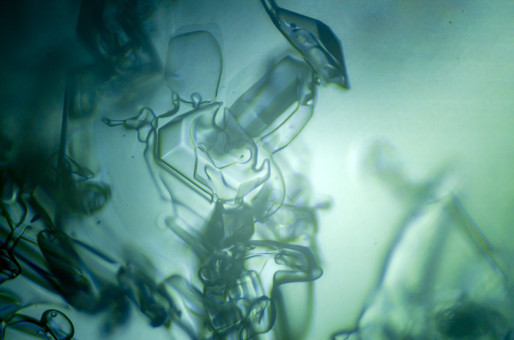

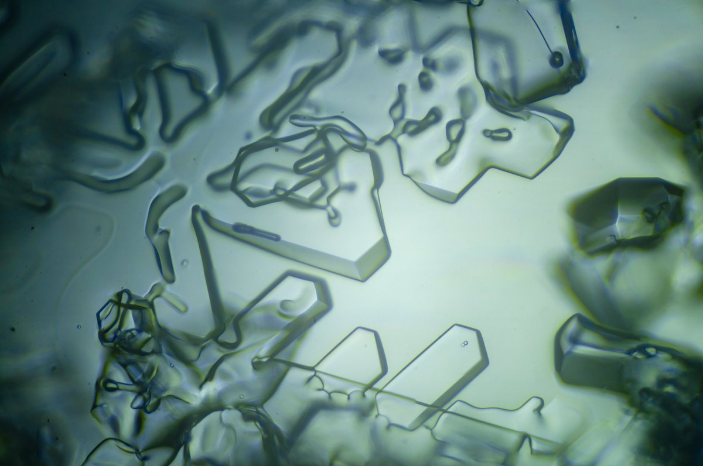

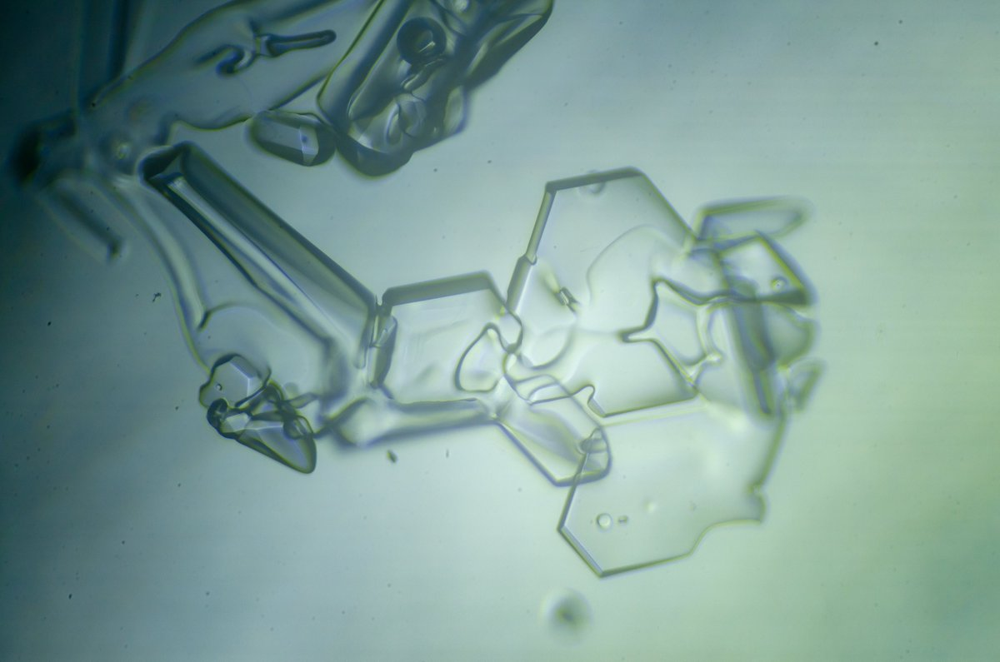

---

