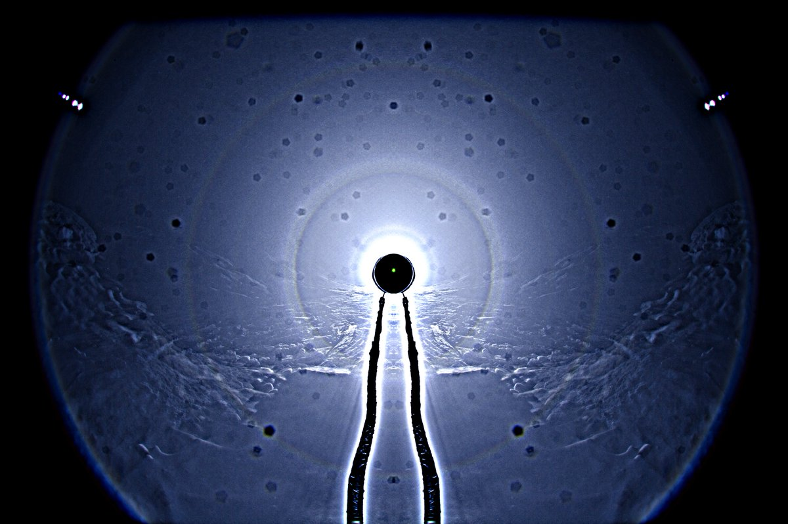
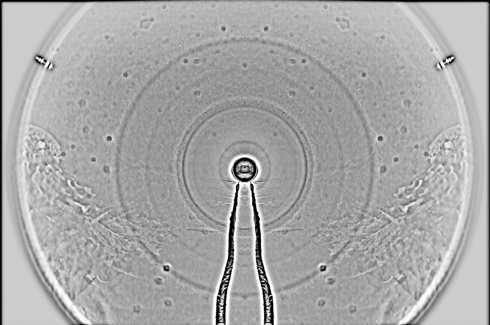

# Thread - 2024-03-25

**Original:** https://x.com/RiikonenMarko/status/1772272524862132611

---

### 1/1 - 2024-03-25 14:41 UTC

Snowpack display last night, 24/25 March 2024 in Rovaniemi. This was at the old snow deposit next to bog  Isoaapa. Snow crust was hardened but there was little area with loose snow of varying thickness.

I have thought wind is bad for this sport, but now I realized it's rather the opposite. When it is calm it is never really calm, instead there is a fickle little breeze switching constantly in direction. And that's not good when you have a stationary pile at a certain position relative to the camera waiting to be flown.

So now there was a small steady wind from north and that allowed good control (relatively speaking) of the falling snow curtain to have it consistently in front of the camera. Previously I have been standing but this time kneeled, which further helped to throw the snow in a controlled manner. The result was the smoothest and consistently angularly widest coverage I have thus far got in single photos.

This flip-stack has 67 frames of 2s exposures. It's getting to feel the weather never changes in snow packs, these displays come pretty much all chip off the same block. But I am still on a positive mind what comes to the prospects of 28° halo. And given the  steadiness of conditions, once the 28° makes showing, it may not be going anywhere in a hurry.

The plan is go also tonight and the next, then the daytime temps rise above freezing and there won't likely be fluffy snow.

---

