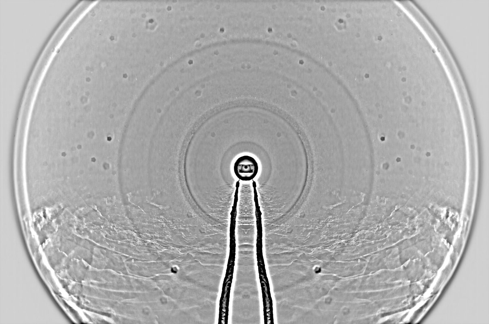
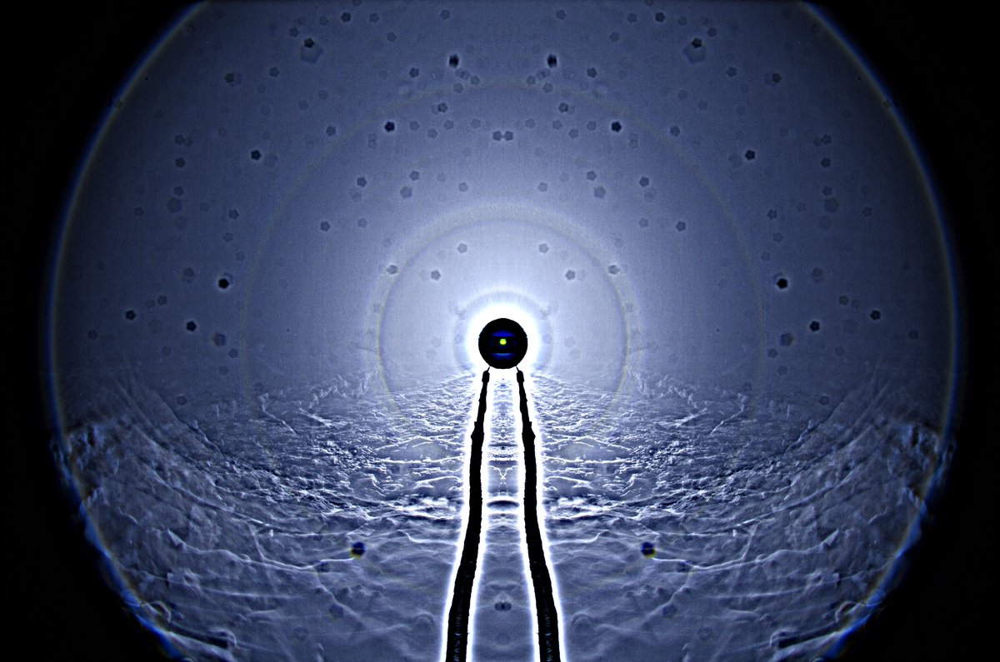

# Thread - 2024-03-26

**Original:** https://x.com/RiikonenMarko/status/1772541261037080629

---

### 1/1 - 2024-03-26 08:29 UTC

Woke up around 1 am last night (25/26 March 2024, Rovaniemi) and drove to Anttilanvaara for snow flying session. Surfaces were crusted but along a roadside snowbank usable, loose drift-snow had accumulated. This flip-stack has 107 frames of 2s exposures. Temperature around -20 C.

Today I got surface display, about 500 photos are waiting to be stacked. Judging by the crystals, I don't expect odd radii. There was nothing reminiscent of pyramid faces.

---

