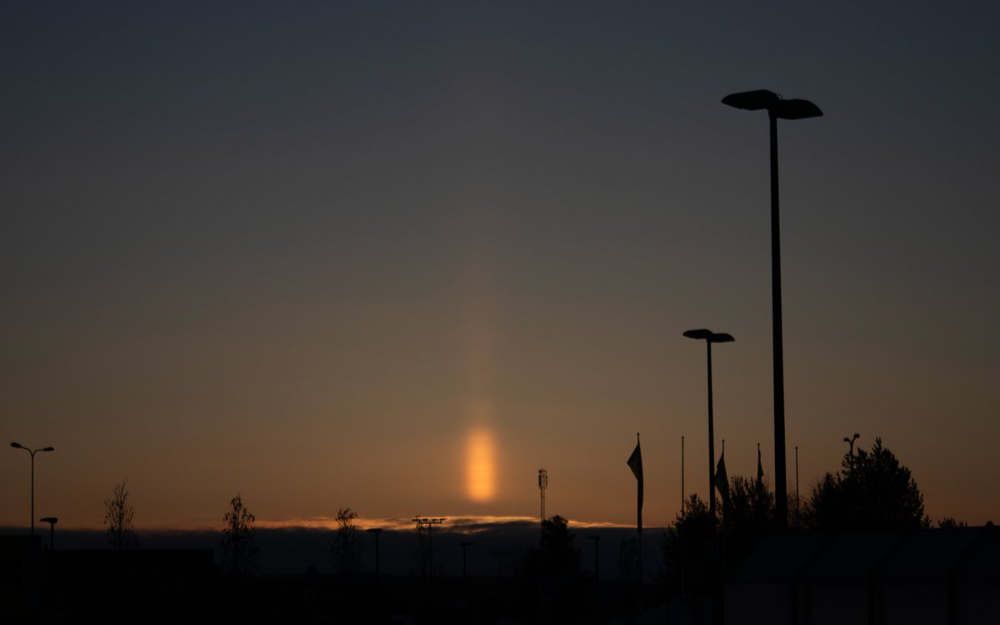

# Thread - 2024-03-27

**Original:** https://x.com/RiikonenMarko/status/1772994255276978381

---

### 1/1 - 2024-03-27 14:29 UTC

Sun pillar this early morning, 27 March 2024 in Rovaniemi (from Prisma parking lot) as I was going to photograph surface halos. It was visible above a receding low cloud sheet and must have been from "edge-nucleation" of this cloud. The surface display was not much to go by, but I took all the same 500+ photos for stack. Identified one tiny pyramid in the crystal samples, so odd radius halos are expected. The stuff is trying to back-log again. I still have the yesterday's surface display to stack.

---

