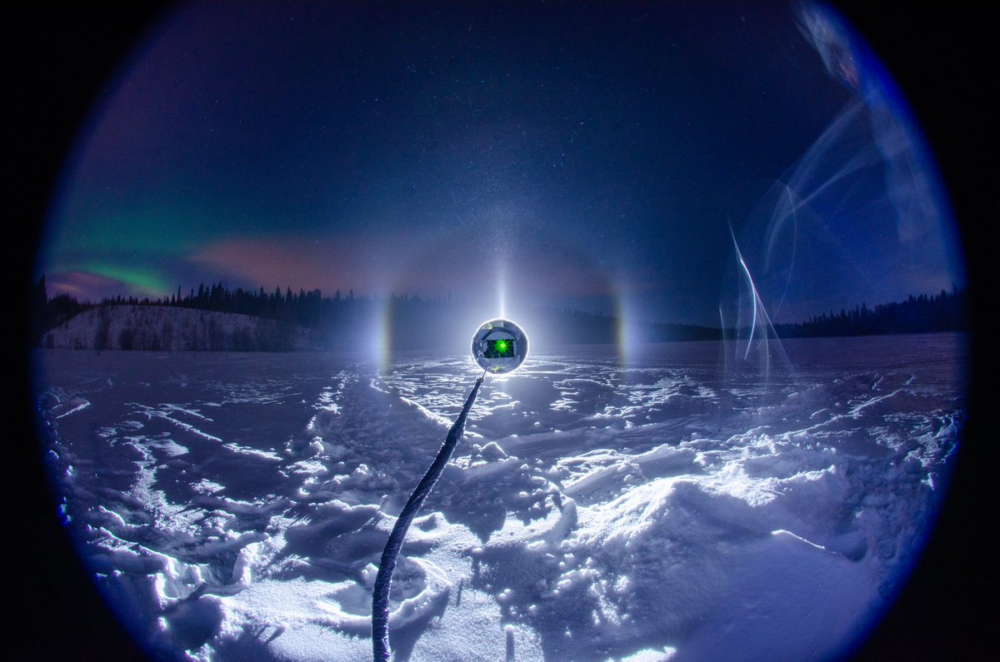
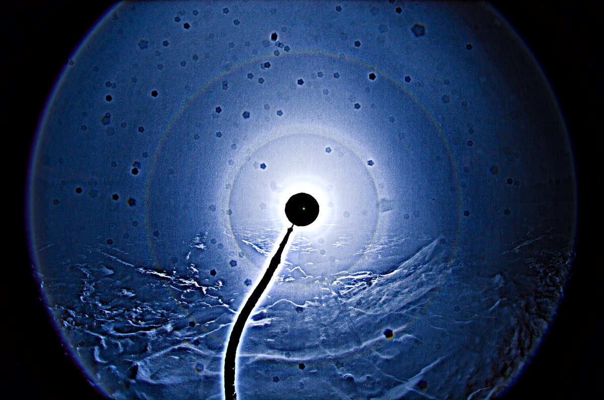
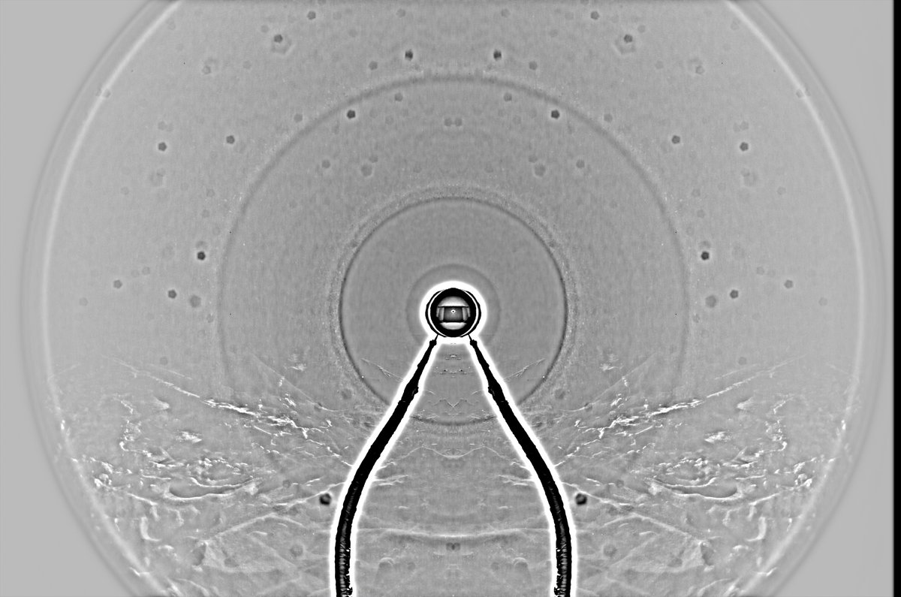

# Thread - 2024-03-27

**Original:** https://x.com/RiikonenMarko/status/1772986773099954559

---

### 1/1 - 2024-03-27 13:59 UTC

Snowpack display on the night of 26/27 March 2024, Rovaniemi. In an attempt to get a snowpack display that is not made of the same old mold I went again to a different place. This time it was the "Toramo pit", which is the cold spot near the city. There was just patches of loose drift scattered amid hard-crusted snow and I was scraping the pile together from all around the camera. And, well, as anyone can see, it is very much like any other of these displays, just a little bit weaker concerning some odd radius rings. But you gotta keep trying, if for nothing else than collecting a big enough statistical sample to say confidently that they are indeed always the same.

This time snow throwing birthed also ice fog, as shown by the third photo. This happened only in the beginning of the session (maybe the moisture got mopped up in the pit, maybe increasing clouding was to blame, or maybe the stuff just drifted to wrong direction). At one point I noticed on the left side two neat vertical parhelia (I was watching a bit from the side of the beam). By all reason the doubling must have come about because there were two distinct clouds which made their own 2D intersections of the 3D parhelia surface. For reference, see the post Crystal Swarm Effects by Jari Luomanen and me: https://t.co/GO3yx0U4yf – especially the link "image 2".

Too bad I could not get a photo of this very fleeting moment. Then there is the question if the doubled and tripled parhelia that we saw with Jari Luomanen in Tampere in January 2011 fits into the above explanation: https://t.co/ArzzYO1mi3
From the description, which is at the end of the story, it sounds like it was not similar effect, but something distinctly related to wind – and which was practically absent from the Toramo pit last night.

If parhelia multiplies outside the classical instance, then it should be due to azimuthally oriented plates. In windy conditions various kind of azimuthal preferences can indeed take place when the swarm meets an obstacle, but this is about the plate crystals rather tilting in some direction, not about having horizontal crystals in identically locked rotation. (We can probably exclude here the explanations that would include electric charge or highly tabular crystals of identical shape that are azimuthally free). If inside, then it can be due to the aforementioned intersections of the 3D shape but azimuthal locking probably can also make inner copies in divergent light. This doubling in Toramo pit was clearly inside of the classical instance. For a moment I thought of 18° plate arc, but that didn't seem right for it was really a perfect copy of the parhelion. 

I didn't have the portable thermometer with me, the car showed -19 C, which means the portable thermometer would have been some degrees below.

[I amended this story quite a lot within an hour from publication]

---

