# Thread - 2024-03-28

**Original:** https://x.com/RiikonenMarko/status/1773236722840522879

---

### 1/4 - 2024-03-28 06:32 UTC

Surface display on 26 March 2024 in Rovaniemi in the widened mouth of the tributary river Kuolajoki. It was in (already morphed) stellar crystals that had fallen from light snowfall the previous day. The crystals settled down quite horizontally which is why the 22° halo was concentrated to the sides and 46° halo to the bottom (in ave stack 46° halo is on the sides, but that's because ave is not good at making anything out of the relatively sparse glitter near the camera. Visually 46° halo was most prominent – as a loose aggregate of colored glints – at the bottom, just like in max stack and min stack, the latter of which is shown down in the next post of this thread). The horizontal orientation of these stellar crystals was also evidenced by the conspicuous pillar which the max stack has supercharged. The pillar got me looking to the opposite side and indeed there was a concentration of small glitter right on the sides of my head shadow. For reference see my post "Subparhelic circle on snow surface" https://t.co/3t1r2budHb
But I had come equipped only with fisheye lenses so didn't start photographing it. Anyway, it was not nearly as good as the case displayed in the above blog post.

I didn't see any pyramids when sampling the crystals, nor in scrutiny of photos, a selection of which is downstream. Given the 24° halo is quite distinct, by all reason I should of captured some of those crystals. Sampling bias would always seem a possibility in surface displays given you only take crystals from just a couple of tiny spots in the wide field in which the display occurs. But could there be another explanation? Given pyramid crystals seem to be always present in snow pack it is conceivable that there were pyramids sitting right below the stellar crystals, and were maybe able to contribute some. If so, I didn't get any of them to show up in the samples as this was a rather rare case where it was possible to collect precisely only the "single crystal layer" made of the last snowfall. Normally the process is less accurate and you get thicker, downwards melded chunks of the surface.

Visually I could not discern 24° halo. The photos show also 9° halo. I was looking for it as well, but the area was so totally empty – could not see any glitter whatsoever – that I thought no way it could be there.

My portable thermometer at the surface level showed -25 C as I arrived to scene right after sunrise. 529 frames in all stacks (I have come to the view that 500 frames hits the right balance. 250 frames still has coarse look whereas 1 000 is an overkill). I have no single photos to show because they happened suffer deletion.

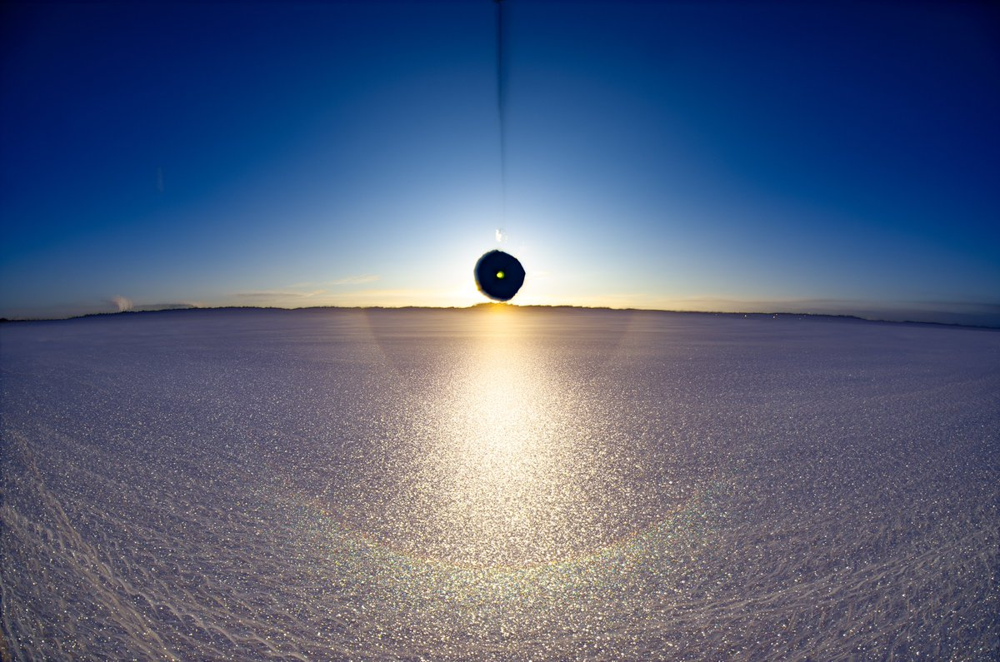

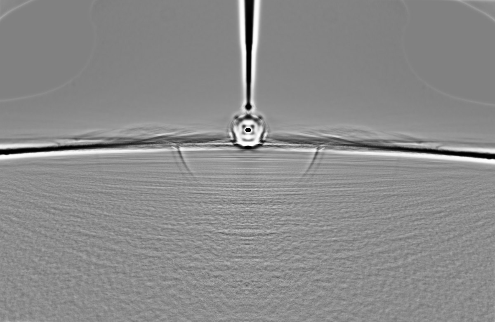

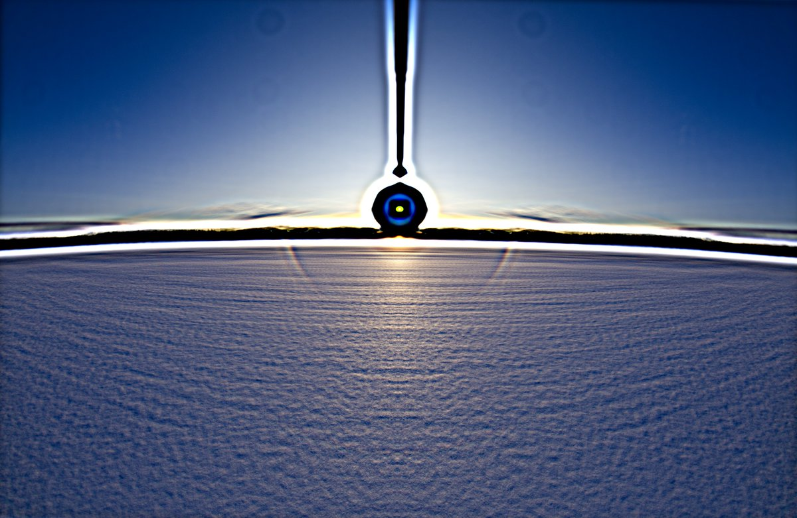

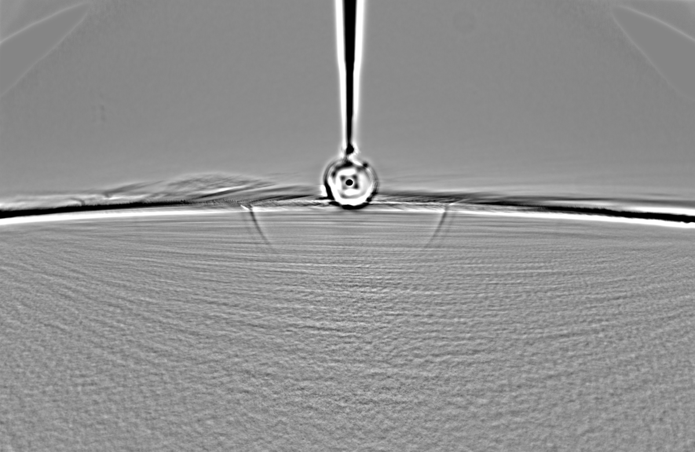

---

### 2/4 - 2024-03-28 06:32 UTC

26 March 2024 Rovaniemi

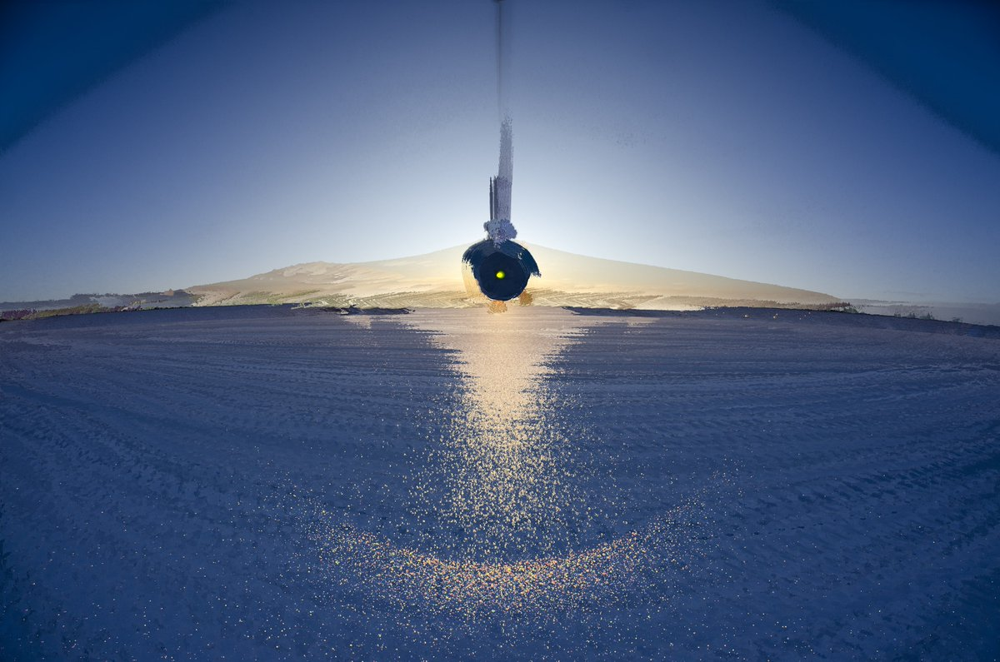

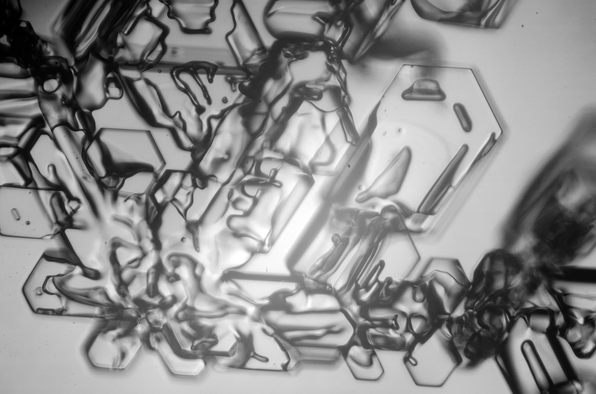

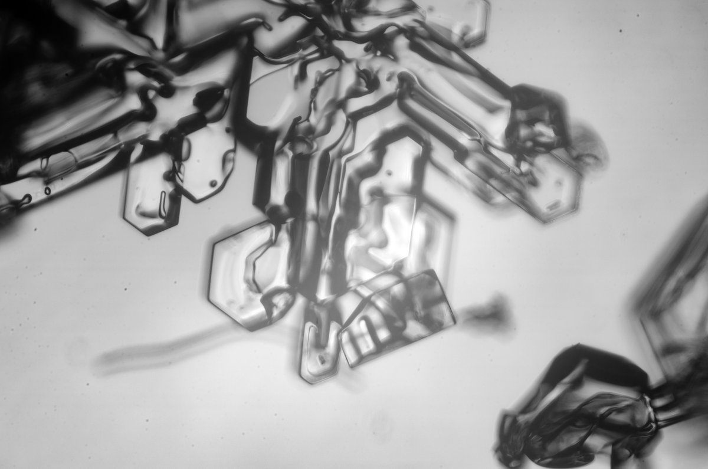

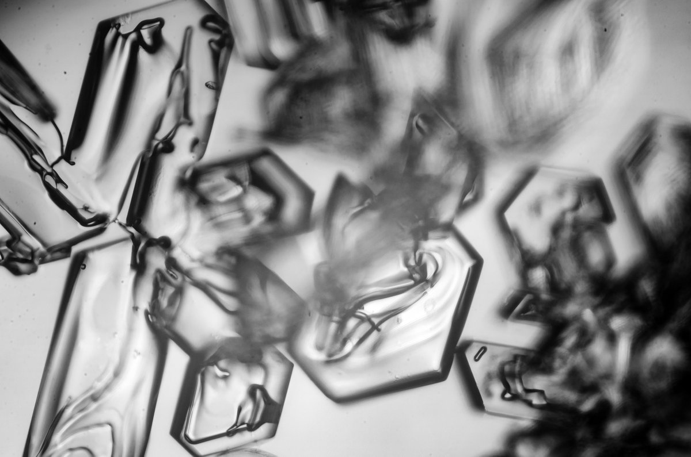

---

### 3/4 - 2024-03-28 06:32 UTC

26 March 2024 Rovaniemi

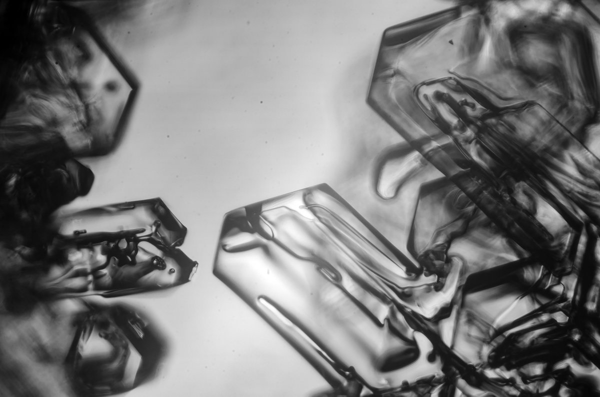

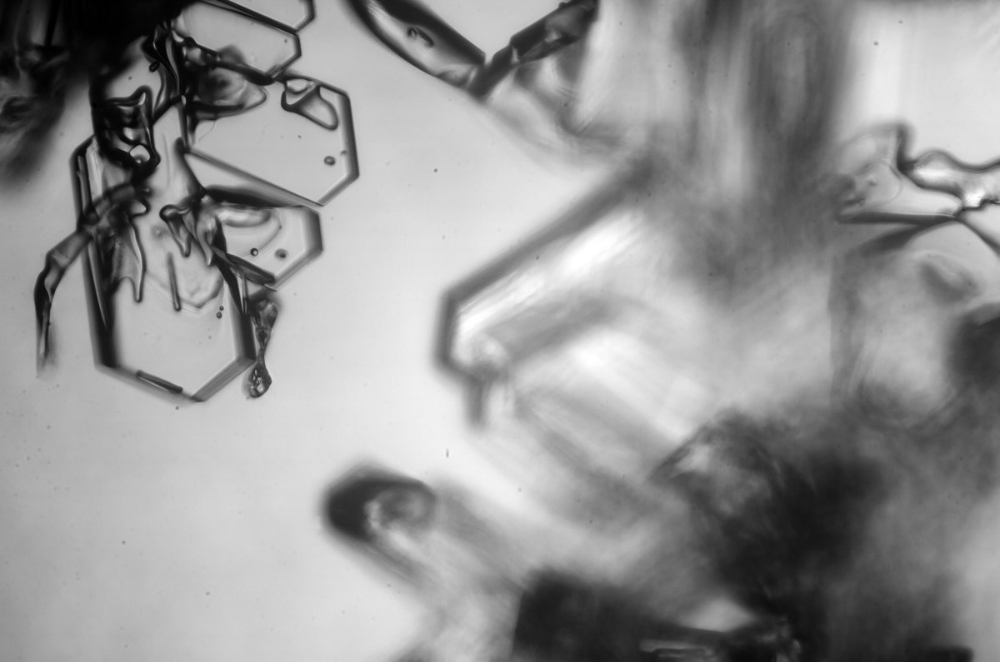

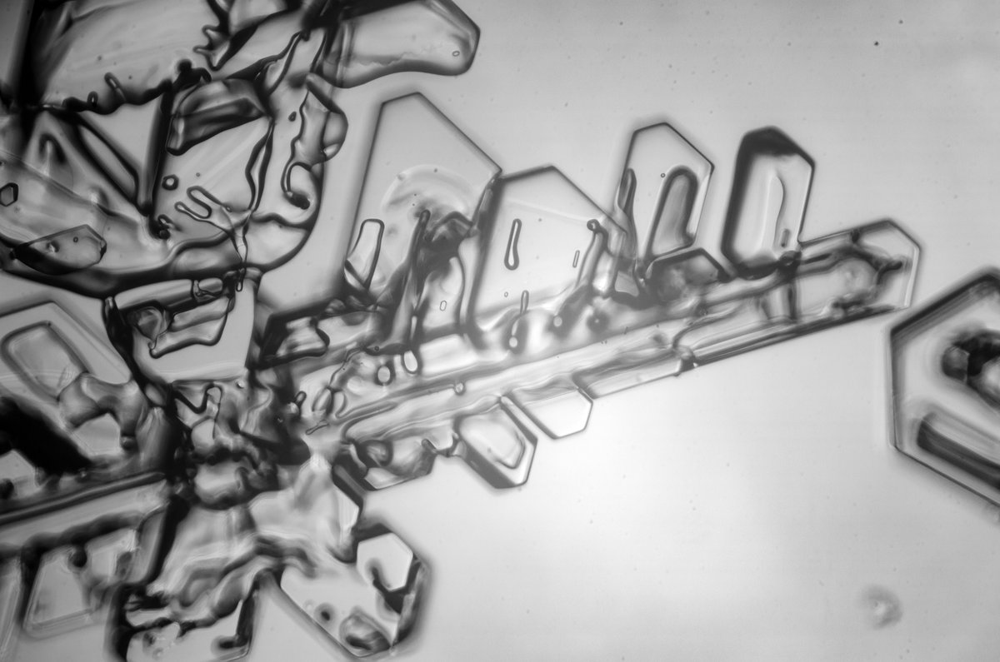

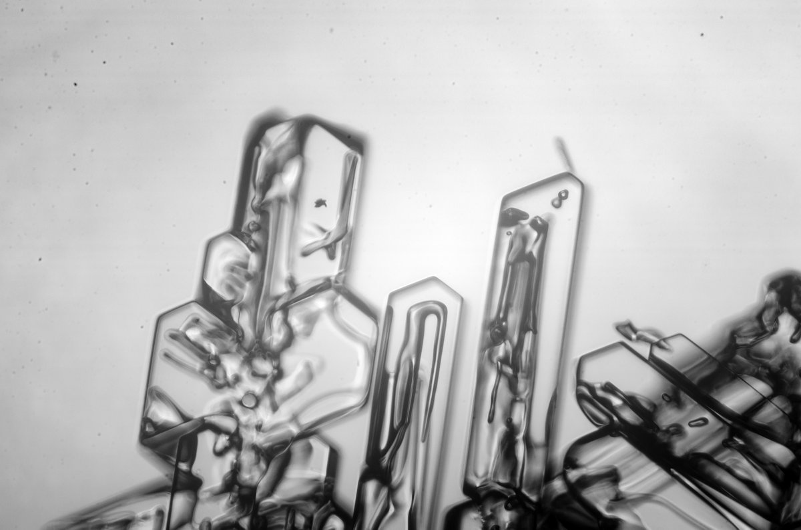

---

### 4/4 - 2024-03-28 06:32 UTC

26 March 2024 Rovaniemi

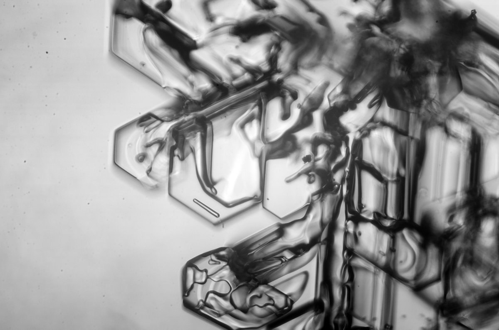

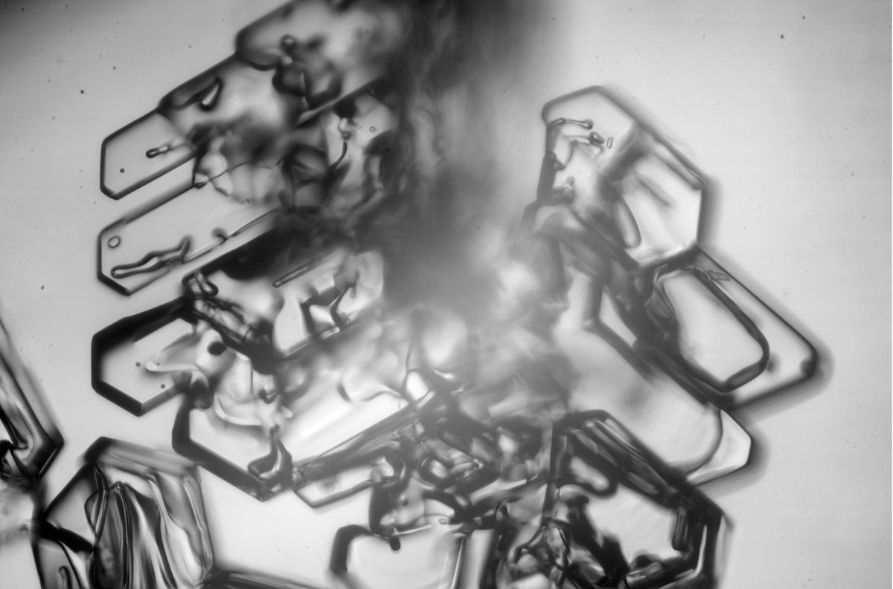

---

