# Thread - 2024-03-29

**Original:** https://x.com/RiikonenMarko/status/1773647783397904507

---

### 1/4 - 2024-03-29 09:45 UTC

If surface halos are seen also the next day, the display either amps up or deteriorates. This time, 27 March 2024, the latter happened (same location, Kuolajoki, Rovaniemi). While in stacked photos the difference to previous day is not that big, visually it was quite much diminished.

Live I thought of having seen one pyramid in the samples but having just went through the photos now I can't say which one that was – I see a few of them. Just like on 26 March, I was able to sample cleanly the very topmost layer. So the lacking of pyramids on 26th looks more like sampling spot bias (see my musings in previous post).

490 frames in the stack. Average and max stacks here, downstream min stack and a single image. Plus select crystal photos. At sunrise -24 C on the surface level in my thermometer.

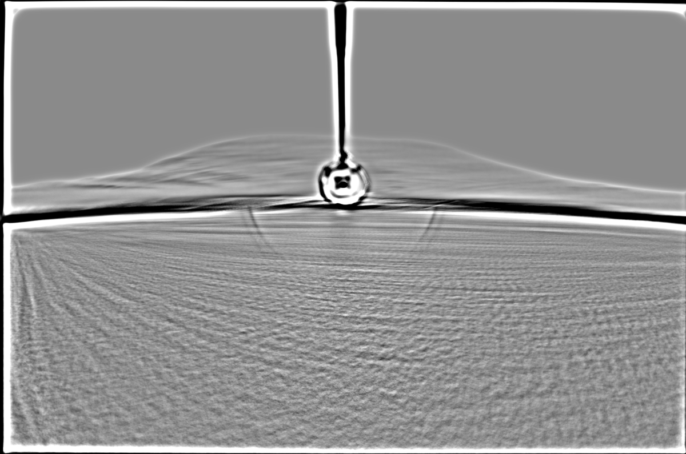

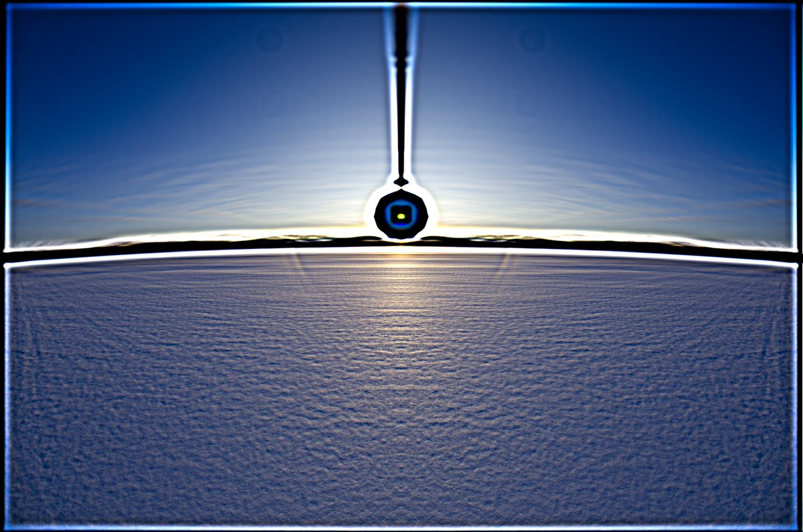

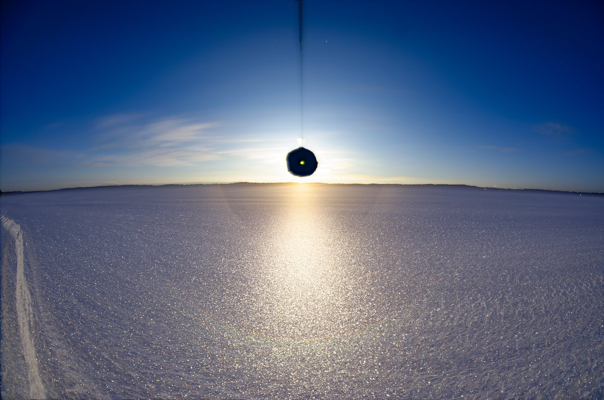

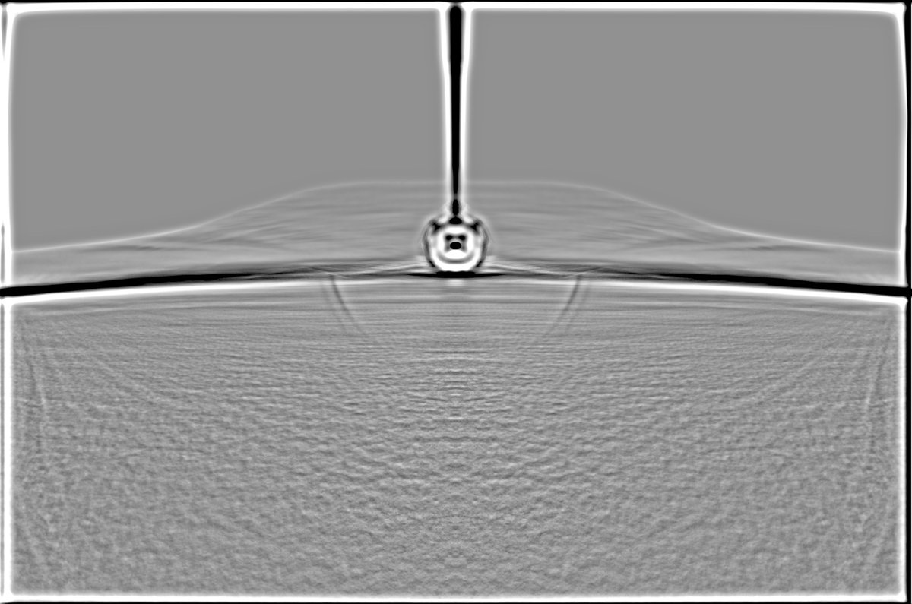

---

### 2/4 - 2024-03-29 09:46 UTC

27 March 2024, Kuolajoki, Rovaniemi

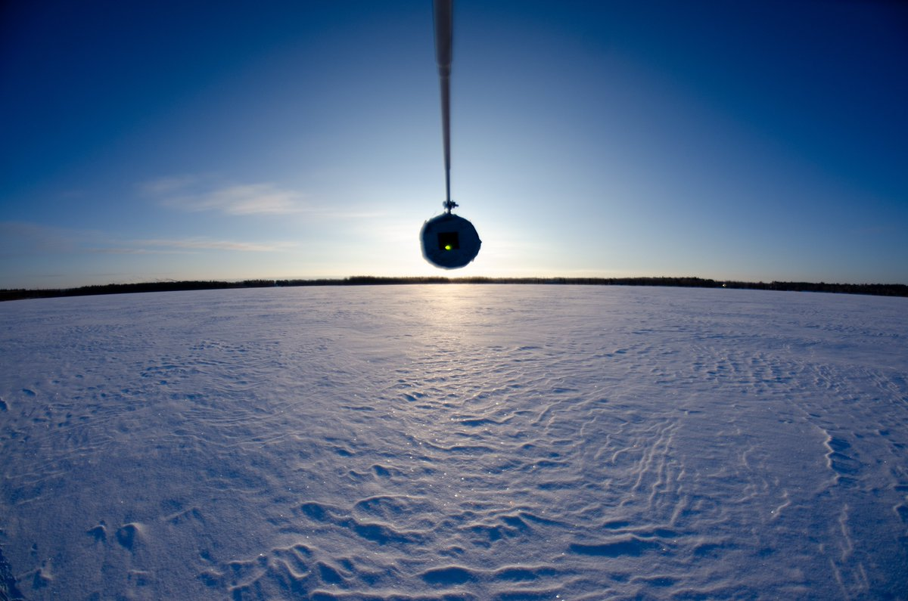

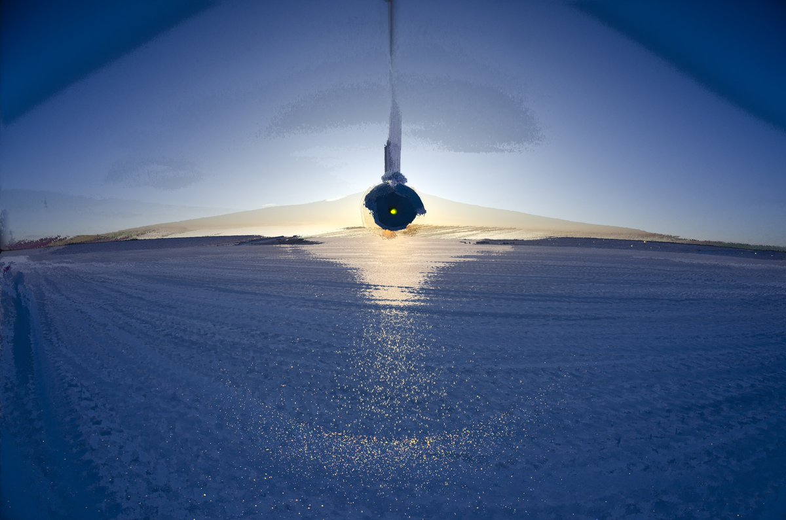

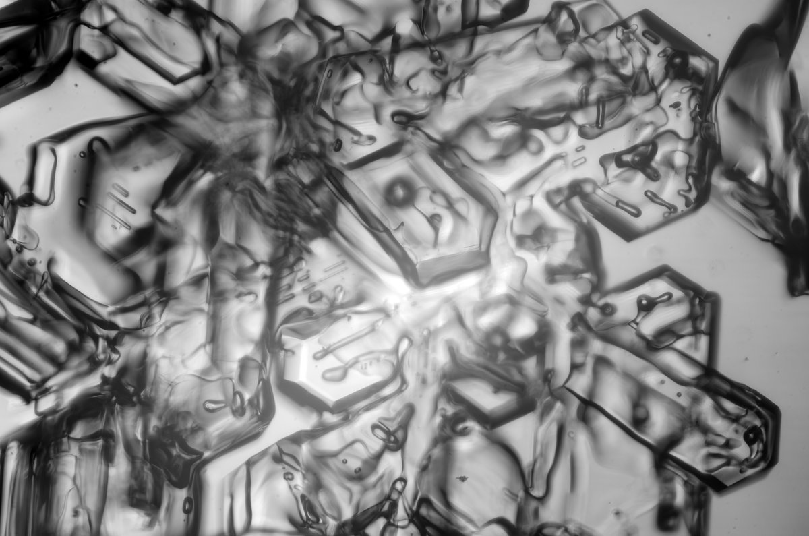

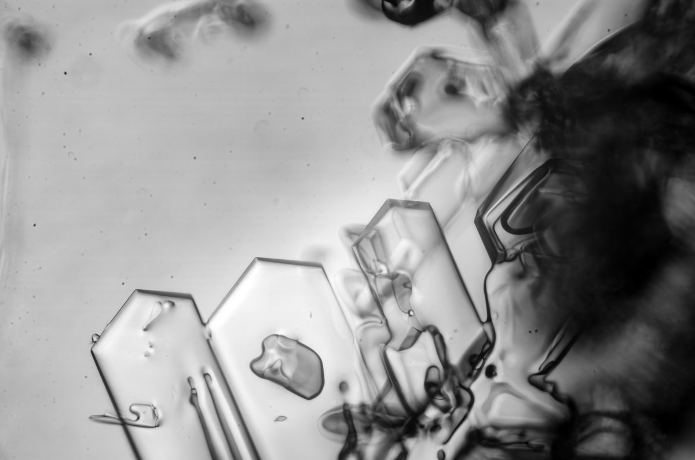

---

### 3/4 - 2024-03-29 09:46 UTC

27 March 2024, Kuolajoki, Rovaniemi

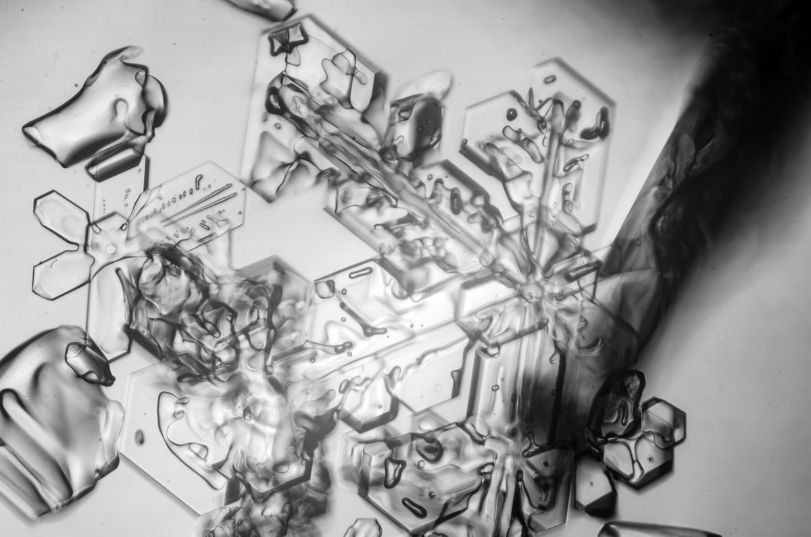

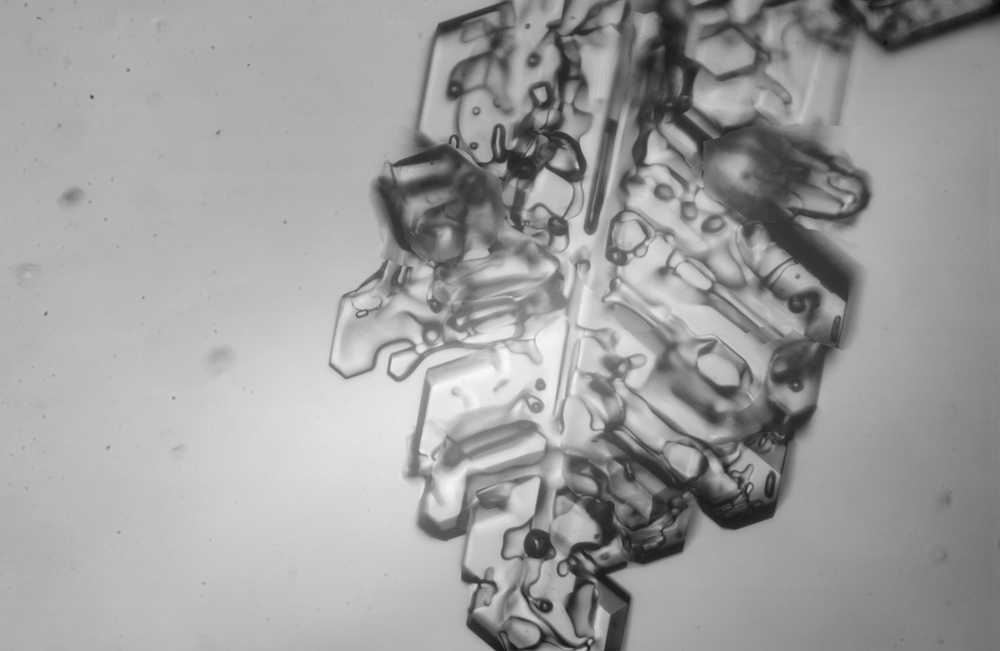

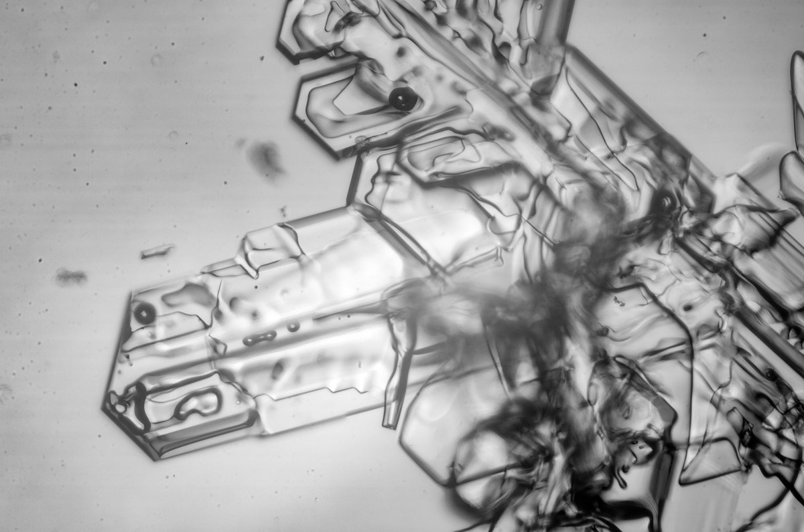

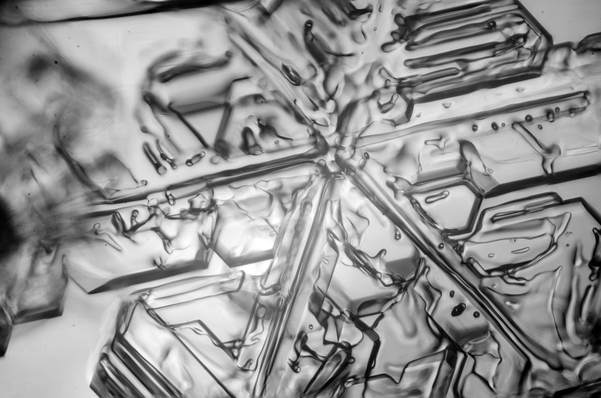

---

### 4/4 - 2024-03-29 09:46 UTC

27 March 2024, Kuolajoki, Rovaniemi

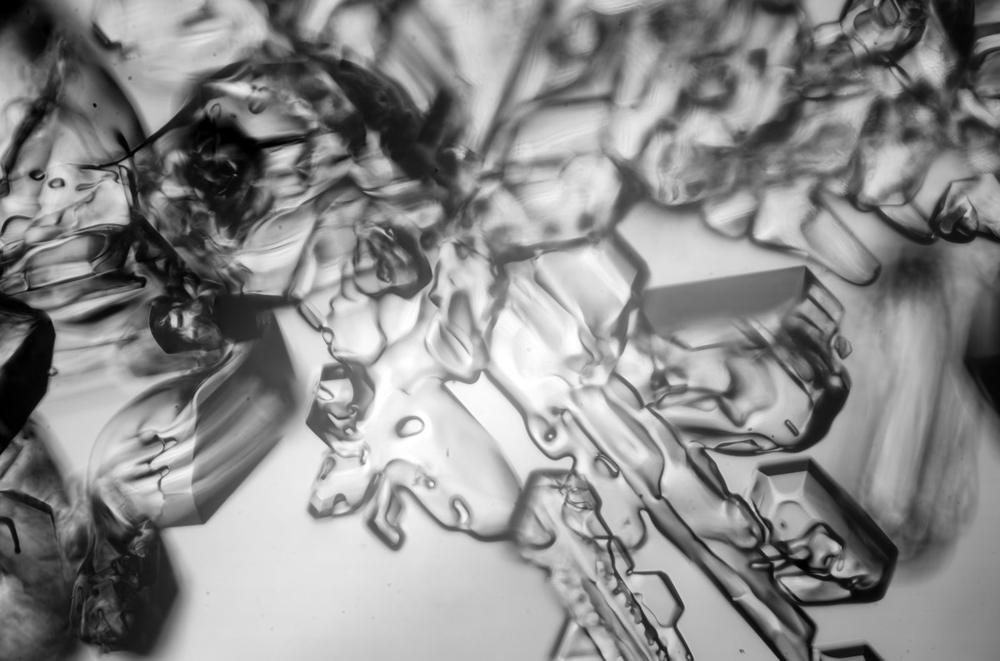

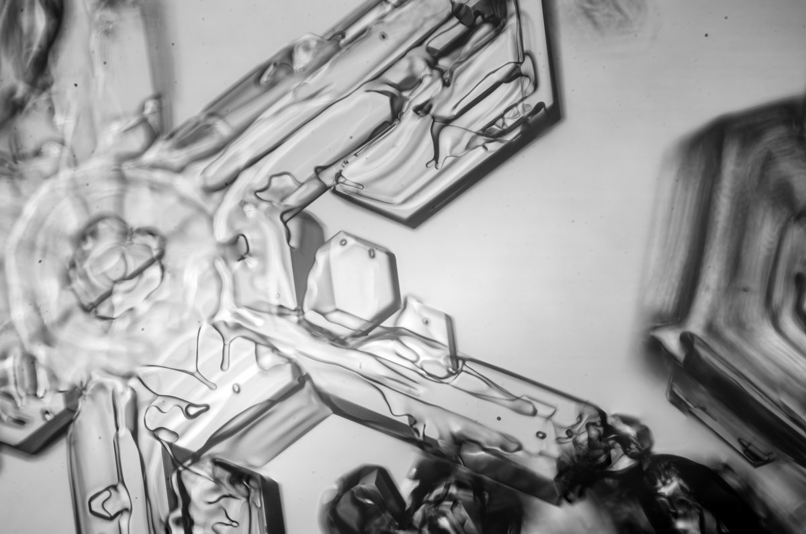

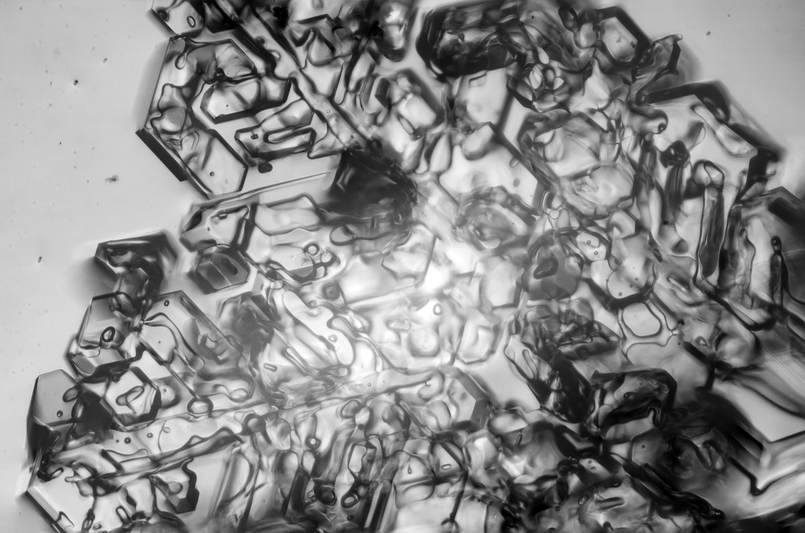

---

