# Thread - 2024-03-31

**Original:** https://x.com/RiikonenMarko/status/1774511899977101579

---

### 1/4 - 2024-03-31 18:59 UTC

Kern arc don't come easy. Today's display (31 March 2024 Rovaniemi) was hopeless due to abundant low clouds but eventually it started clearing up. The cza looked like it might have what it takes to cough up Kern arc in stack. But this was no to be that day – no amount of squeezing materialized it. Had to be content to visual subhelic arc. And is that Wegener meeting it at the top? When I ran this stack's 59 photos in FastStone Image Viewer, there was no high or lower cloud that could have made that stripe. It is fully a stack-emergent feature – I think it is Wegener. For reference provided are four single frames, beginning, end and two in between. Sun elevation 15.4-14.8 degs.

For this as well as the other stacks that follow below in chronological order, photo interval is 7 seconds. Camera was sitting on my car roof. I stacked the photos as such, so no sun tracking in post-processing either.

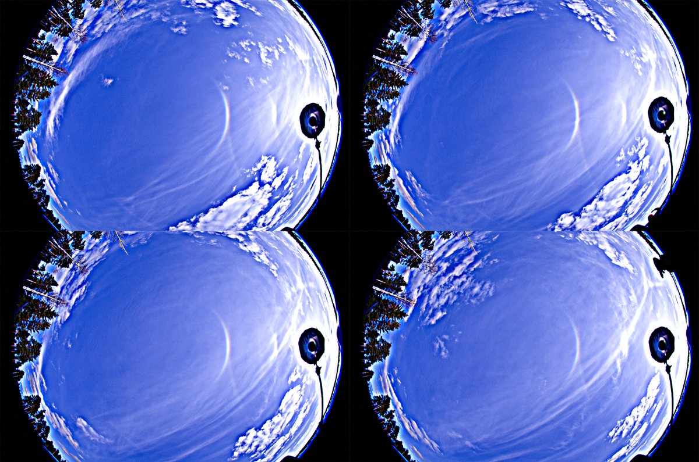

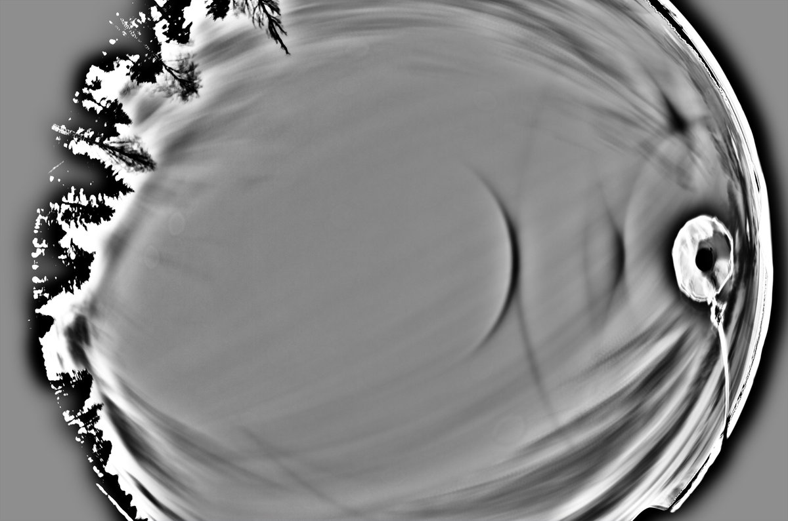

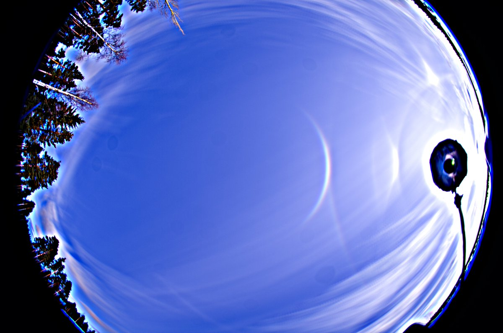

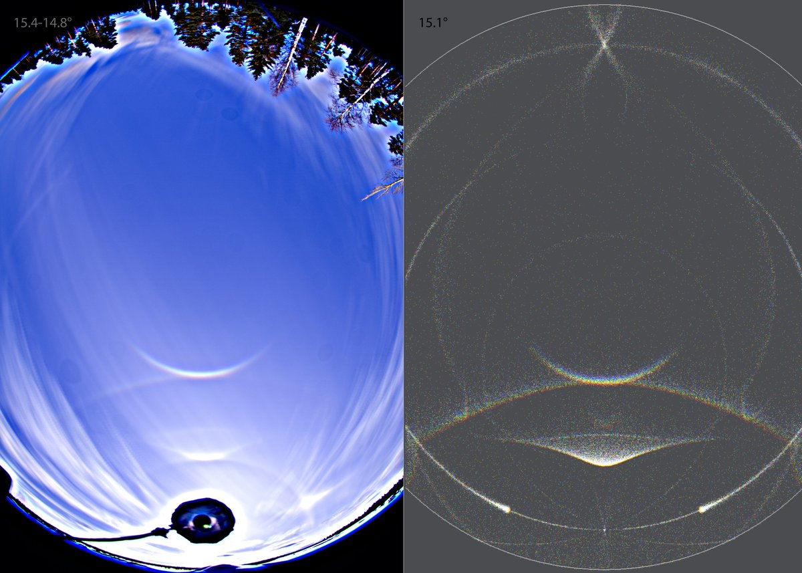

---

### 2/4 - 2024-03-31 18:59 UTC

31 March 2024 Rovaniemi. 44 and 43 frames.

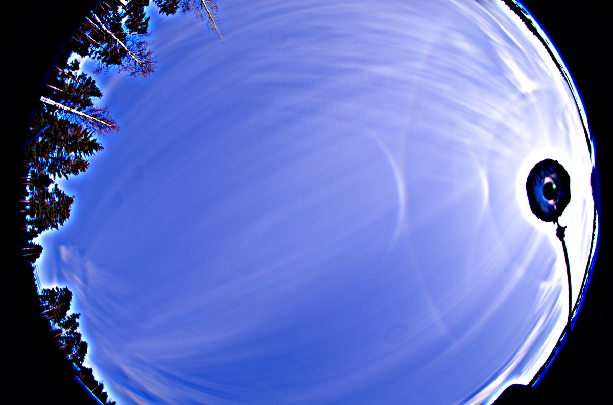

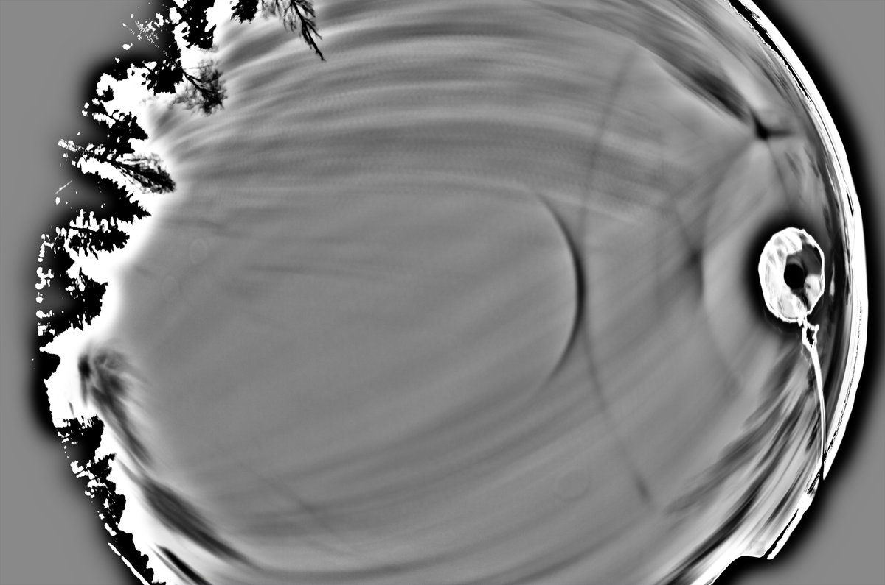

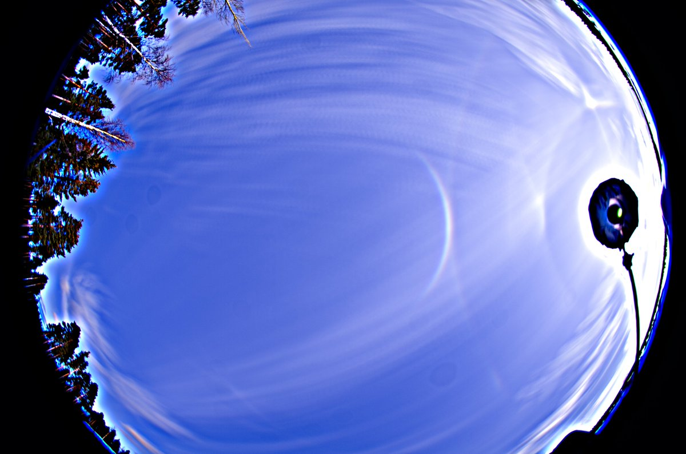

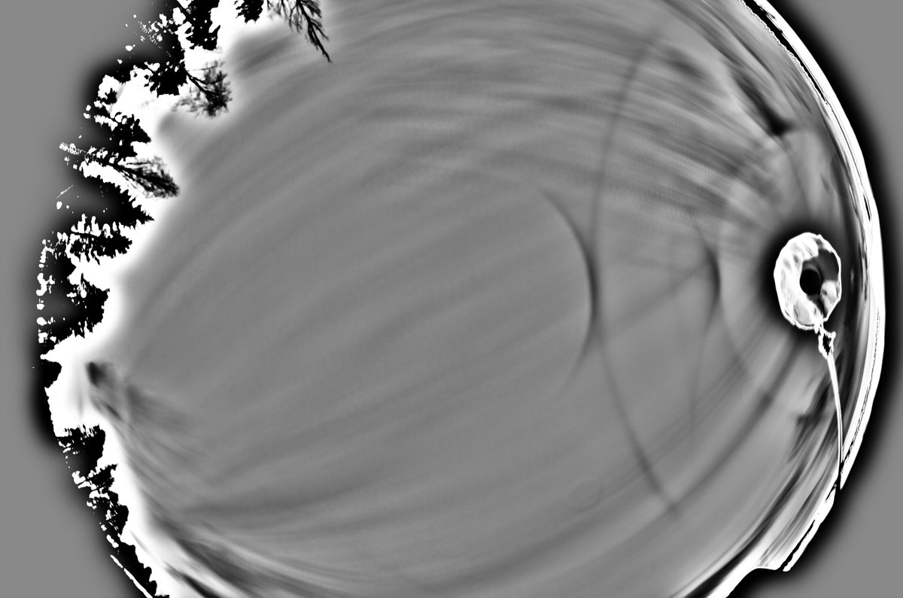

---

### 3/4 - 2024-03-31 18:59 UTC

31 March 2024 Rovaniemi. 42 and 41 frames. The latter is the final stack, sun elevation 13.9-13.4 degs. That is already raising the expectation for the uppervex Parry (next thread).

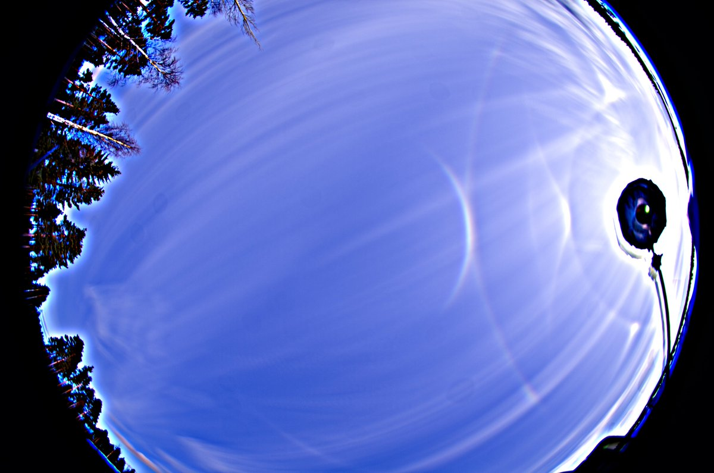

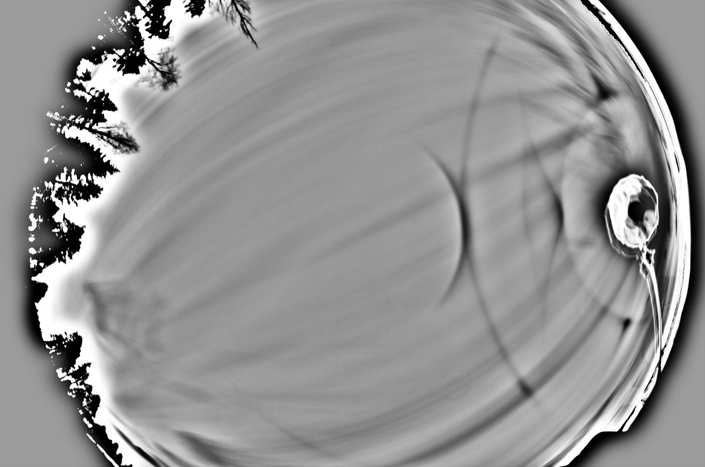

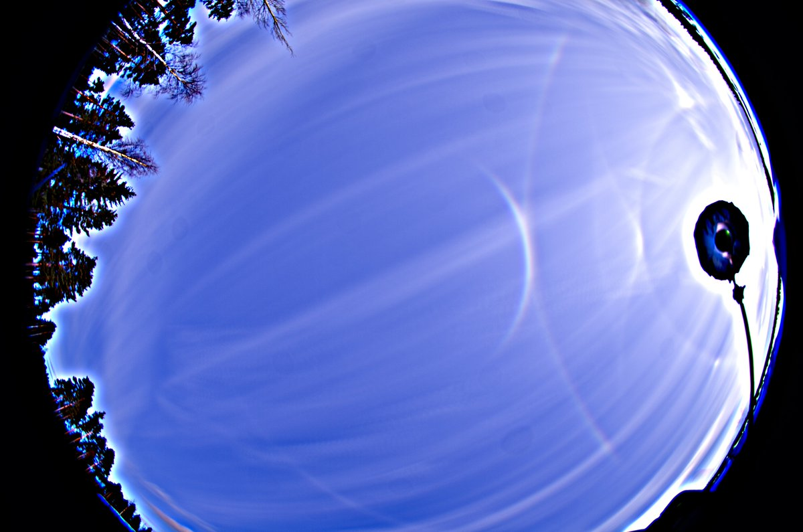

---

### 4/4 - 2024-03-31 18:59 UTC

31 March 2024 Rovaniemi. Simulation (HaloPoint) and the final stack br-version for comparison. Uppervex Parry is not visible in the display. After this, the show crapped rapidly and lower clouds took over.

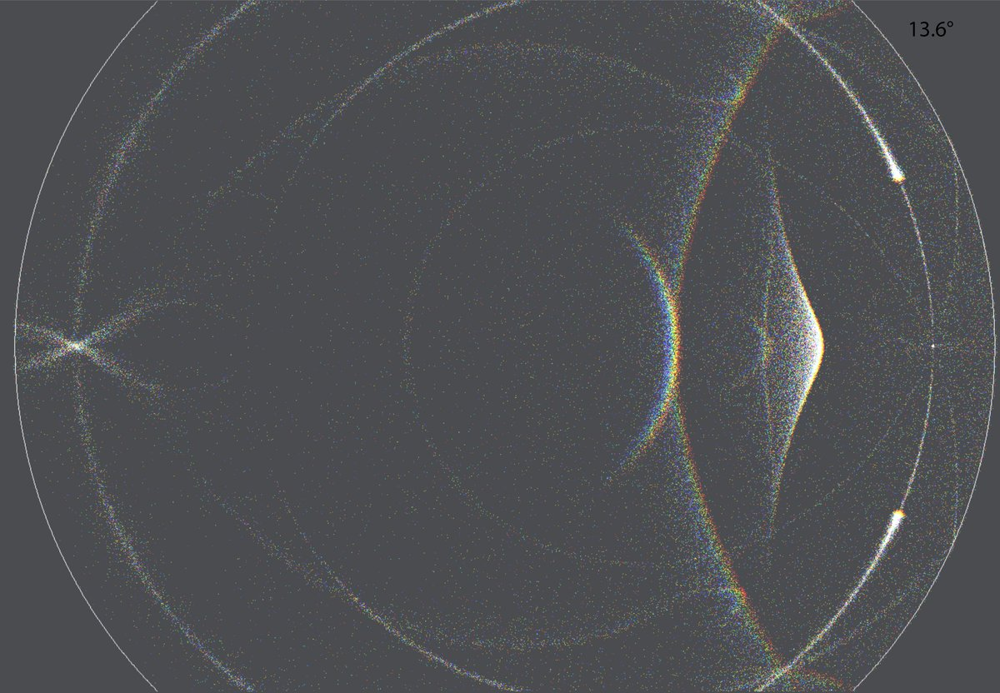

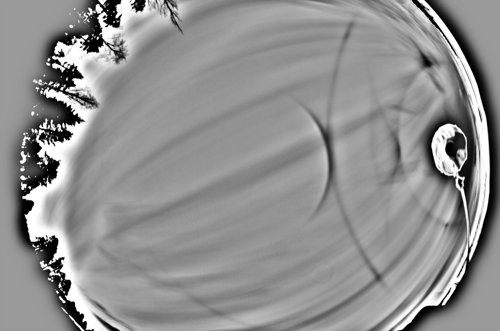

---

