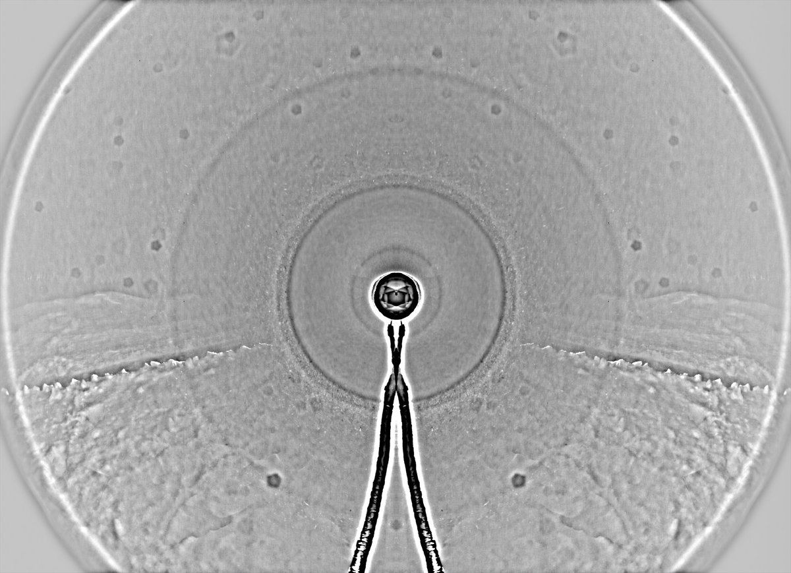
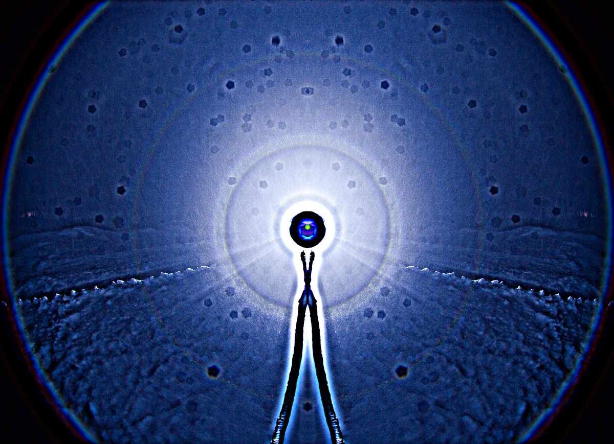
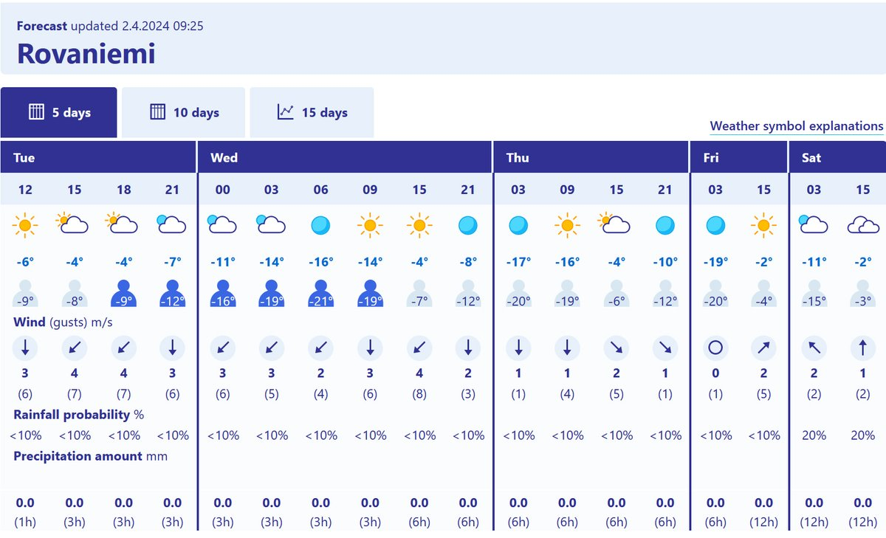

# Thread - 2024-04-02

**Original:** https://x.com/RiikonenMarko/status/1775061031758299549

---

### 1/2 - 2024-04-02 07:21 UTC

It got permanently below freezing again and there had fallen a good layer of fresh snow, so last night, 1/2 April 2024, Rovaniemi, I went around 2 am to fly snow to the old snow depo. A bit too much wind, but managed to get plenty enough (53) usable frames. I aligned the configuration with the wind, the camera at upwind position and the snow pile some 1.5 meters behind it.

It is good to have a snowbank on front of the camera to shadow the ground for better contrast for the halos' bottom sections (applies to ice fog displays as well). I have neglected this often, it is not much at all work with shovel to make such a bank. This time I planned the configuration so that the snowbank was already included and actually I needed to lower it some. Should have probably chipped off even more.

Windy weather does not prognose the best for surface, but I should of gone this morning all the same as you can never know how it really is. The forecast is pretty cold for the coming days so I try to shape up. Will be easier if I don't go snow-throw – at least not on all nights. We'll see.

---

### 2/2 - 2024-04-02 07:26 UTC

Let's add here also the Finnish Meteorological Institute forecast.

---

