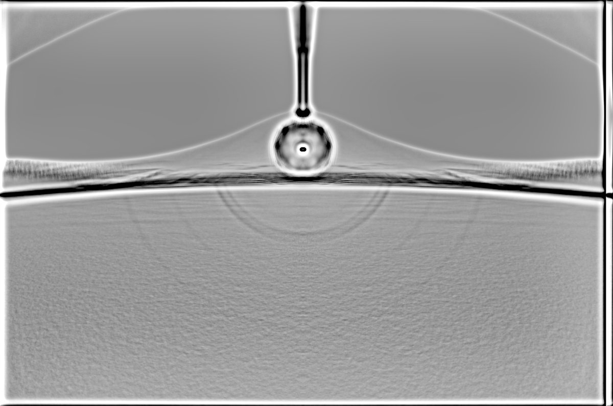
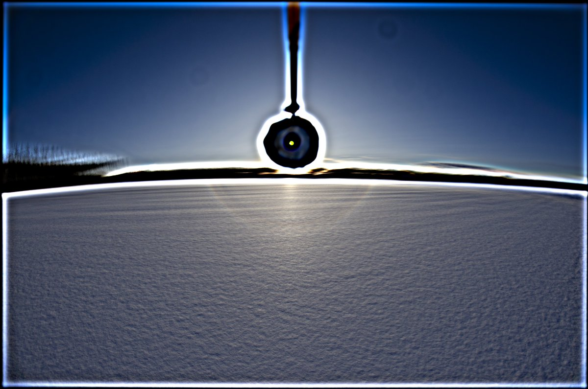
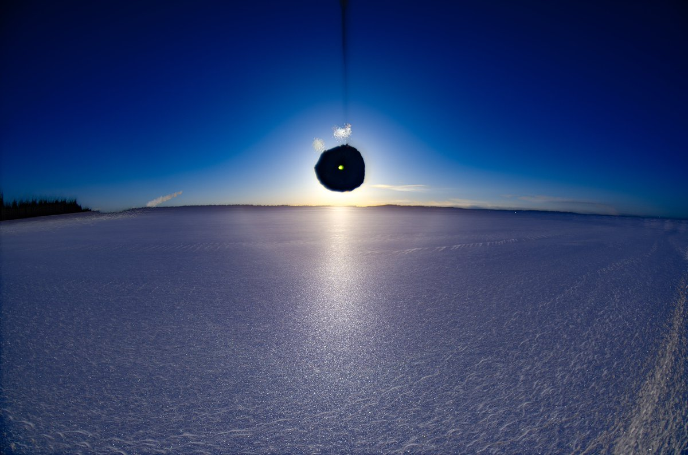
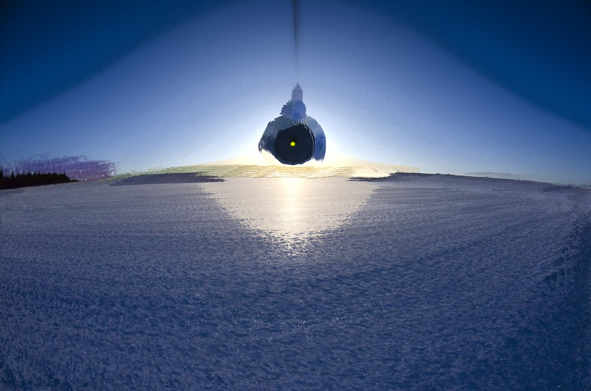
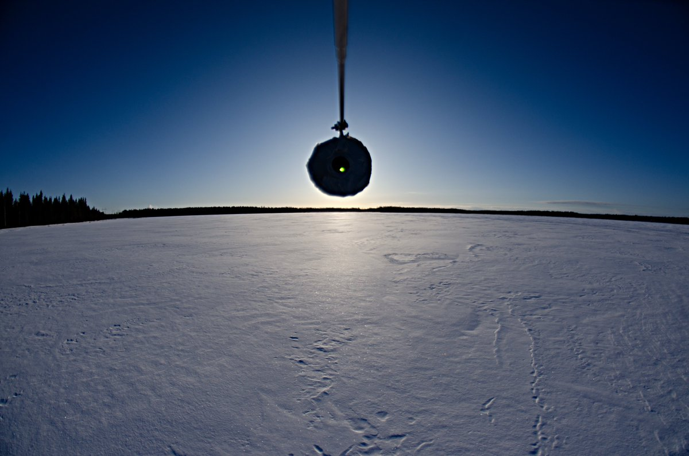

# Thread - 2024-04-03

**Original:** https://x.com/RiikonenMarko/status/1775515659817869560

---

### 1/2 - 2024-04-03 13:28 UTC

And this is what happens you when decide not bother with the crystal sample (3 April 2024, Kuolajoki, Rovaniemi). Granted, there is no 28° halo, but I would of really liked to peruse those crystals given the dominating feature is 24° halo.

The single image in the second post down should make it palpable enough that the display was rather far down in the crappy end of the visual quality spectrum. I could still see what I thought was 22° halo and also the 46° halo, but the sight was so uninspiring that I decided to have an excuse to skip with the crystals, even if all along I knew that it's precisely this kind of displays that have the goods.

528 frames in stack. Temp on the surface in my thermometer -21 C upon arrival some time after sunrise and (rather unexpectedly) -22 C when leaving. I waited maybe half an hour before starting to take photos to allow for the shadows cast by the uneven surface shorten. The night was moderately windy and cloudy until clearing up at 3 am according to FMI data. Sunrise 06:20. Near the middle of this river widening surface was very uneven due to drift (not really different from having been spoiled by snow mobiles) but nearer to the shore where forest provided cover it was smoother. That's where I took the series, making five parallel lines (with some two meters spacing) because the optimal area wasn't that wide.

Looks like I am given a chance to make it right for the forecast is giving two more cold, clear mornings.

---

### 2/2 - 2024-04-03 13:28 UTC

3 April 2024, Kuolajoki, Rovaniemi.

---

