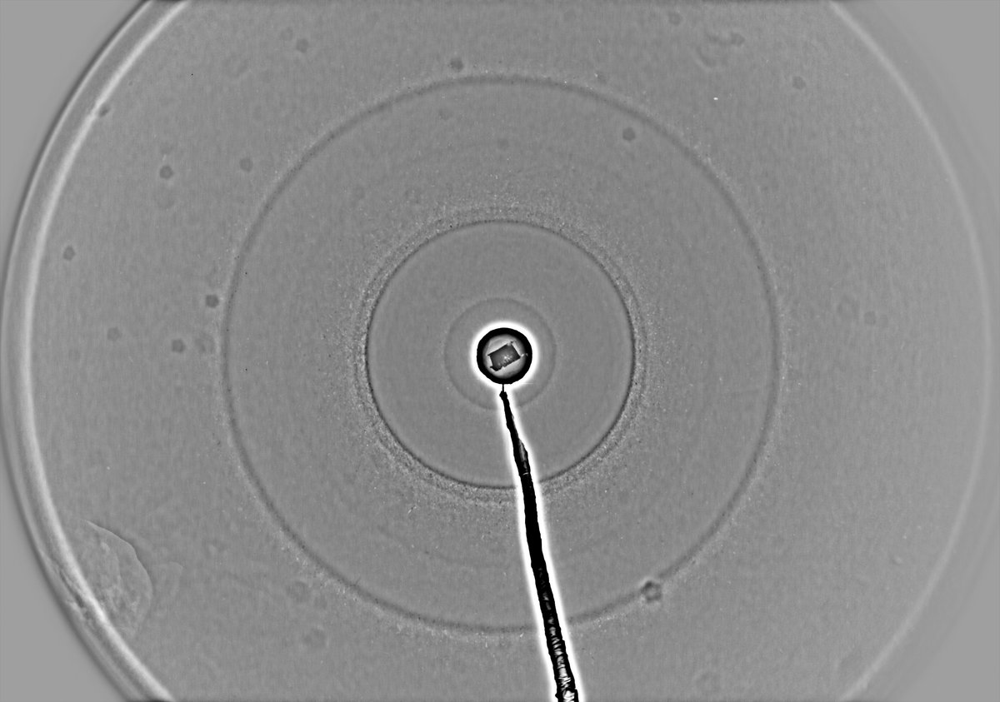
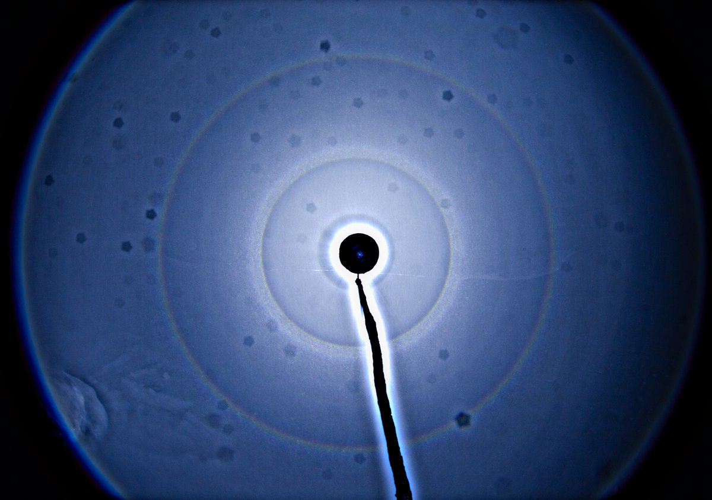
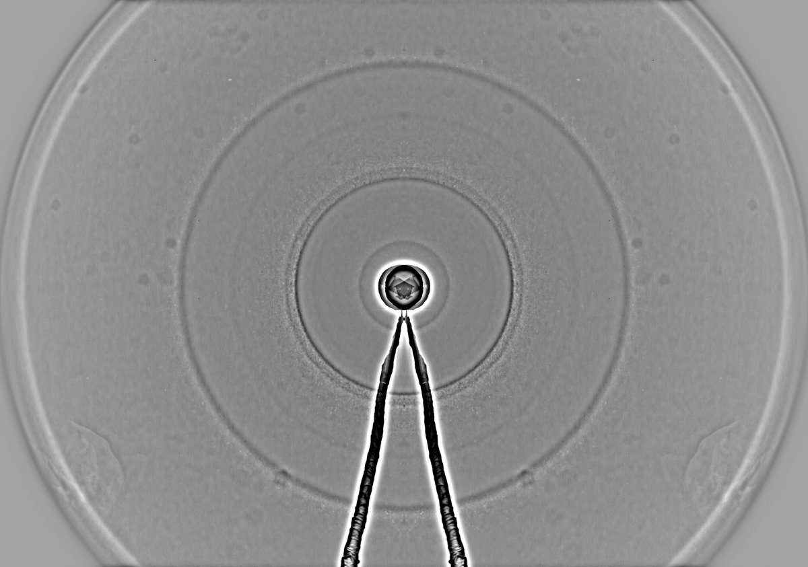

# Thread - 2024-04-04

**Original:** https://x.com/RiikonenMarko/status/1775710822859252148

---

### 1/1 - 2024-04-04 02:23 UTC

Snowpack display on the night of 3/4 April 2024, Rovaniemi. I had alarm going off at 02:15 and made quick in-and-out to the old snow depo. 60 frames in stack. A nice ~15 cm layer of light snow. Calm and quite cold for the season, temperature in my car thermometer -24 C (back up in Korkalovaara where I live only -17 C, Apukka -20 C). I reverted back to my earlier practice of putting the camera a bit higher. The lamp was right on the ground below the level of the camera and there was also a snow bank for shadow. All this worked to emphasize the lower part of the display.

---

