# Thread - 2024-04-05

**Original:** https://x.com/RiikonenMarko/status/1776276910164643975

---

### 1/4 - 2024-04-05 15:53 UTC

4 April 2024, Kuolajoki, Rovaniemi. 24° halo dominating, the display was identical to the previous day what a slightly better defined, and I got to make right the skipping of crystals. Here are different versions of 573 frame stack, mirrored except for the last one. At the start -32 C on the surface in my thermometer. The posts down have two more versions, max and min, and crystals. As to those, it was not the pyramid fest I wanted it to be. I tend to see some certain pyramid faces there, but generally I have difficulties make sense of what I am looking at.

Got surface also 5 April, making it three days straight. It gave what I thought as the best visual 24° halo I have seen. In between I was throwing snow. These are under process.

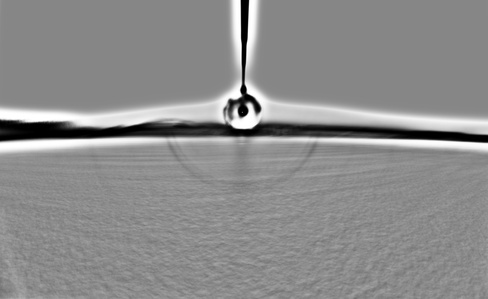

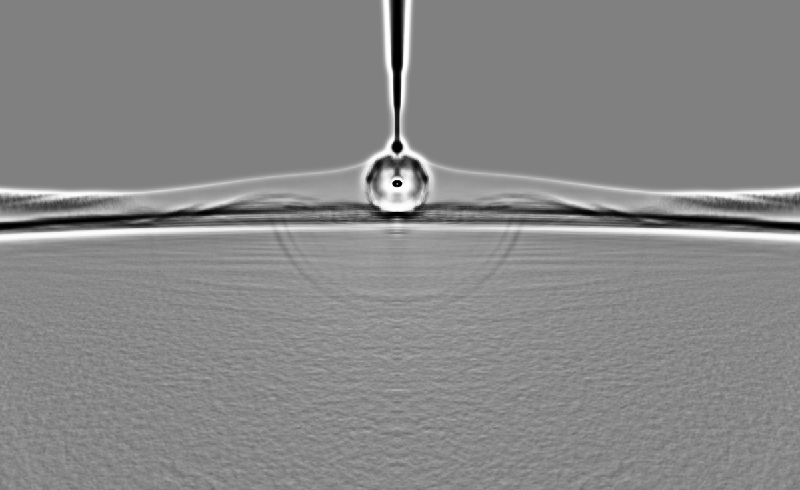

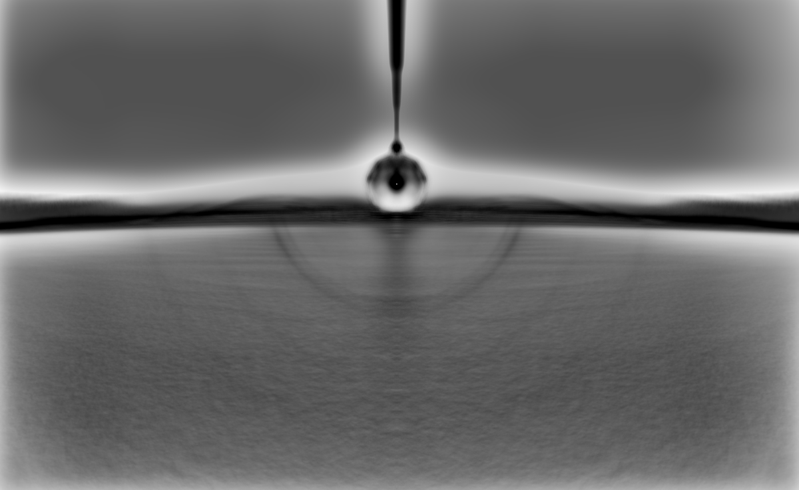

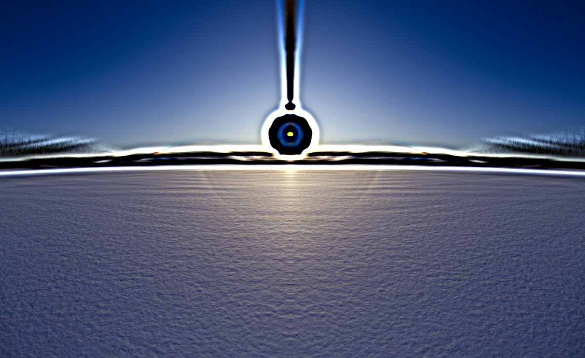

---

### 2/4 - 2024-04-05 15:53 UTC

4 April 2024, Kuolajoki, Rovaniemi.

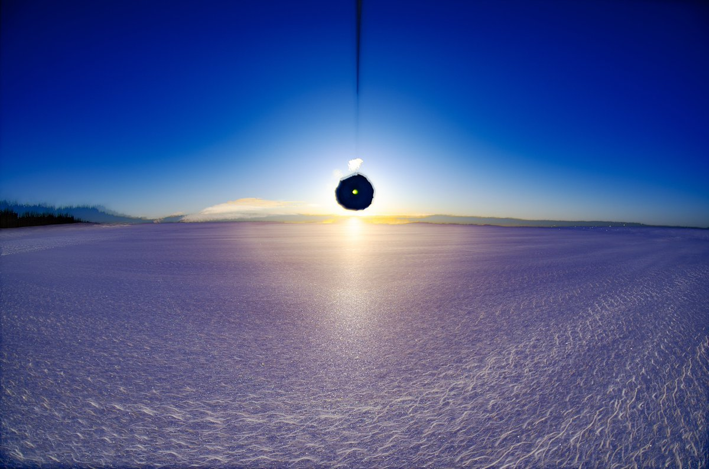

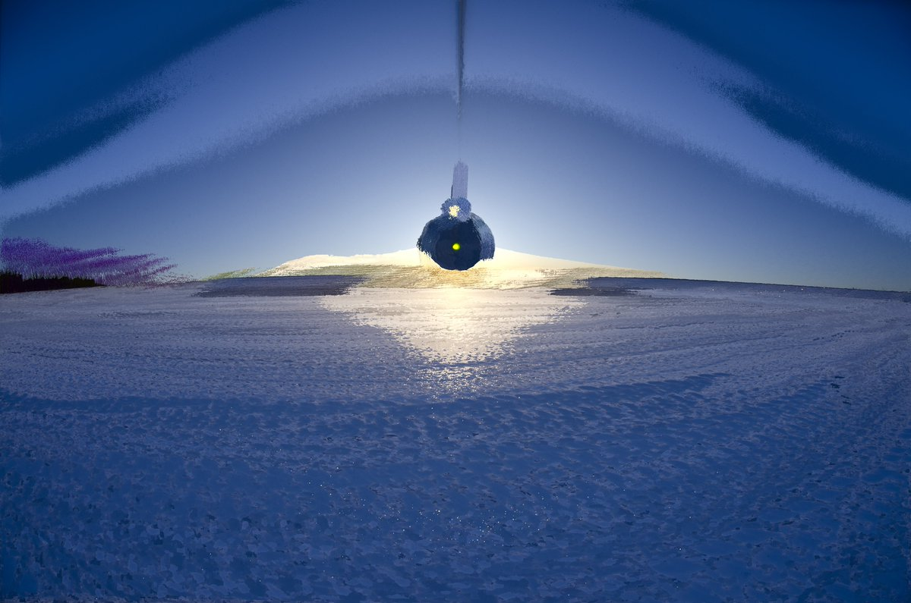

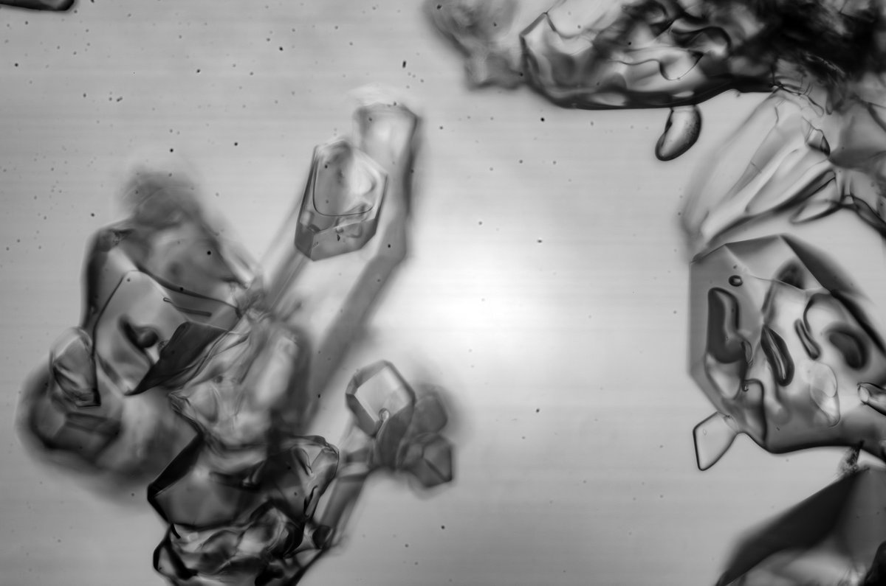

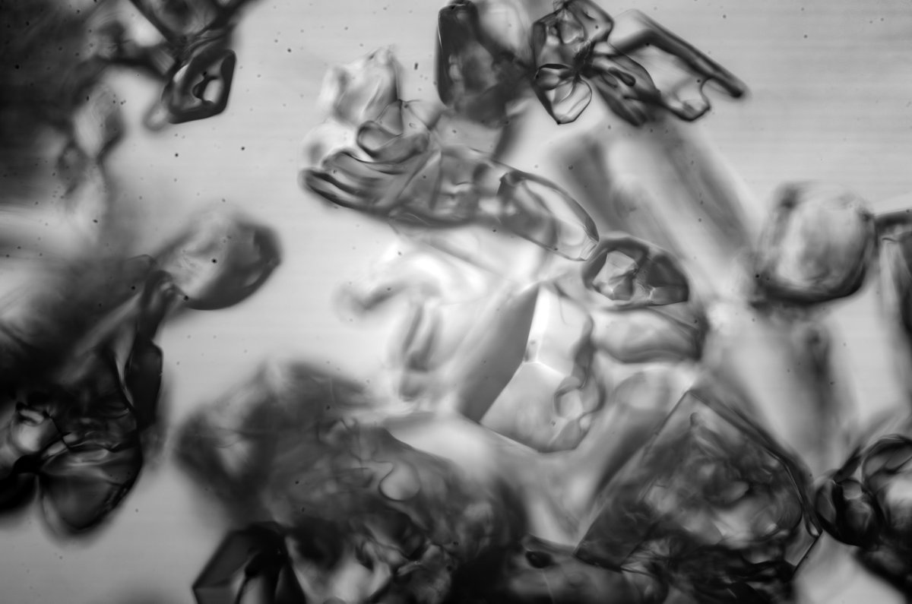

---

### 3/4 - 2024-04-05 15:53 UTC

4 April 2024, Kuolajoki, Rovaniemi.

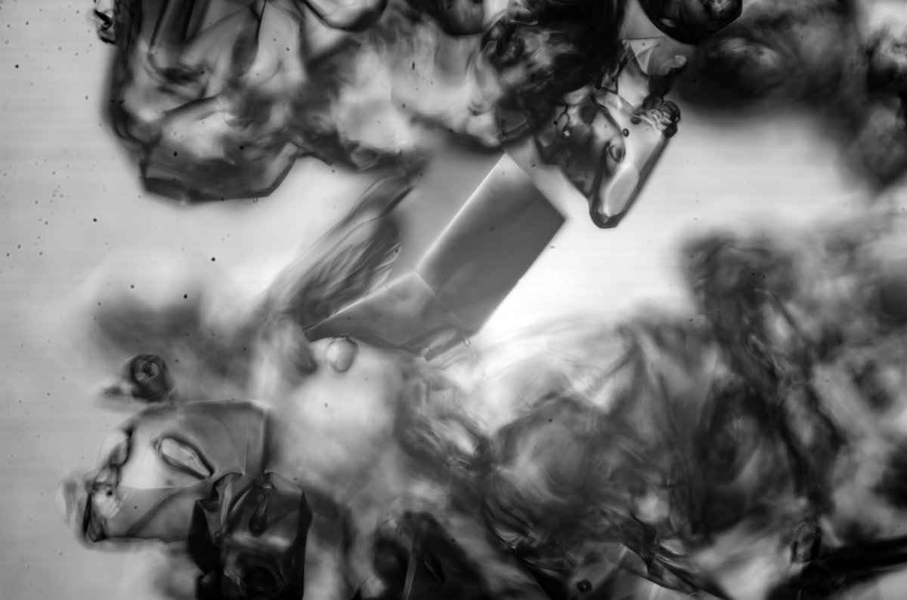

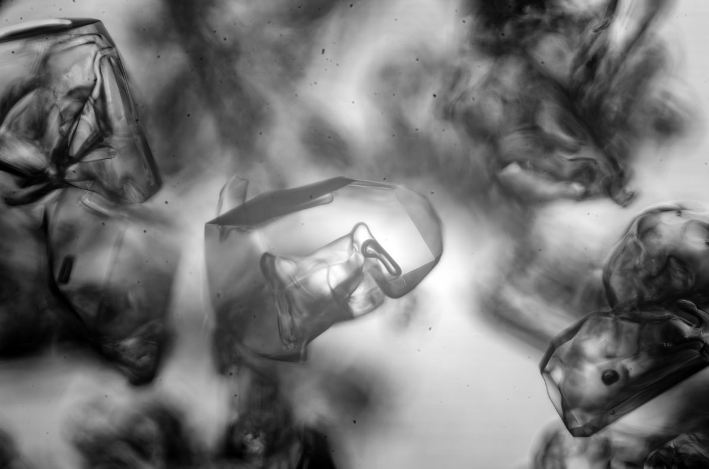

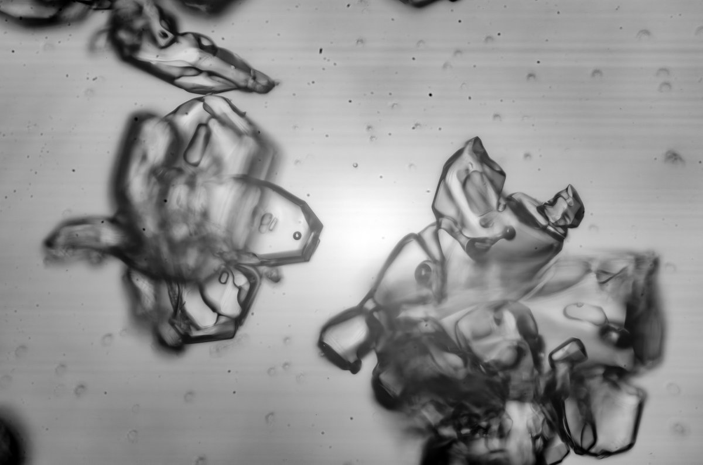

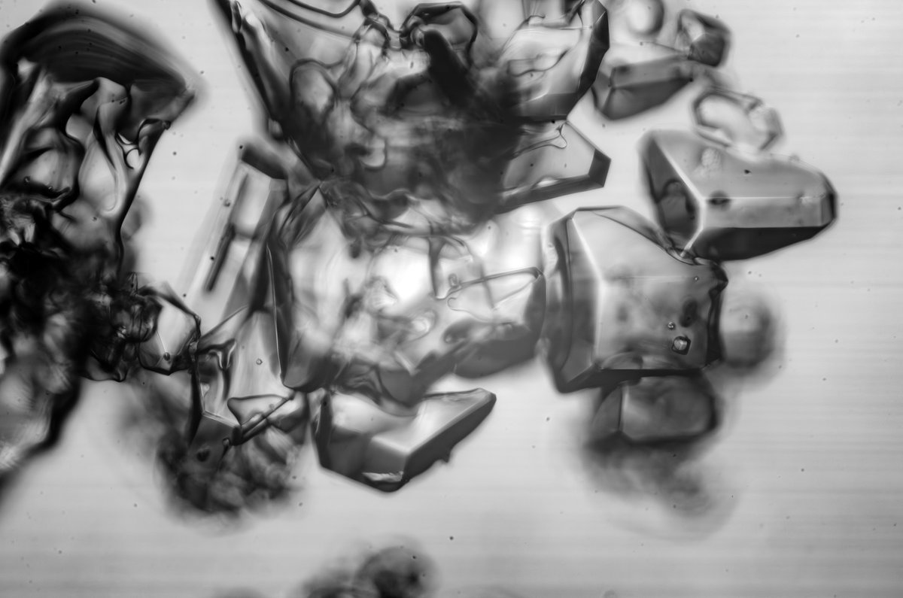

---

### 4/4 - 2024-04-05 15:53 UTC

4 April 2024, Kuolajoki, Rovaniemi.

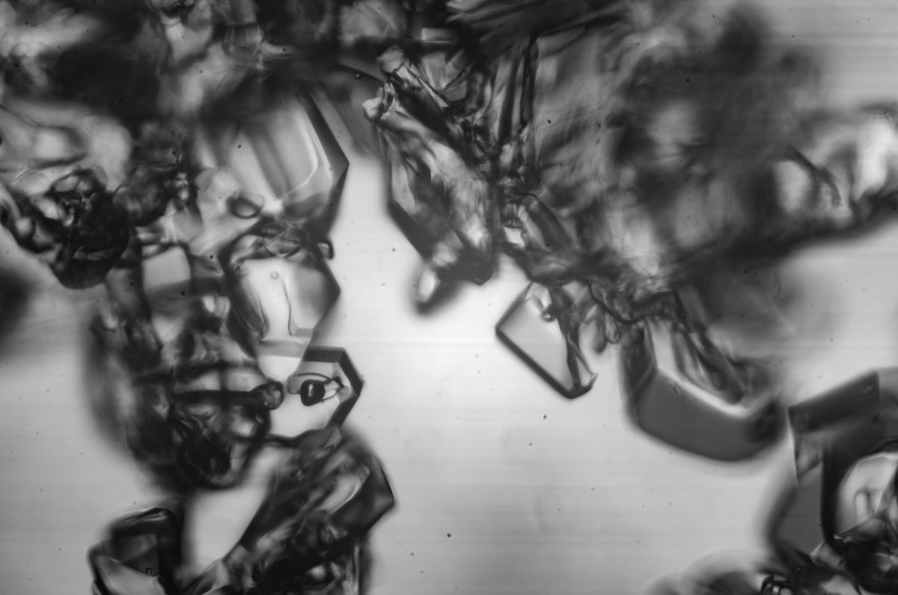

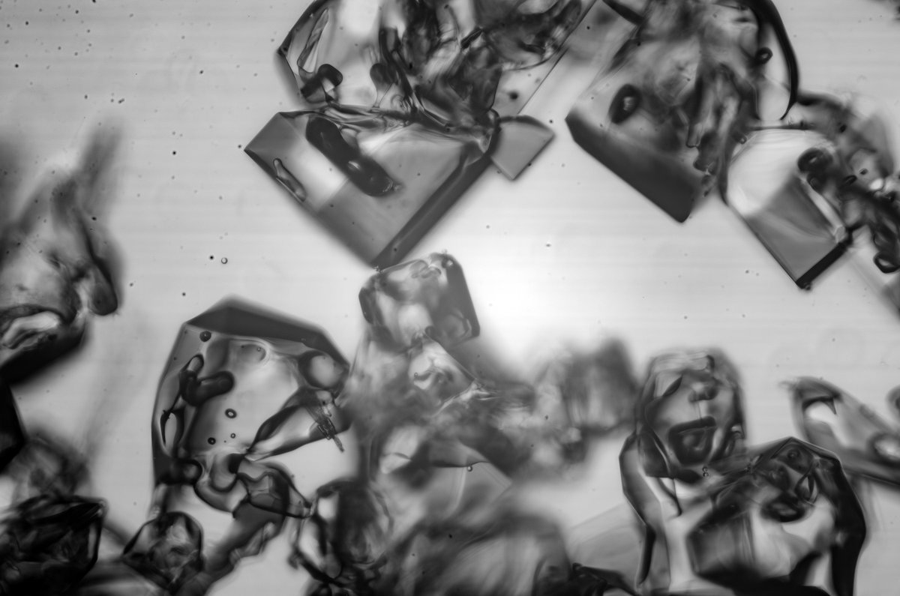

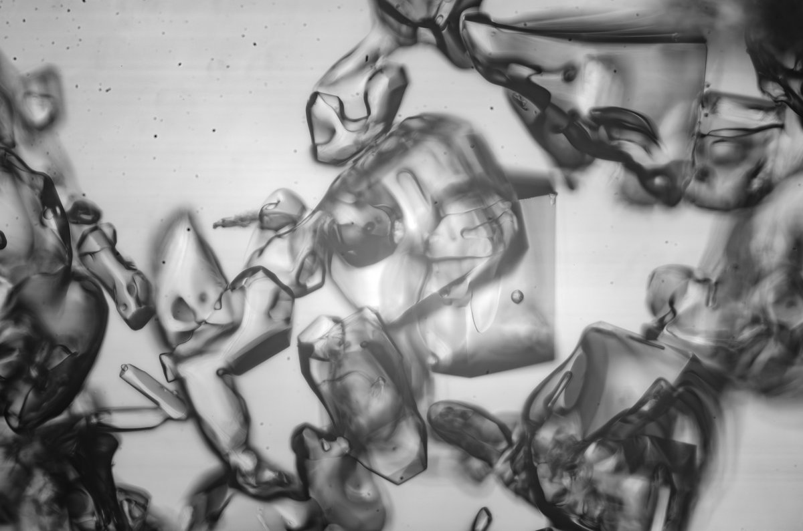

---

