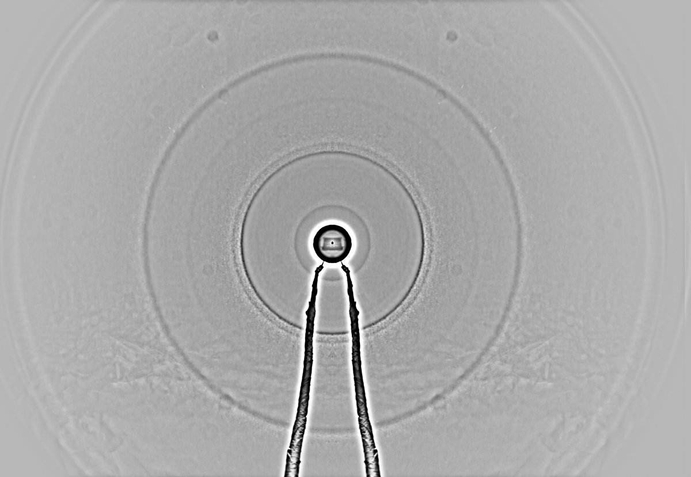
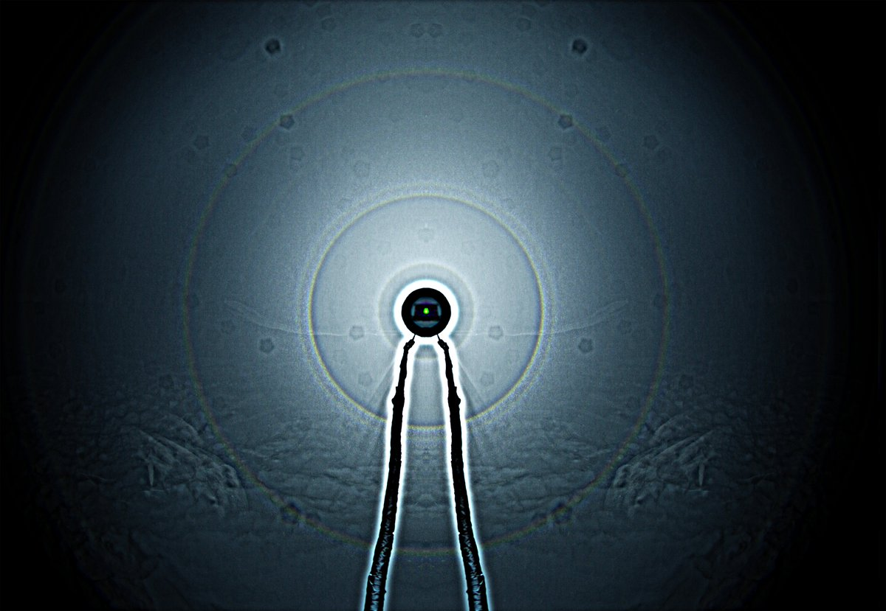
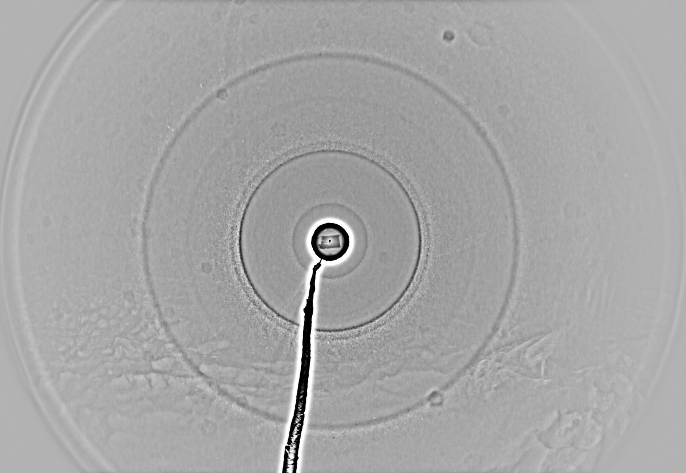
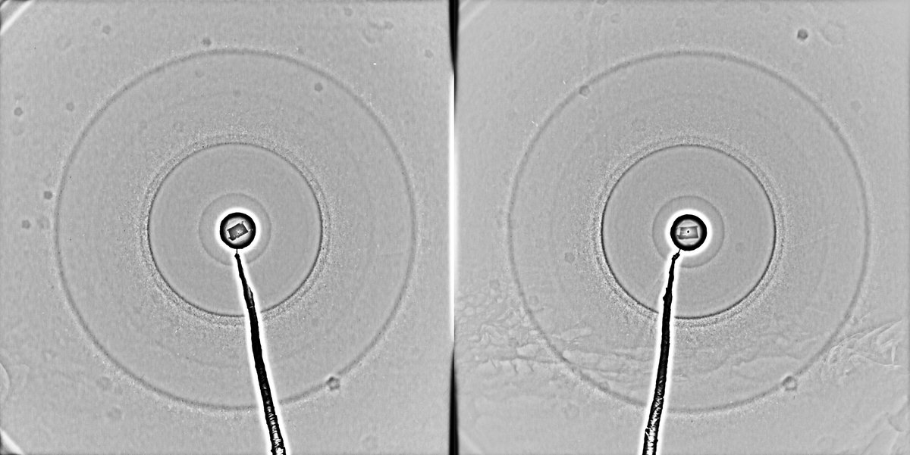
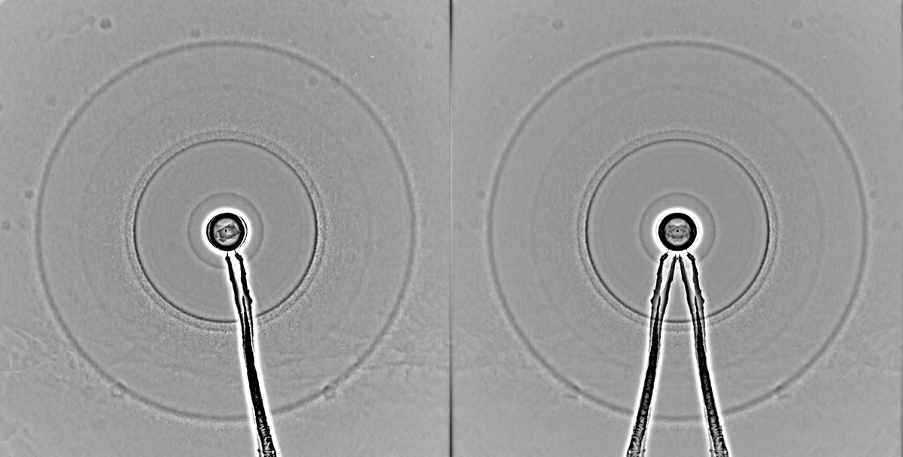

# Thread - 2024-04-06

**Original:** https://x.com/RiikonenMarko/status/1776518862374097306

---

### 1/2 - 2024-04-06 07:54 UTC

Snowpack display 4/5 April 2024, Rovaniemi. Got up at 2:30. Went to same place as the previous night, the old snow depo, the same spot, to see if there is any change. Forgot the lamp so had to make quick visit back to the apartment. Collected pristine snow, not from the area where the snow that I had thrown up the previous night had landed (it was actually slightly crusted). 70 frames stacked. Temp on the ground -32 C.

No difference whatsoever as shown by the comparison. Next post down I have stacked these two sessions.

---

### 2/2 - 2024-04-06 07:54 UTC

3/4 and 4/5 April 2024 stacked.

---

