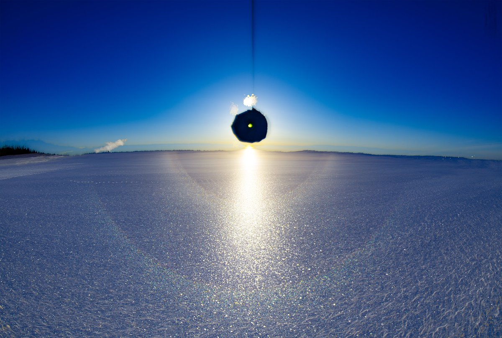
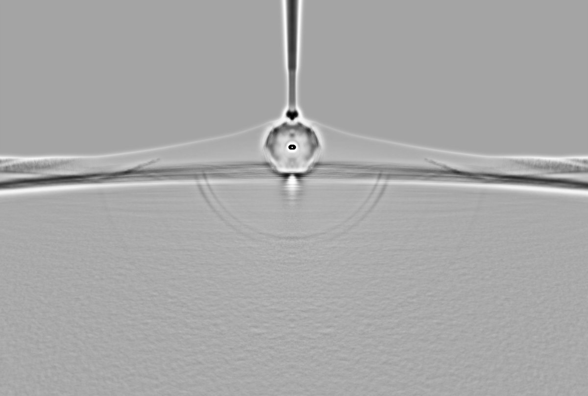
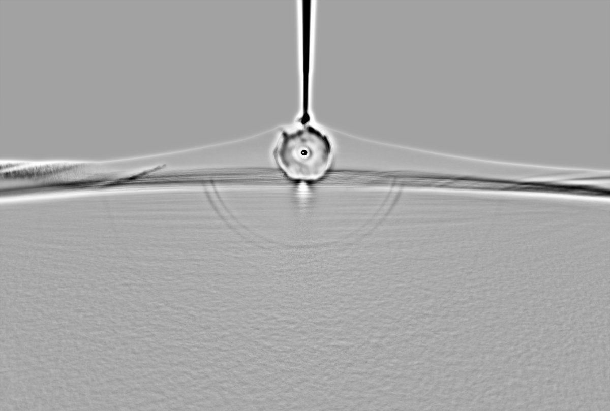
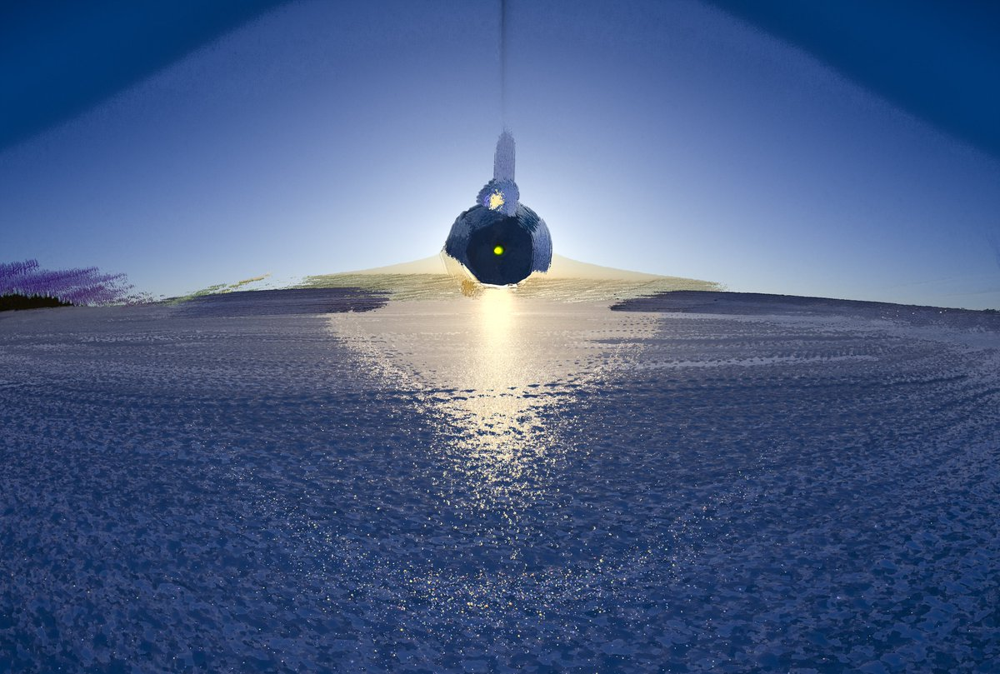
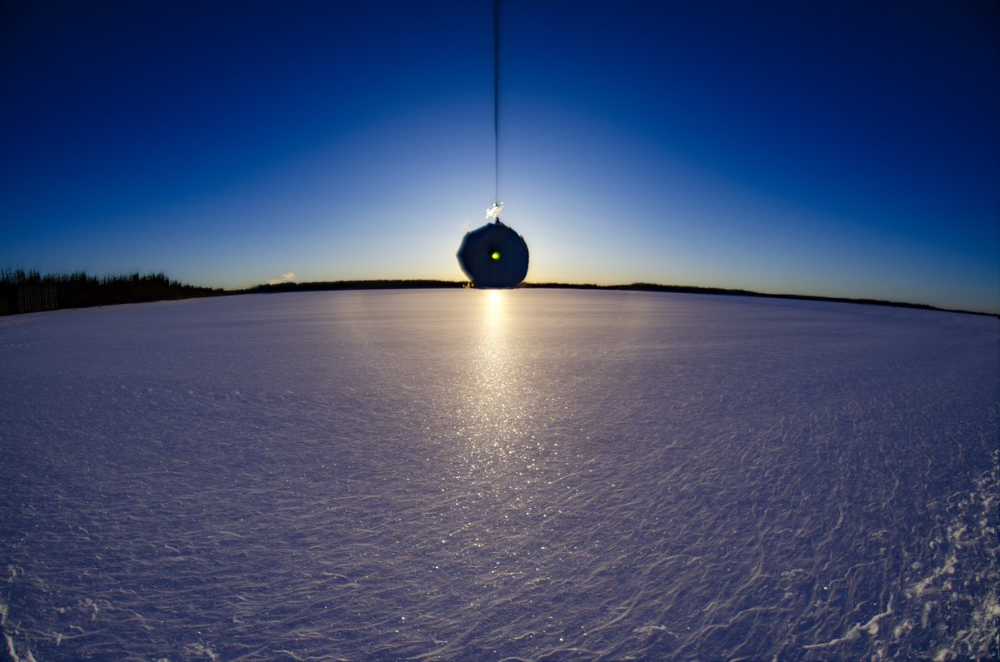
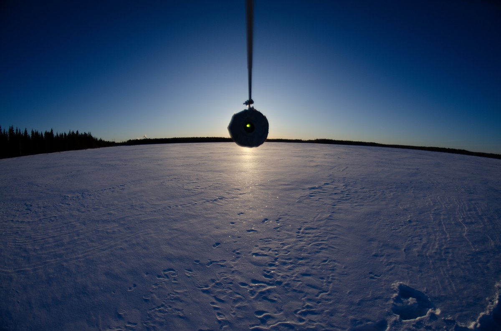
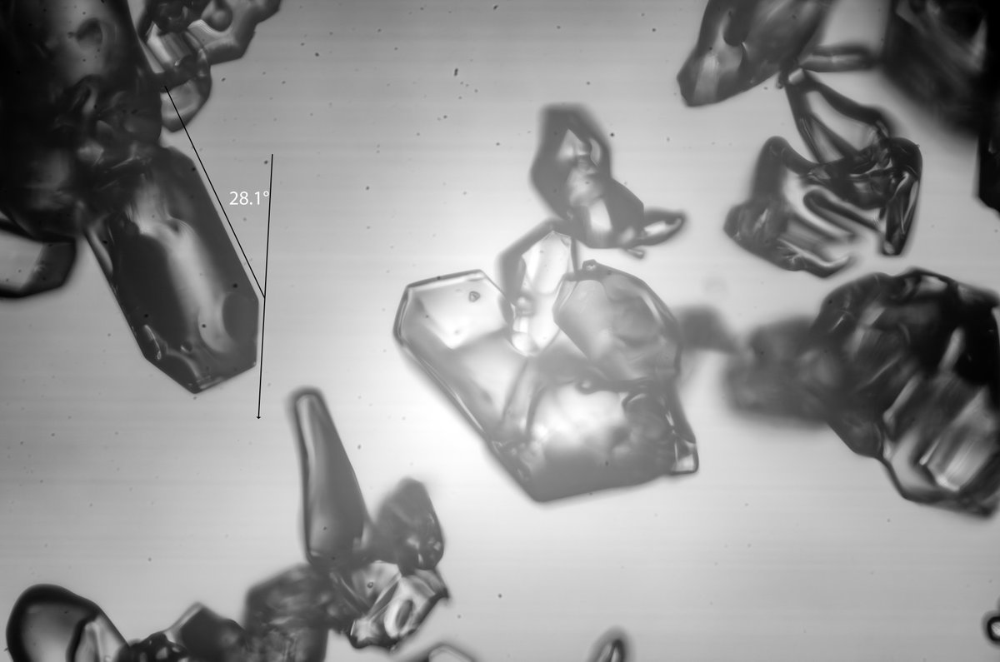
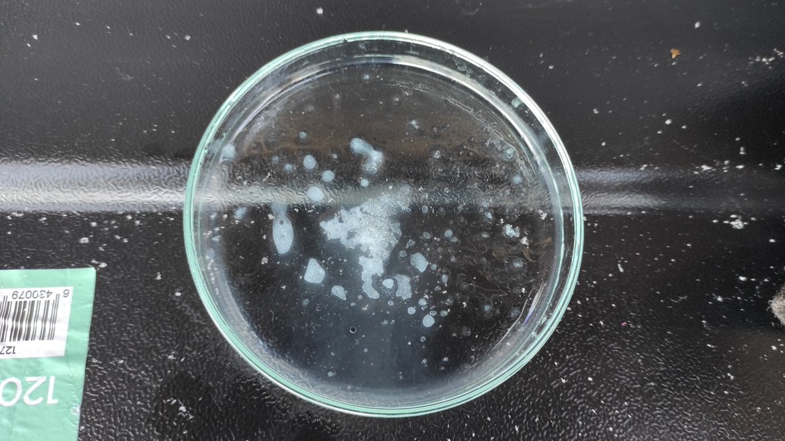
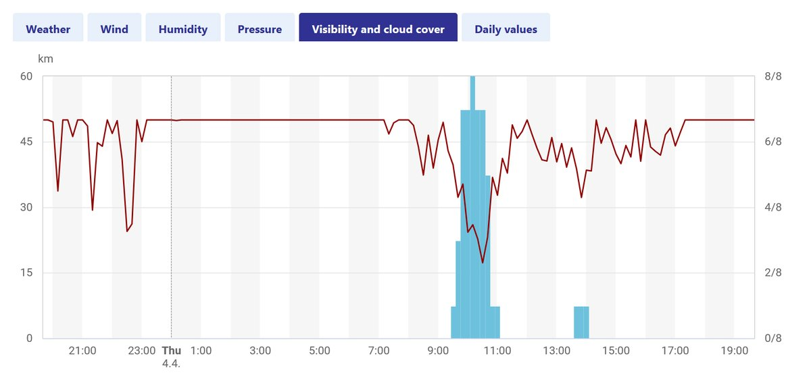

# Thread - 2024-04-06

**Original:** https://x.com/RiikonenMarko/status/1776573859283575109

---

### 1/4 - 2024-04-06 11:33 UTC

Surface display 5 April 2024, Kuolajoki, Rovaniemi. The best day of the three day odd radii streak giving visually very good 24°. However, none of the full stacks (571 frames) quite captures how I perceived it. I saw 22° halo limited at near the horizon positions and while a solid 24° halo next to it could be seen, it was ghosty, instead nearer by at oblique positions in separate crystals it was prominent. It was as if 24° halo was continuing 22° halo where it stopped. The max stack is opposite to this perception! I made smaller max stack (20 frames, next post down) to see if it would come closer to the visual. It came, but still not right.

Upon opening the trunk I realized having run out of the charcoal lighting liquid. But I had the jerrycan with E95. Lo and behold, as I dropped surface crystals into the petri dish that had this liquid, they morphed into blobs. I didn't get it until afterwards at the pump. As picked the nozzle, my eye caught a text displayed at the meter saying this E95 can be used in motors that accept 10% ethanol. So the gasoline in the jerrycan must have been this same stuff – peppered with ethanol. And water is soluble in ethanol. Now that I think back, I tried at least once this winter in diamond dust this very same gasoline and was wondering why all crystals were melted. But I had then with me also the charcoal liquid to switch to and put mentally aside the mystery of melting.

As to the crystals, it is bad without liquid because they get thick dark rim (refractive index between air and ice too high?). But I appears that I may gotten the winter's first pyramid crystal with long enough faces and right position way to allow for measuring. But even if its contours are long and straight, it seems to have suffered some rounding, so I am not sure about it. Anyway, whatever it is, the angle turned out to be exactly right.

---

### 2/4 - 2024-04-06 11:33 UTC

5 April 2024, Kuolajoki, Rovaniemi. Min stack, 20f max stack, single frame and (what appears to be) a pyramid crystal.

---

### 3/4 - 2024-04-06 11:33 UTC

5 April 2024, Kuolajoki, Rovaniemi. Crystals morphed by ethanolized E95.

---

### 4/4 - 2024-04-06 17:02 UTC

5 April 2024, Kuolajoki, Rovaniemi. I forgot a detail of some interest concerning the conditions for this display. On the previous day there was snowshower soon after I had wrapped it around 9 am. FMI data shows this event. Those crystals accounted for the increased glitter at solar vertical and most probably had a role in enhancing the display overall as compared to the two previous mornings. Between those, nothing came down from the sky.

---

