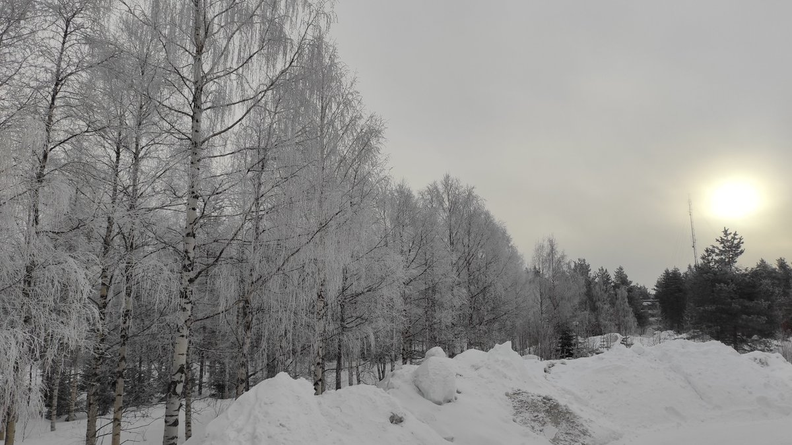

# Thread - 2024-04-07

**Original:** https://x.com/RiikonenMarko/status/1776848452078404059

---

### 1/1 - 2024-04-07 05:44 UTC

Looked like a fourth morning would be on the cards. It got foggy in the night, tree wigs getting frosty and in the morning I went driving to appraise the surface halo situation. Expectation is high with fog involved. In Kuolajoki there was opening in the fog, allowing for sunshine. The surface had frost growth but practically no glitter at all, only in the opposite side some pitiful reflection glints. As places can have stark differences, I drove to Norvalampi but it got cloudy. The photo of the frosted trees is upon returning to the apartment.

---

