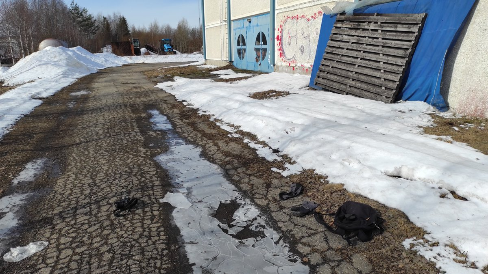
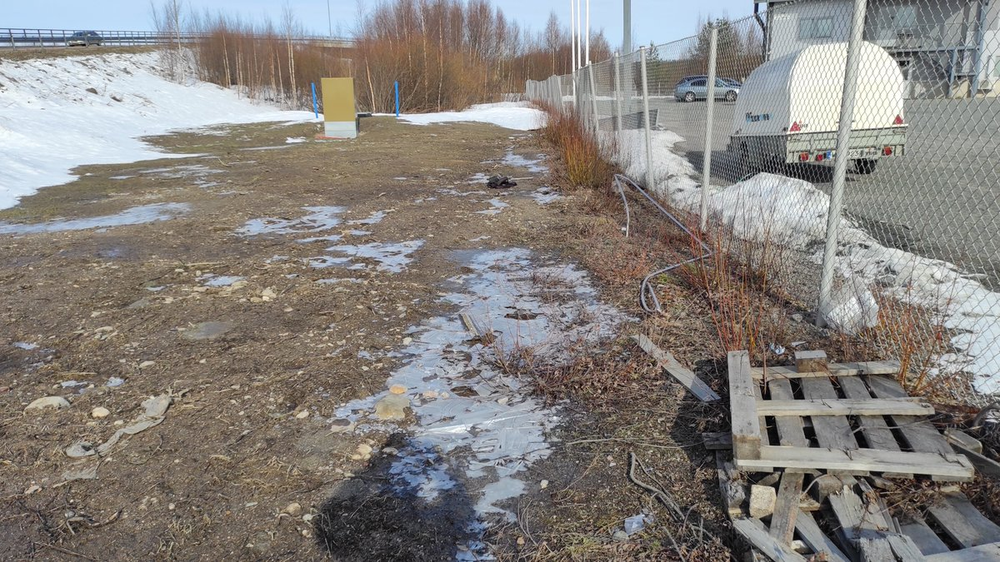

# Thread - 2024-04-17

**Original:** https://x.com/RiikonenMarko/status/1780567942599450840

---

### 1/2 - 2024-04-17 12:04 UTC

Went out with bicycle this morning (17 April 2024, Teollisuuskylä, Rovaniemi) in hope of catching displays in frozen puddle crusts. The game for this particular niche of displays in strictly formed up crystals was opened by Beata Ujvarosi on 18 January 2020 in Hungary (https://t.co/5EEpIcWufT), but I don't know anyone else since having tried their hand.

As you can see from the video my first attempt was not in vain. I have been dreaming of seeing the six pronged "Ujvarosi star" and there it was in the pieces that I broke off from the crusted puddles – both in transmitted light when looked at the direction of the sun and in reflected light when looked the opposite way.

Maybe this stuff is not particularly rare. But finding those puddles was not just hopping from one to another. After thought of having experimented enough at the first location I needed to ride some around in the industrial area to find next suitable looking puddles. You need a puddle that has drained overnight and left an ice ceiling – many were still too full of water underneath. It is easy to recognize the drained ones, they appear white.

The night had been windy and cloudy so no growth conditions existed for the upper surfaces, the crystals were solely on the crust inner surface. Railway station -5 C, Apukka - 6 C in the morning.

I have a quite a bit videos and photos, for this preliminary report two best videos will suffice, the other one focusing just on the antisolar Ujvarosi star. In both videos the inner surface is facing the camera. What's noteworthy is that there is no subparhelia when the plate is turned horizontal. If the stuff still exists the coming night, I will try to photograph crystals as it is rather important for more complete picture of what's going on. Also, I may rather need to do videos with my phone camera than D7000 even if the view angle will be much tighter. That's because the colors of spots are more washed out in D7000 videos (may be in part also due to fisheye compression). Possibly I should also give a try for Canon 80D video.

[🎬 1780567942599450840-3AuB8RyiAfjWdsxe.mp4](media/1780567942599450840-3AuB8RyiAfjWdsxe.mp4)

[🎬 1780567942599450840-gj-_i8hbaDcGSfIA.mp4](media/1780567942599450840-gj-_i8hbaDcGSfIA.mp4)

---

### 2/2 - 2024-04-17 12:04 UTC

The two locations of operations.

---

