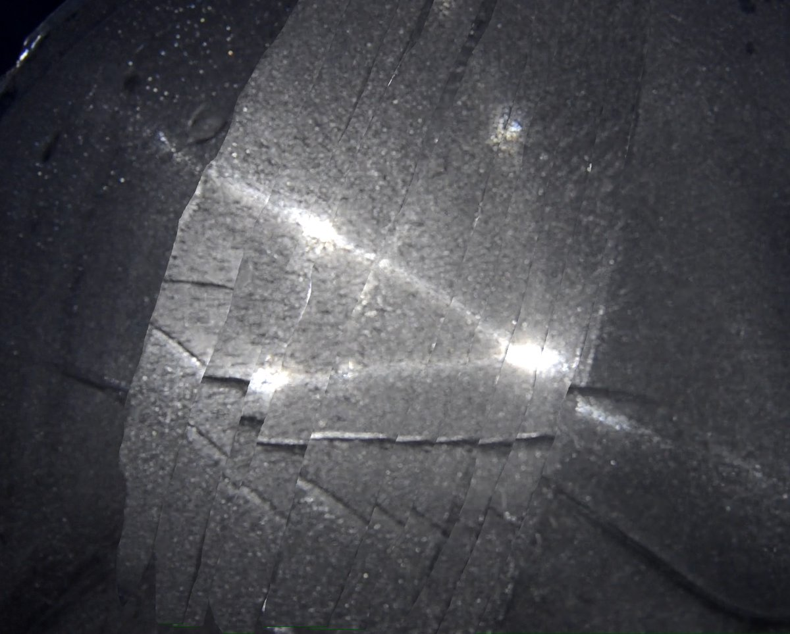
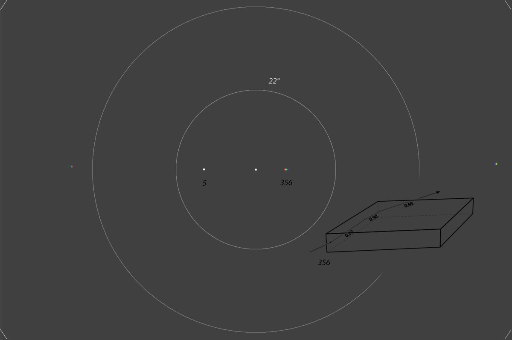
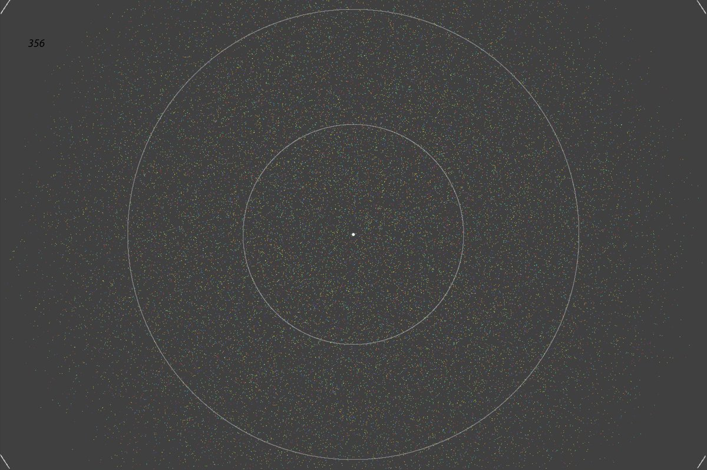
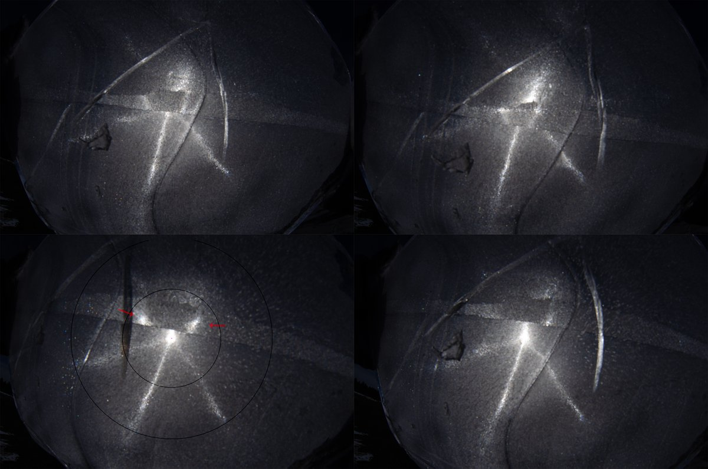

# Thread - 2024-04-21

**Original:** https://x.com/RiikonenMarko/status/1782110762132976103

---

### 1/2 - 2024-04-21 18:14 UTC

The interest in this video is in the seam that cuts across the plate (20 April 2024, old snow depo, Rovaniemi). It displays an off-set Ujvarosi star, or more precisely, segments of it. The actual sun is completely blocked when the seam crosses its position. Total internal reflection at work. 

The parhelia of this off-set Ujvarosi star are inside 22 radius. If you make simulations, then it turns out that in individual az-locked crystals it is possible to have parhelia spots inside 22 degree radius only by raypath 356. Diamond shape would seem to be the best to realize such rotated parhelia. I doubt, though, if that's how this was exactly formed. Maybe better to think the reflection and refraction separately. More like multiple scattering.

Interestingly, the off-set parhelia are brighter than the normal parhelia spots seen in the video.

At first topside is facing the camera, at 01:01 I turn it around.

[🎬 1782110762132976103-4x0jOUKyCoEaxcoh.mp4](media/1782110762132976103-4x0jOUKyCoEaxcoh.mp4)

---

### 2/2 - 2024-04-21 18:14 UTC

First is an image in which I have stitched differently positioned seams from video frames to compose a fuller picture of the off-set Ujvarosi star (20 April 2024, old snow depo, Rovaniemi). Next is a simulation showing the 356 spot at a suitable crystal rotation to place it inside 22 degree radius. This rotated parhelion can be regarded as parhelion of the reflection spot 5. The second simulation shows the extent of 356 rays. In the lower left photo of the fourth image 22 and 46° halos are drawn for scale, arrows marking the off-set parhelia spots. In this photo – and in many others that I took – there is sparse random glitter further out from the sun. I don't know how that should be characterized as it is seen across the 46 degree radius. When I took a closer look, it seemed like those glints were in crystals formed at the points of the numerous air pores going through the plate.

---

