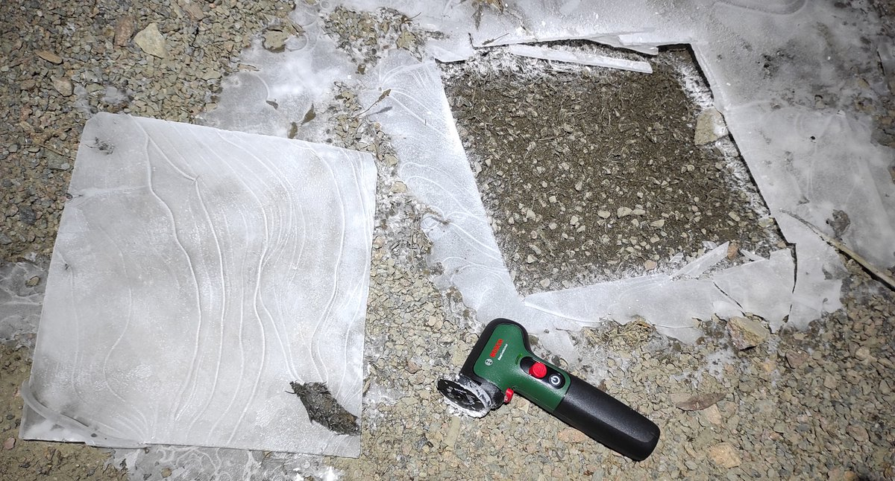
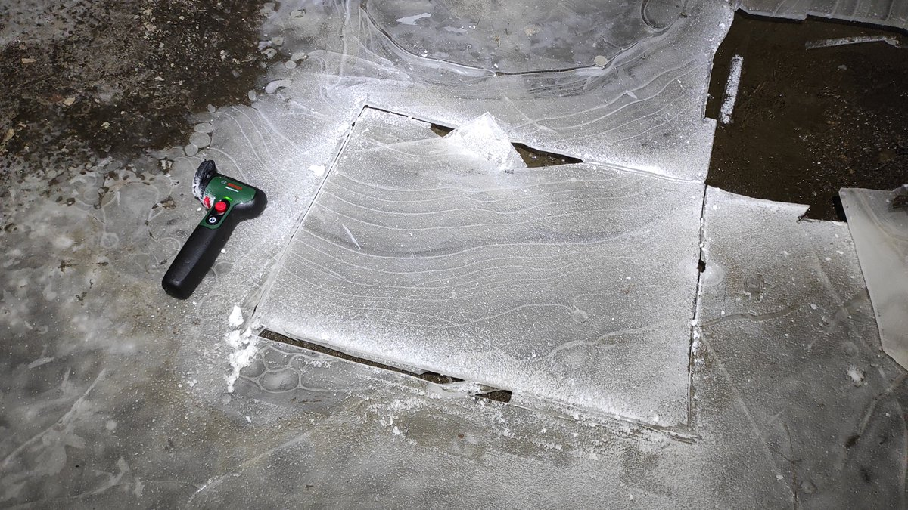

# Thread - 2024-04-21

**Original:** https://x.com/RiikonenMarko/status/1782128504689004588

---

### 1/2 - 2024-04-21 19:25 UTC

The method improves. Last night I was for the first time doing Ujvarosi stuff in spotlight beam (20/21 April 2024, old snow dump, Rovaniemi). As a consequence I feel less compelled to rush for the morning sessions. First, the stuff simply comes out better – less noise, better colors. Second, you don't need to be concerned with the heat of the day starting sublimating the crystals. Third, because the sun and the halos are not to blind you, you can actually appreciate the display visually as much as you like. In the dark I could also see from the camera screen what was going on.

The second improvement was the angle grinder I bought (next post down). It made the plate extraction a controlled, super-easy, joyous operation. I could get off some big-ass plates.

[🎬 1782128504689004588-eWYl_TVLaTimFJmQ.mp4](media/1782128504689004588-eWYl_TVLaTimFJmQ.mp4)

---

### 2/2 - 2024-04-21 19:25 UTC

20/21 April 2024, old snow dump, Rovaniemi.

---

