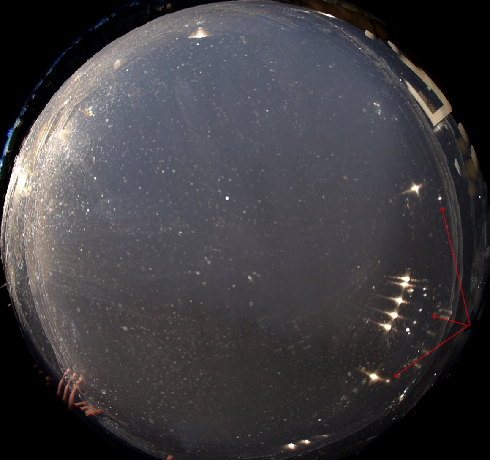
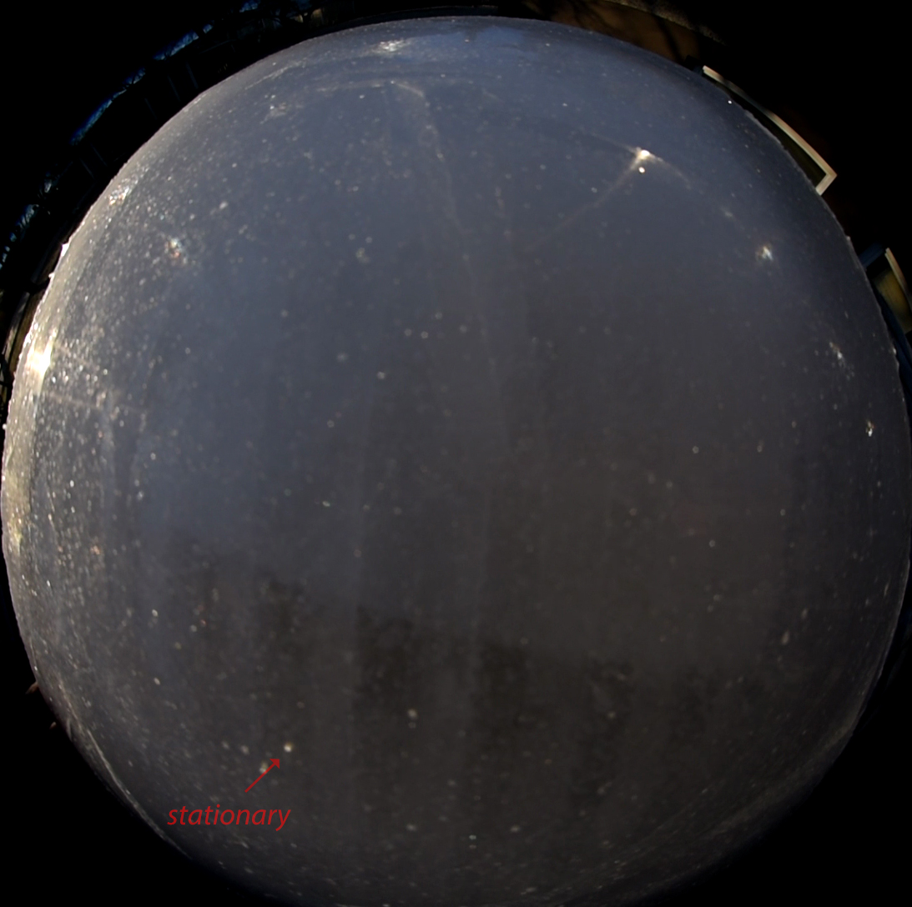

# Thread - 2024-04-22

**Original:** https://x.com/RiikonenMarko/status/1782436259064905993

---

### 1/3 - 2024-04-22 15:48 UTC

I almost threw this low quality plate away right off (20/21 April 2024, old snow dump, Rovaniemi). But then I thought interesting things can lurk anywhere. Indeed. From 00:46, when I turn the plate downside facing me, there are suddenly these neat round spots – as if I was having a visitation of the Predator himself. It reminded me of the "cultivated" plate in Tampere in 2020 (https://t.co/iJuK7AOyzd) that had some tight spots I have wondered about (next posts down). Possibly all these spots are perfect mirror images of the light source.

[🎬 1782436259064905993-71kJ6LigIPtl1gz0.mp4](media/1782436259064905993-71kJ6LigIPtl1gz0.mp4)

---

### 2/3 - 2024-04-22 15:48 UTC

The first image has lighten stacked in it seven rotations of the Tampere plate. They show a bright tiny spot following the larger spots above. In the second image, which is a single frame, is marked a singular tight spot. This is different in that it doesn't wander when the plate is rotated as shown by the trimmed clip of the full Tampere video next post down. For that reason it must be regarded as 120° parhelion spot. There is 120° parhelion spot also at the mirror location at the top, but different in habitus, puffed up like a normal halo. I have pointed out both of these 120° features in the second image of the post "Halo displays from stricly [sic] regimented crystals on ice surface" in The Halo Vault: https://t.co/zJEsmw4kUg

---

### 3/3 - 2024-04-22 15:48 UTC

A clip of the Tampere plate showing the tight and diffuse 120° spots.

[🎬 1782436267935801500-h-5SEV5OdJTj7GI-.mp4](media/1782436267935801500-h-5SEV5OdJTj7GI-.mp4)

---

