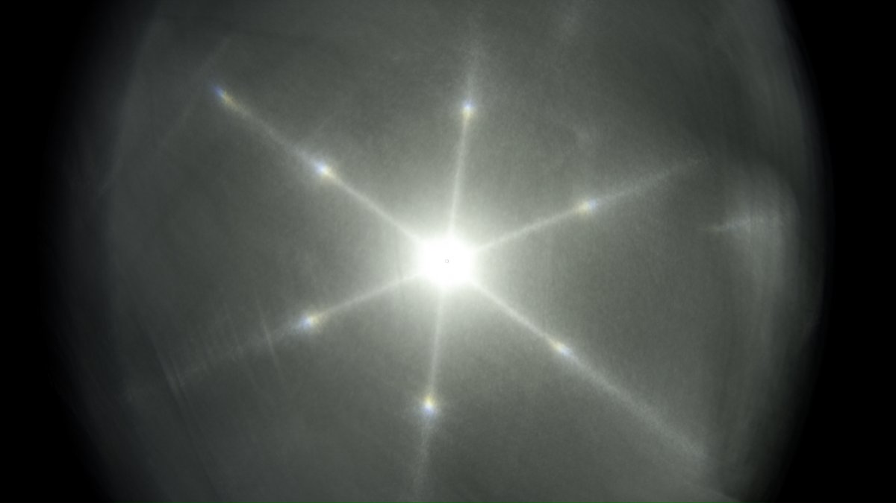
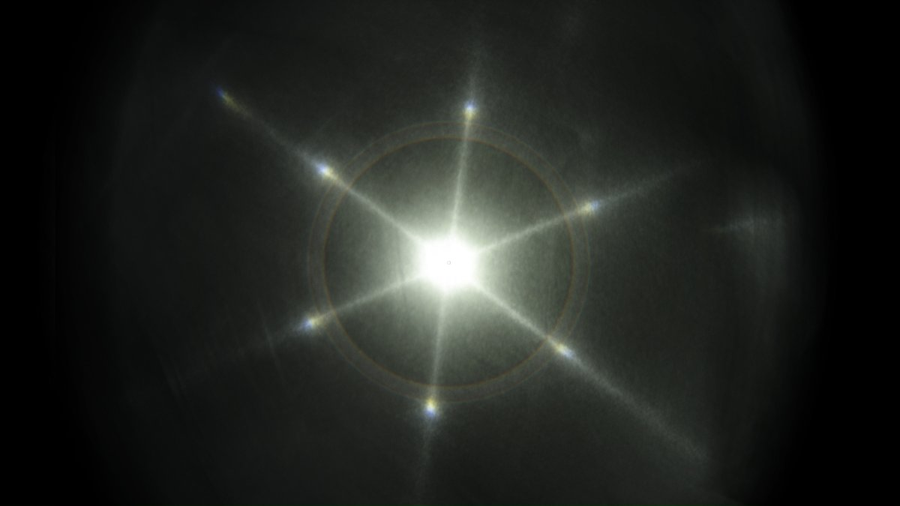
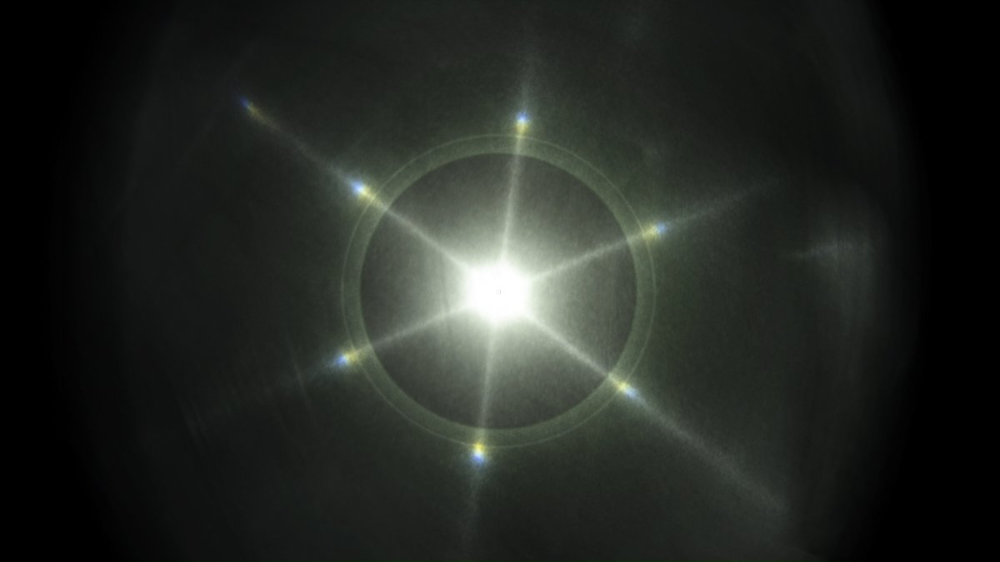
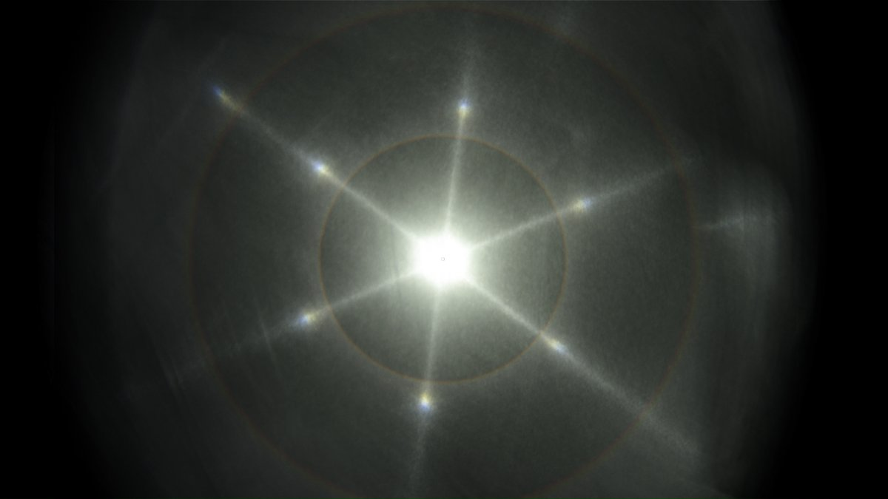
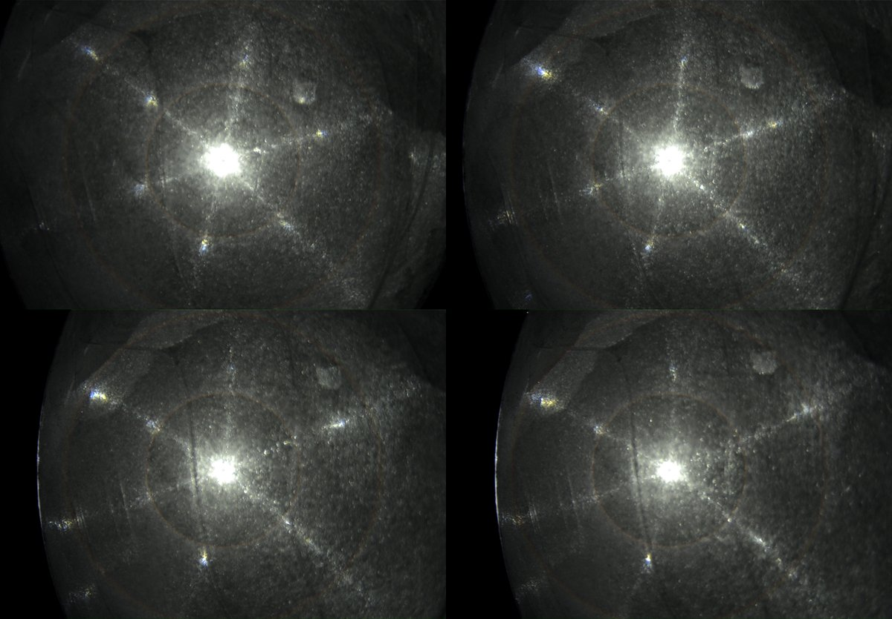

# Thread - 2024-04-27

**Original:** https://x.com/RiikonenMarko/status/1784176719865188481

---

### 1/4 - 2024-04-27 11:04 UTC

This plate was enough uniform and its orientation keeping level as I moved it across the beam to allow stacking about three dozen successive video frames (20/21 April 2024, old snow dump, Rovaniemi). To have a better sense of the angular distances, in the next post down simulated 22 and 46° halos and zenith light elevation Parry arc are added in the stack. I scaled the simulation to size by matching its 22° halo with a real photo of 22° halo taken with the same lens. The third post has the video.

---

### 2/4 - 2024-04-27 11:04 UTC

20/21 April 2024, old snow dump, Rovaniemi. The layer mode for the simulation in the first image is soft light. For the second and third image (with 22° halo and Parry) it is luminosity and soft light, respectively. The former brings out the parhelia colors better.

---

### 3/4 - 2024-04-27 11:04 UTC

20/21 April 2024, old snow dump, Rovaniemi. The stack is from 00:19-00:20.

[🎬 1784176728862028082-XgAb4hFuxgFo-a-K.mp4](media/1784176728862028082-XgAb4hFuxgFo-a-K.mp4)

---

### 4/4 - 2024-04-27 13:34 UTC

20/21 April 2024, old snow dump, Rovaniemi. This is from the same video as above (DSC8976). The 46° spot at 10 o'clock is moving inside 46 degree radius as the plate is tilted.

---

