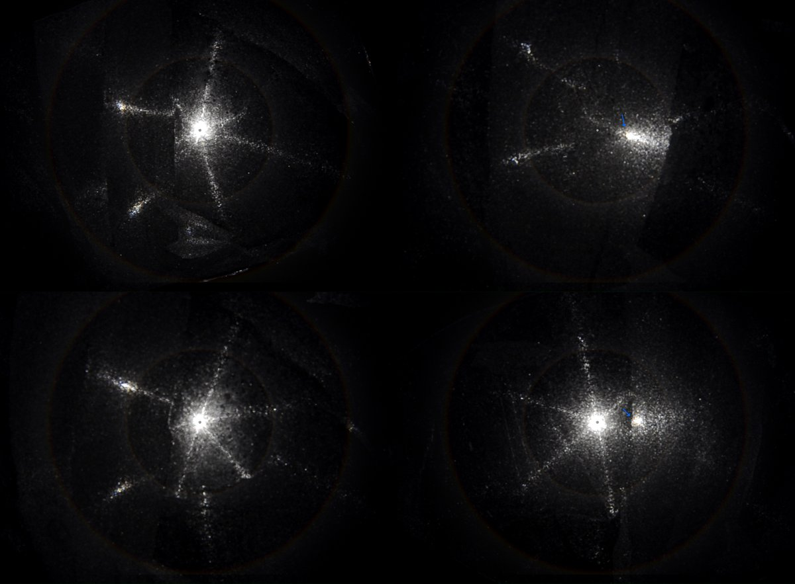
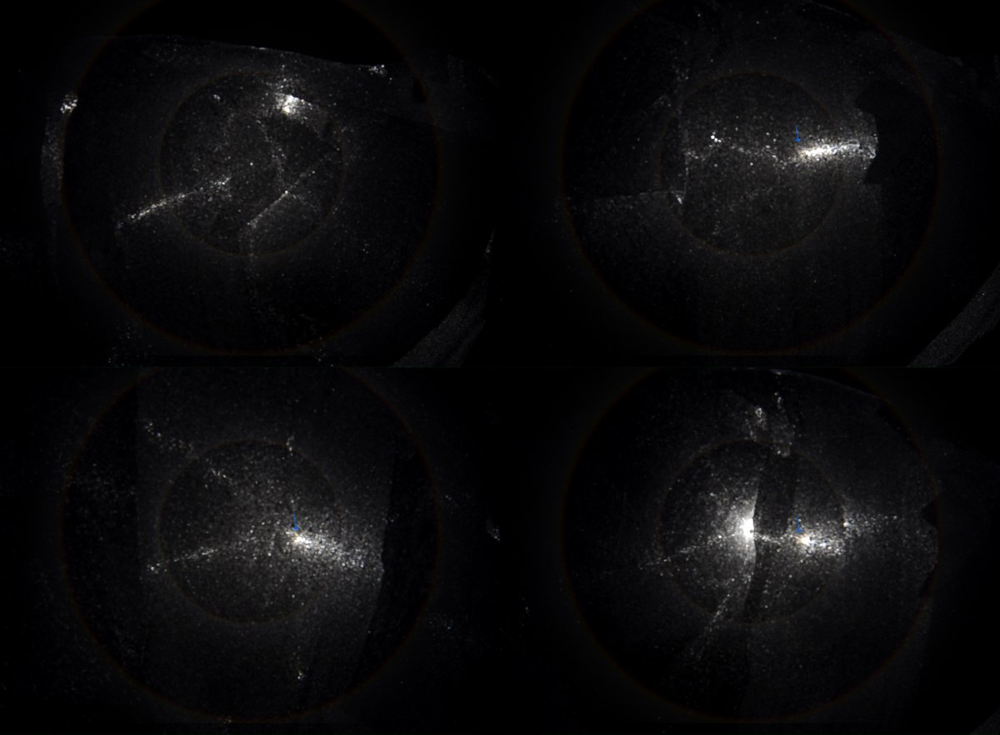
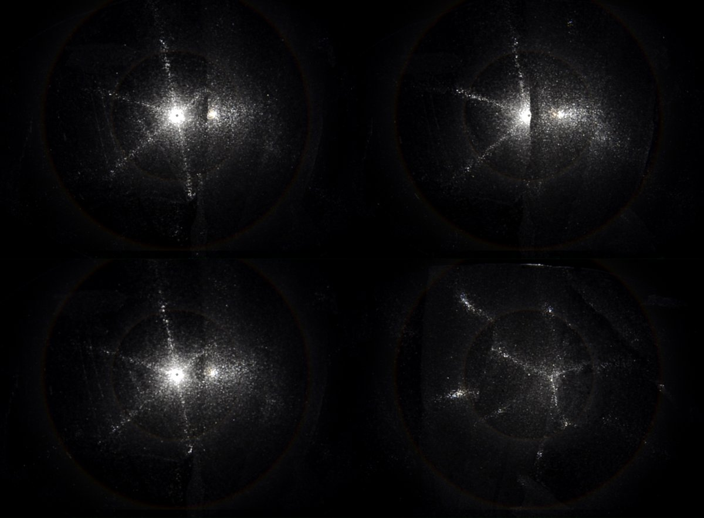
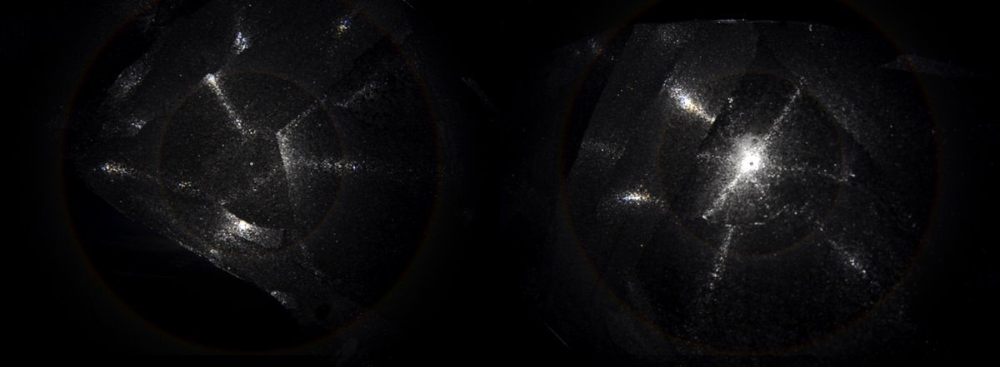
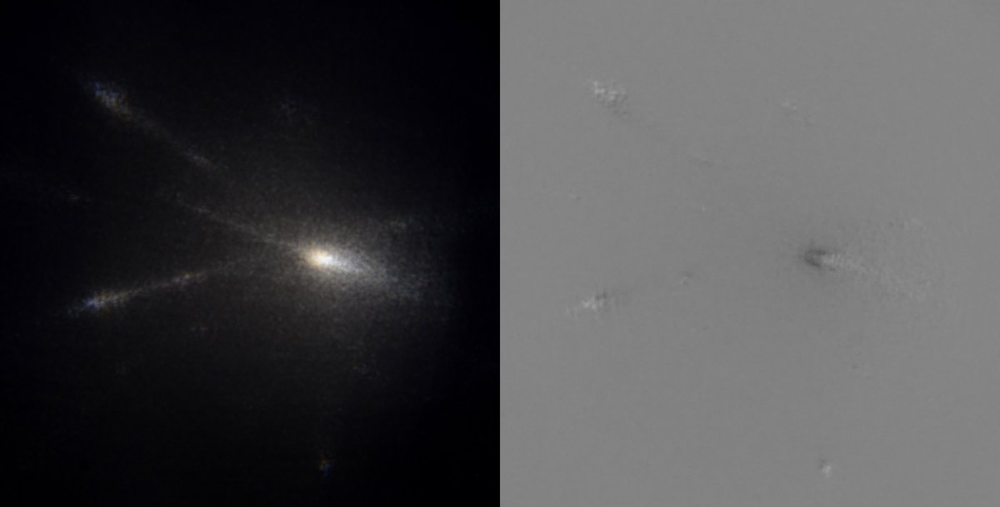
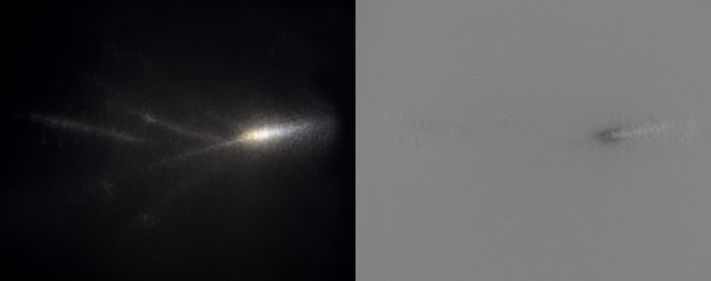
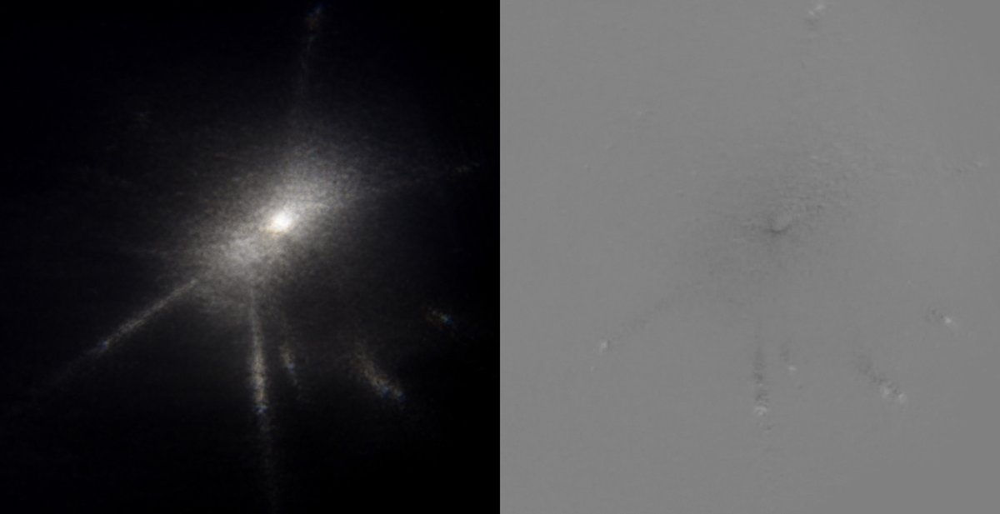
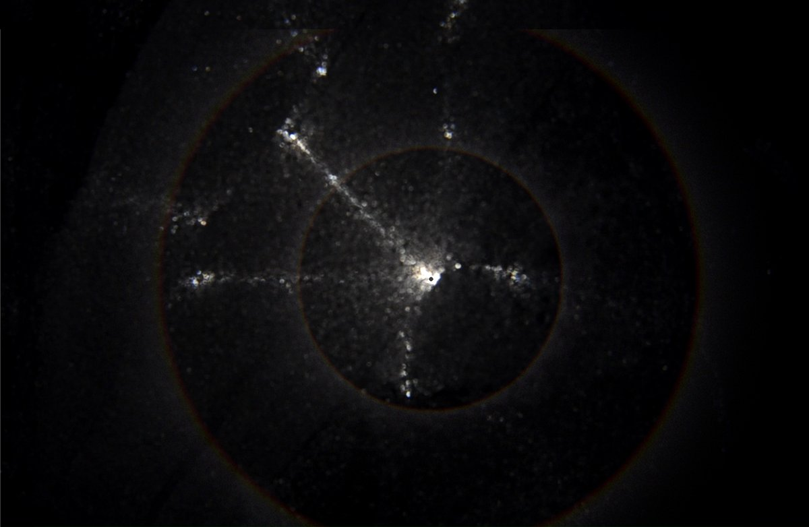

# Thread - 2024-04-29

**Original:** https://x.com/RiikonenMarko/status/1784935772736336372

---

### 1/3 - 2024-04-29 13:20 UTC

This plate has the sun completely blocked in parts (20 April 2024, old now dump, Rovaniemi, DSC8632). There seems to be a partial, off-set Ujvarosi star here, similar to the one seen in another plate: https://t.co/H4P9FUpPde But here the "fake sun" spot at the intersection of two arms has orange color on its sunward edge, suggesting refraction rather than reflection origin (in the linked display overexposure may have done away with the coloring).

Is it then the result of the angle formed by the plain upper surface and tilted crystal growth on the bottom surface? The crystals must be tilted (relative to the perfect Parry and plate orientation) in those areas where sun is blocked.

Diffraction surely is not an option here?

The underside of the plate is towards the sun until I flip it at 01:00. The colored fake sun spot continues to remain visible. But 22° parhelia spots don't form quite so easily in this configuration, something that seems to be the case with most if not all plates.

[🎬 1784935772736336372-dUcwm5rwMXtYr1M8.mp4](media/1784935772736336372-dUcwm5rwMXtYr1M8.mp4)

---

### 2/3 - 2024-04-29 13:20 UTC

Video frames with simulated 22 and 46° halos for scale. In some frames I have added arrows to denote the orange fringe on the fake sun spot.

20 April 2024, old now dump, Rovaniemi, DSC8632

---

### 3/3 - 2024-04-29 13:20 UTC

I stacked, as such, successive frames to bring out the orange fringe better. Manual alignment of the spot would have likely resulted in even a better result as the spot wanders some.

In the last photo the simulation's light source spot is centered on the fake sun spot to give sense of distance of those parhelion spots at the tip of the arms. The lower one in particular is quite far. On the upper arm, however, there seems to be a midway parhelion spot right on the 22° halo. On the video, these halfway spots (which seem to be weakly colored) on both arms are seen better. I don't really know how all these spots should be characterized.
 
20 April 2024, old now dump, Rovaniemi, DSC8632

---

