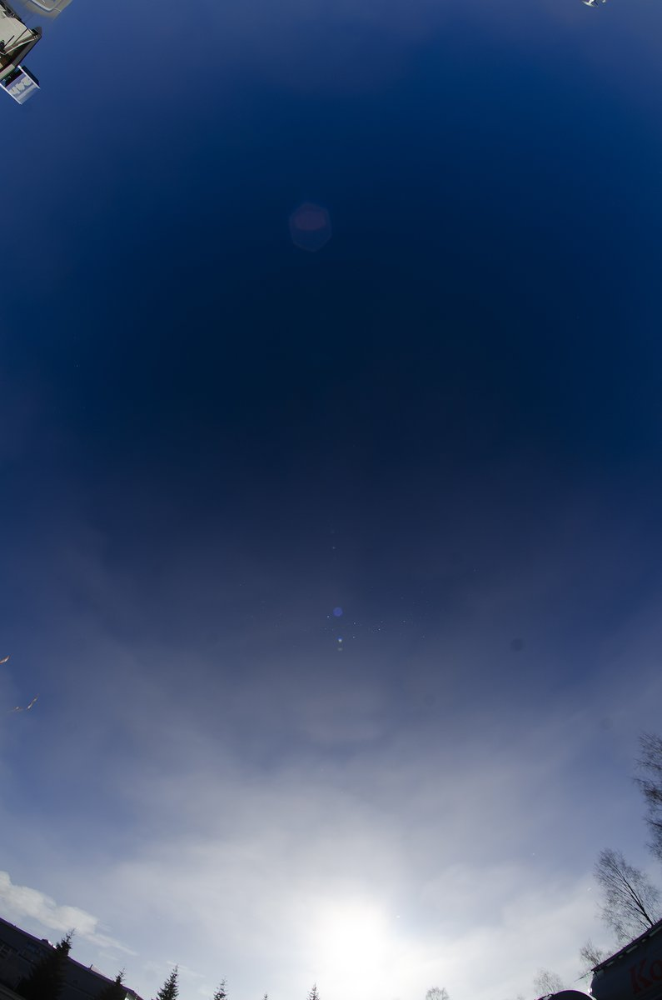
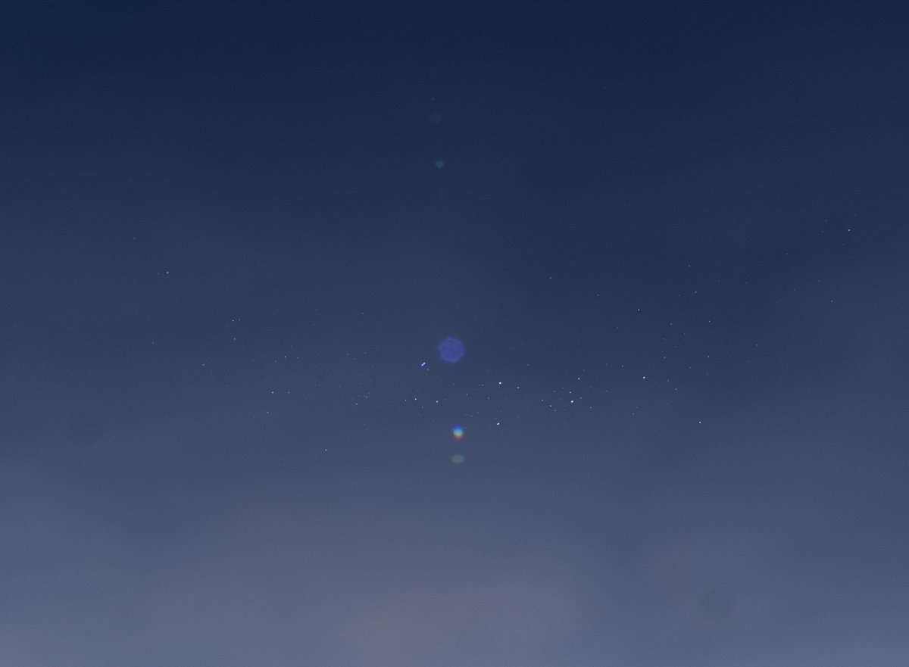
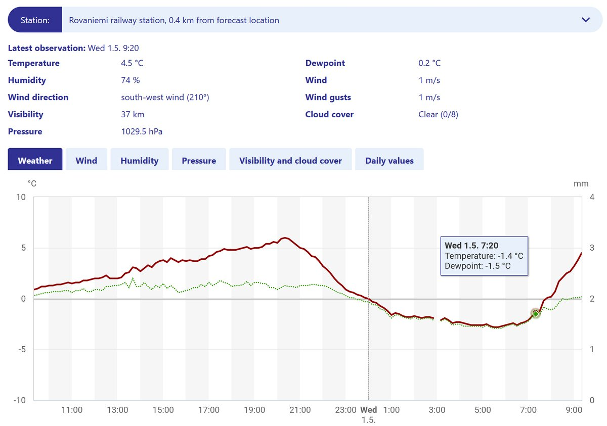
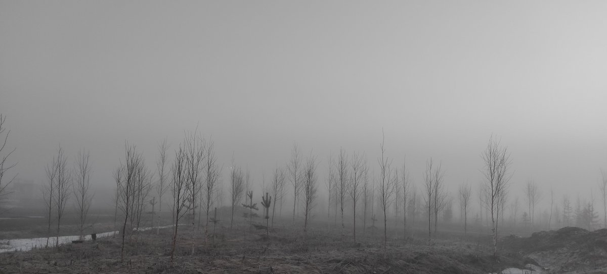
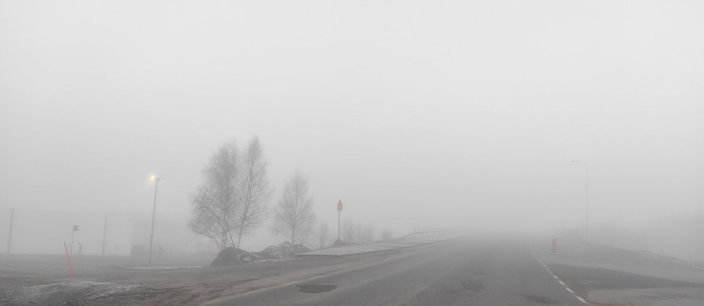
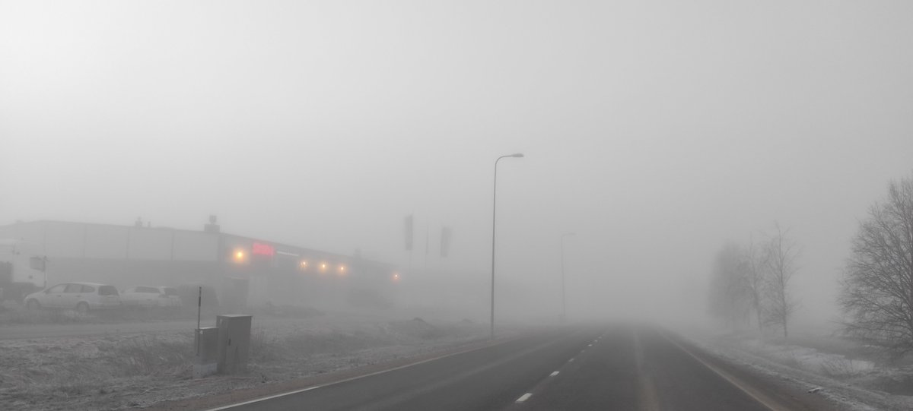
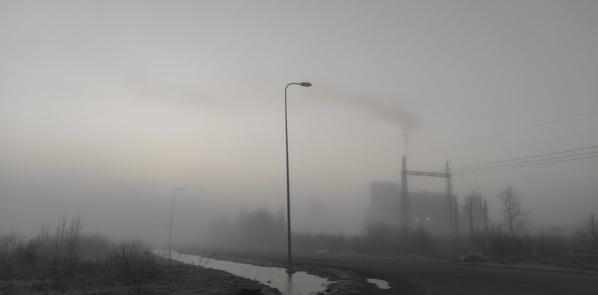

# Thread - 2024-05-01

**Original:** https://x.com/RiikonenMarko/status/1785572164344655896

---

### 1/3 - 2024-05-01 07:29 UTC

Well, the season wasn't over yet. Got this ice fog cza today, 1 May 2024, at the Neste Reissumies gas station in Rovaniemi. I had come to the scene just for this eventuality. It was foggy over large areas of the city and dissipating fogs have some tendency to turn into ice crystals, such as happened in Joensuu on 6 April 2017: https://t.co/XsWrFdovly

It was close call. When I turned to the gas station to have a look at the sky and saw cza glittering in sparse crystals, I quickly placed the camera on car roof, taking photos in 1 second interval.  After 17 photos it was gone. The image here, in full and cropped versions, is stack of these. Visually it was clear, but when a halo is not solid, you need to stack several frames to reach the visual impression.

After its disappearance I drove around and got one more much poorer occurrence. Soon after that the fog was gone.

Presumably I would have gotten a little better display had I been on the chase a bit earlier. I was out already before sunrise, but was occupied with puddle ice plates. Too long. Those displays were not that good, the night was not quite enough long and cold.

Anyway, back to this cza. The air had already warmed up some when I took the photos at 7:23. Temperature at the railway station was -1.4 C at 7:20; -1.2 C at 7:30.

Talking of late ice fogs, to my knowledge the Finnish record holder is this display in Järvenpää on 28 April 2017:
https://t.co/lB3m9g9rjI

Even if I may have now pushed that date three notches further, the Järvenpää display of course stands out as the true halo show – what I documented today was specialist stuff. It is also noteworthy that Järvenpää is located 670 km south of Rovaniemi. 

As the forecast still has below freezing night temps, it is not entirely out of question that an even later ice fog might crop up. But for the puddles the season is definitely over, the nights will be too short for proper freezing.

---

### 2/3 - 2024-05-01 14:34 UTC

Just like in sports, the halo item is made that much more interesting by looking for all kinds of records, international or national. Concerning the subject matter in the above post, I want to rise – even at the risk of coming out self-aggrandizing – an angle that is related to the lateness: the sun elevation. What is the highest sun elevation ice fog display in Finland? Yes, it appears that this record has befallen on me in the 6 April 2017 Joensuu display, the link of which is given in the above post. Sun reached 30.5 degrees just before the display vanished. I don't know any other Finnish diamond dusts that come even close, they are all below 20 degree mark. Today in Rovaniemi sun elevation was 15 degrees at the time I photographed the cza.

---

### 3/3 - 2024-05-01 16:02 UTC

Some casual photos from 1 May. In places the fog was pretty thick in the early morning.

---

