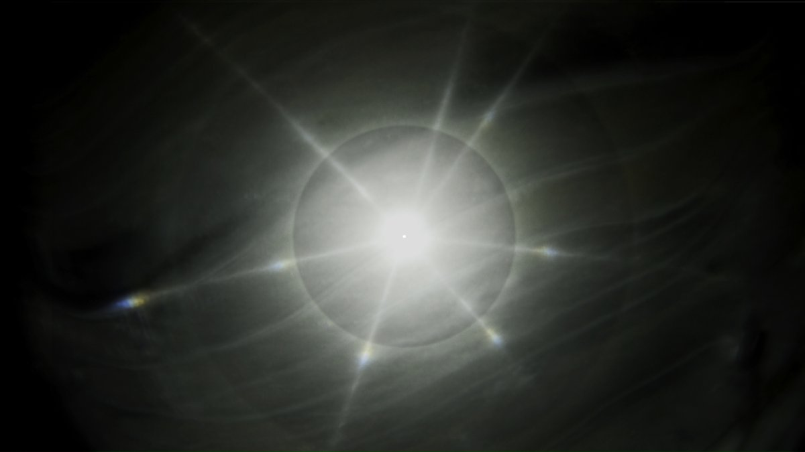
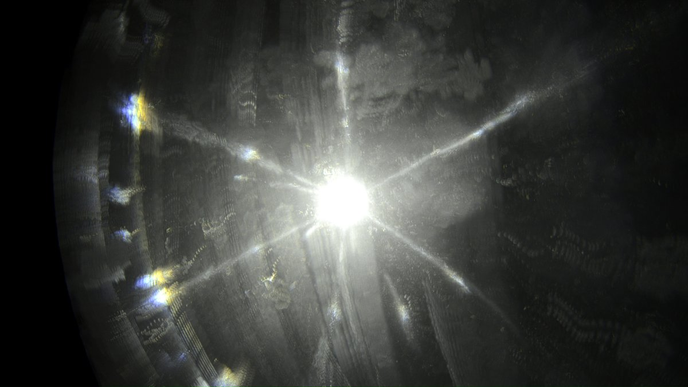
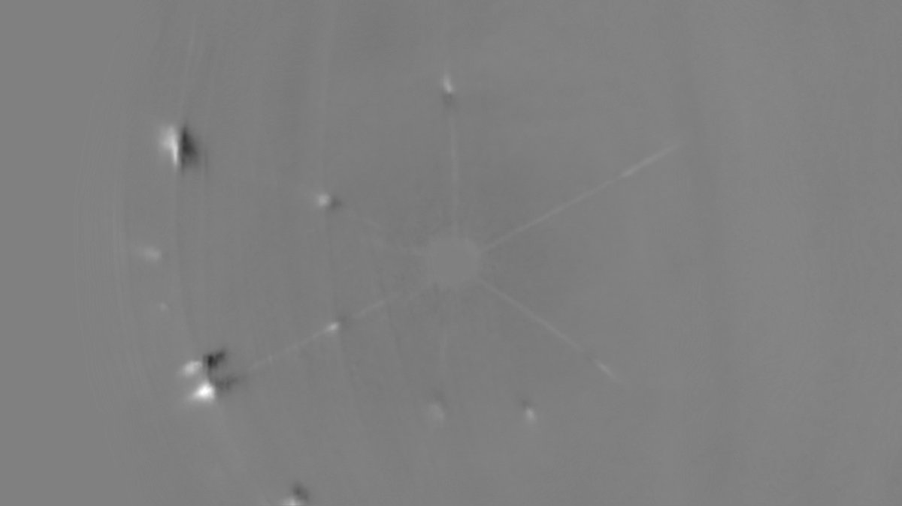
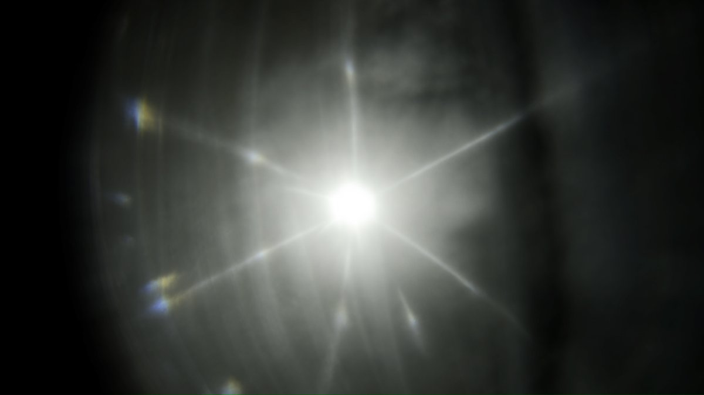
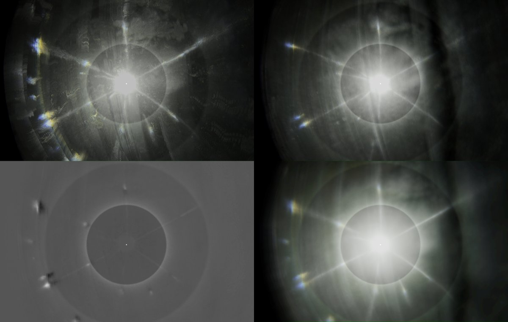
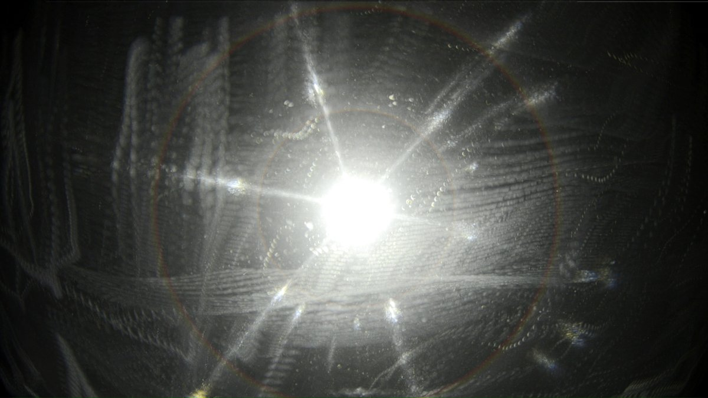
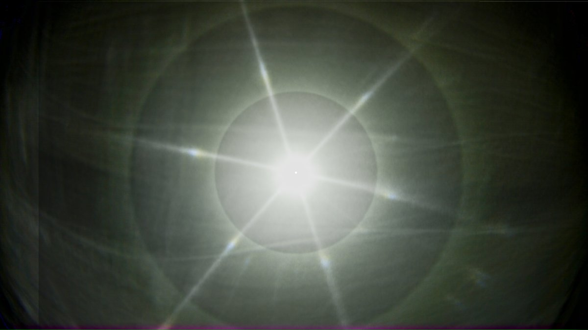

# Thread - 2024-05-02

**Original:** https://x.com/RiikonenMarko/status/1786077810060120118

---

### 1/3 - 2024-05-02 16:58 UTC

This plate has the best 46° spots so far (20/21 April 2024, old snow dump, Rovaniemi, DSC8922). First underside is facing the lamp, 01:46 I flip it around and 02:29 flip back. In the posts down, various images processed from the video are shown with and without simulated 22 and 46° halos. Mostly these are stacks. I processed also some max stacks this time.

[🎬 1786077810060120118-5n2SwFOmSK4P3F2U.mp4](media/1786077810060120118-5n2SwFOmSK4P3F2U.mp4)

---

### 2/3 - 2024-05-02 16:58 UTC

20/21 April, old snow dump, Rovaniemi, DSC8922.

---

### 3/3 - 2024-05-02 16:58 UTC

---

