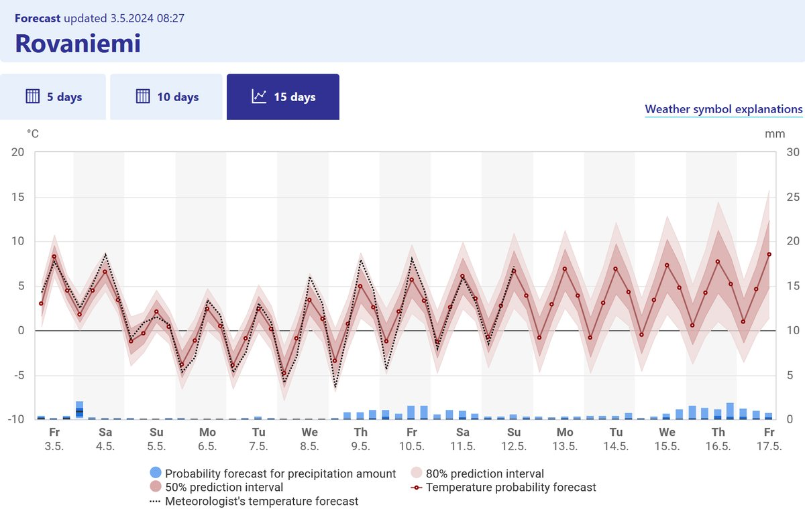

# Thread - 2024-05-03

**Original:** https://x.com/RiikonenMarko/status/1786273714151018724

---

### 1/1 - 2024-05-03 05:56 UTC

As the FMI graph shows, it is turning pretty cold, but also windy (not shown in this graph) which is not good for ice fog. However, often it is calmer at night than what they say. Are even Ujvarosi displays possible? If it is overcast during the day, then yes. If it is sunny then the dark ground may have heated up too much to cool enough during the short night.

---

