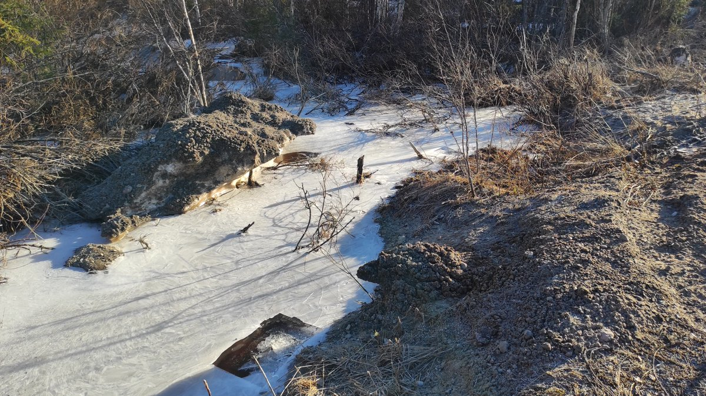
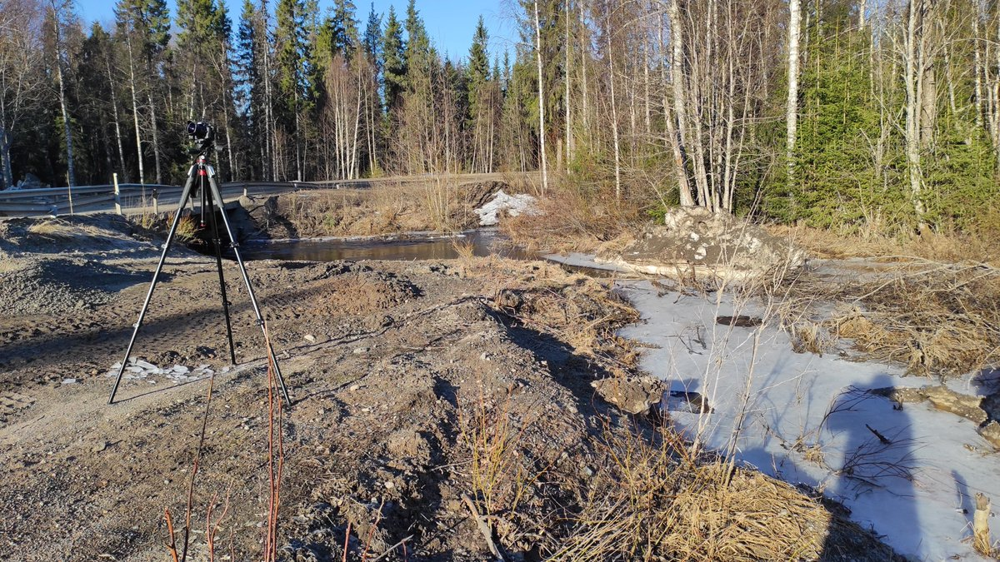
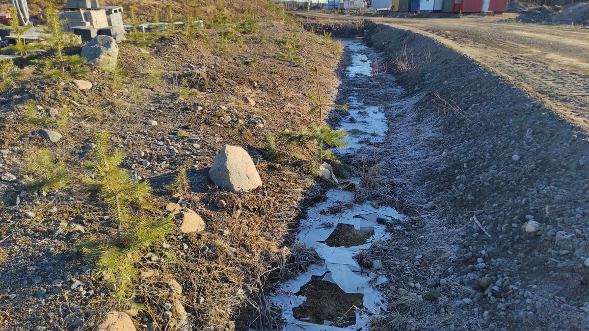
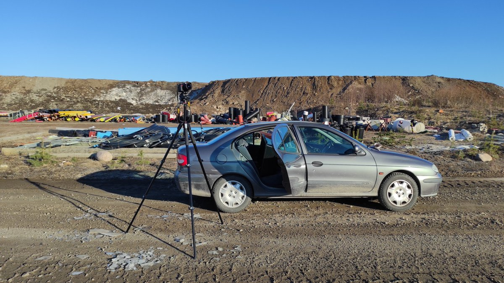
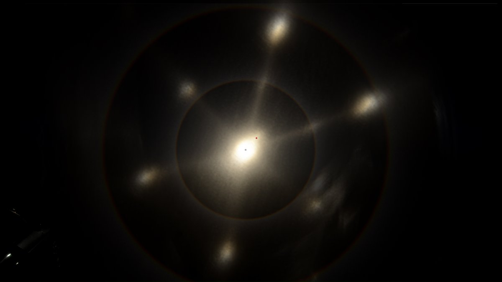
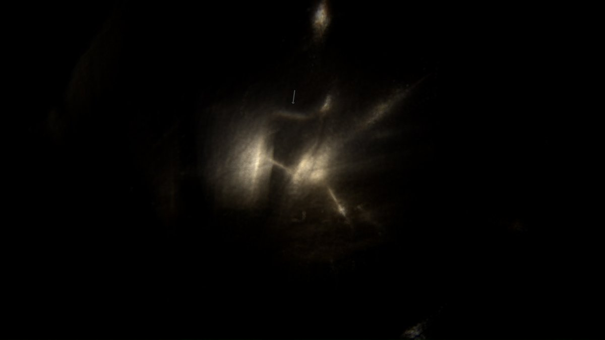
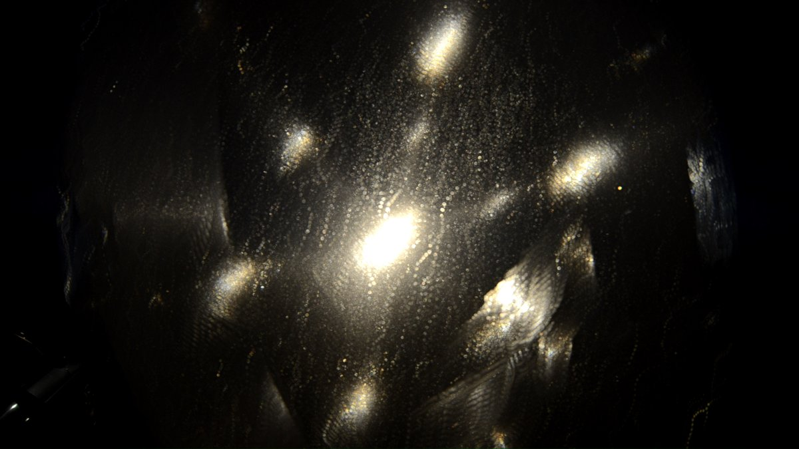

# Thread - 2024-05-10

**Original:** https://x.com/RiikonenMarko/status/1788834515269427595

---

### 1/6 - 2024-05-10 07:32 UTC

In an earlier post I thus declared: "but for the puddles the season is definitely over, the nights will be too short for proper freezing". Far from it. The post concerned the stuff on 1 May and now we had two more cold nights, 7/8 and 8/9 May. I skipped the first morning, the resulting hang-over of which made sure I was there on the second morning. Alarm clock had me waking up at 3:30, the sunrise being at 3:59.

I went to Anttilanvaara where I cut ice plates in three places. Here is video of plate that I extracted from large frozen surface next to a little brook. It has a lot of differently grown parts, resulting in a lot of spots.

9 May 2024, Anttilanvaara, Rovaniemi, DSC9145.

[🎬 1788834515269427595-X937_xMvQHZxITAM.mp4](media/1788834515269427595-X937_xMvQHZxITAM.mp4)

---

### 2/6 - 2024-05-10 07:32 UTC

The location for the above video.

---

### 3/6 - 2024-05-10 08:33 UTC

Another plate from 9 May morning in Anttilanvaara (DSC9135). The feature of interest here is the faint colored bridge connecting the parhelia spots. I had suspected it already in some earlier ice plates, but here there is not doubt about it. It shows particularly well at 0:46 above the sun. Unlike the arc of light between the white spots (https://t.co/jtqiNXZnv6), this one looks straight. Gotta try next season to capture the complete hexagon of it.

Underside towards the sun first, from 0:55 towards me. The bridge is seen in both configurations.

[🎬 1788849728685212103-REA07w290GSQ_tgh.mp4](media/1788849728685212103-REA07w290GSQ_tgh.mp4)

---

### 4/6 - 2024-05-10 08:33 UTC

The plate in the above video was from this ditch. As sun climbs higher, such shadowy shelters keep crystals longer fresh.

---

### 5/6 - 2024-05-10 10:57 UTC

This plate (DSC9133) from 9 May in Anttilanvaara has its own set of interesting features, clarified in next post down. First, there is seen glimpses of what looks like a colored stripe, such as at 1:14. Second, the distances of the parhelia spots at the beginning of the video on the two arms in the 12 to 3 o'clock segment are rather curious. It turns out, when the real sun position is plotted over, that the whole shebang is off-set. Also noteworthy is how extremely bright the parhelia are at some points in the video. Not much exaggeration to say that they are as bright as the sun. I don't look at these plates at all when operating in sun light, just through the camera display. The visual pleasures must wait for when the nights are again dark and spotlight can be used.

The video stars with the underside towards the sun, at 1:13 I flip it around.

[🎬 1788886043220996386-EA3sjFyQnxkd8kFF.mp4](media/1788886043220996386-EA3sjFyQnxkd8kFF.mp4)

---

### 6/6 - 2024-05-10 10:57 UTC

First image: 16 frames stacked from 1:14 to show the colored stripe.
Second image: 56 frames average stacked from the beginning. Red dot marks the true sun position.
Third image: same max stacked
DSC9133

---

