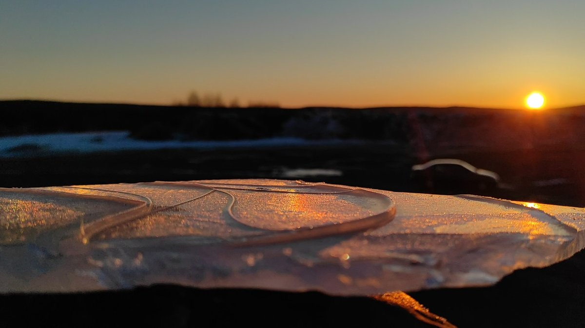
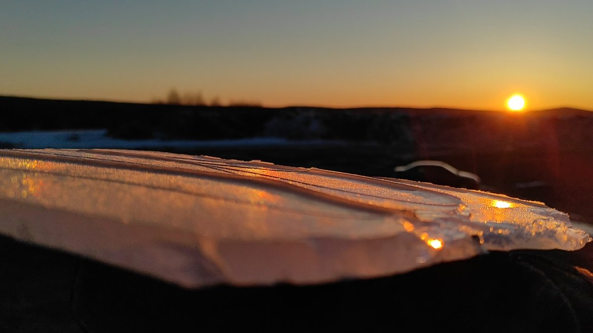

# Thread - 2024-05-12

**Original:** https://x.com/RiikonenMarko/status/1789701321890668859

---

### 1/2 - 2024-05-12 16:57 UTC

I wonder if that's a double hit subparhelion spot (a path through two 60 degree prisms) at the very left of the view (0:02-0:07)? We see instances of normal subparhelion spots, which get doubled and swapping places at some ice plate rotations (e.g. 0:07-0:09), just as they should. Then there are also white arcs sweeping by, though the very low sun has given them reddish dressing.

Well, let's call it only suggestive at this stage, there are lots of funny things going on in these plates and some other explanation may apply. But here is one more thing to pay attention to in the coming season. What needs to be made is some kind of rotating stand – possibly motorized for the smoothest motion – on which to place the ice plates. Next post down are two frames from the video.

19 April 2024, Ylikylä Snow deposit, Rovaniemi, VID_20240419_054032

[🎬 1789701321890668859-UEuLHRmAVeP0ZwH0.mp4](media/1789701321890668859-UEuLHRmAVeP0ZwH0.mp4)

---

### 2/2 - 2024-05-12 16:57 UTC

19 April 2024, Ylikylä Snow deposit, Rovaniemi, VID_20240419_054032

---

