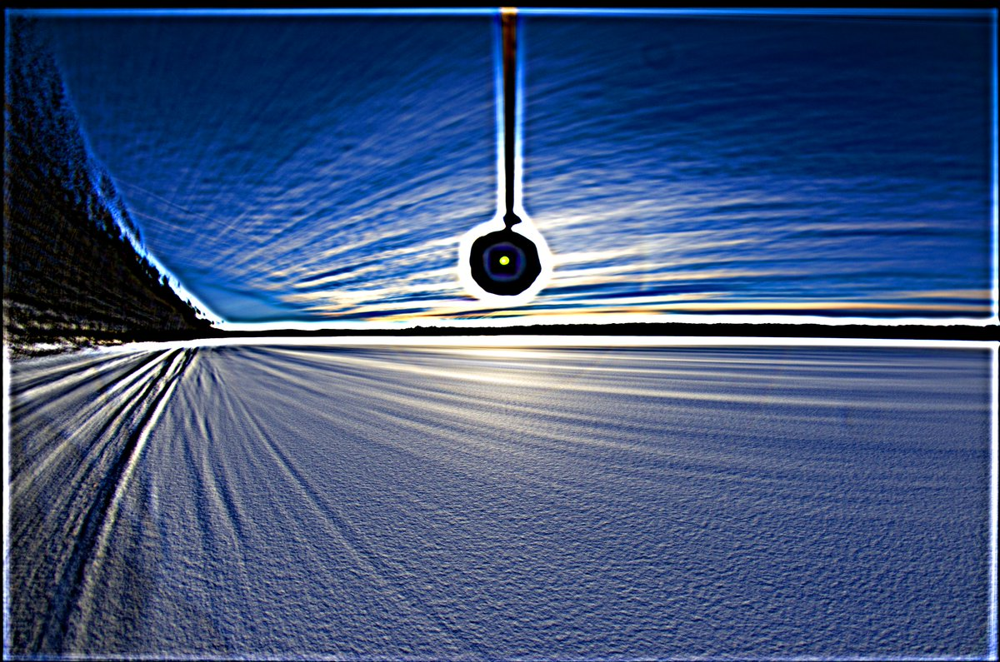
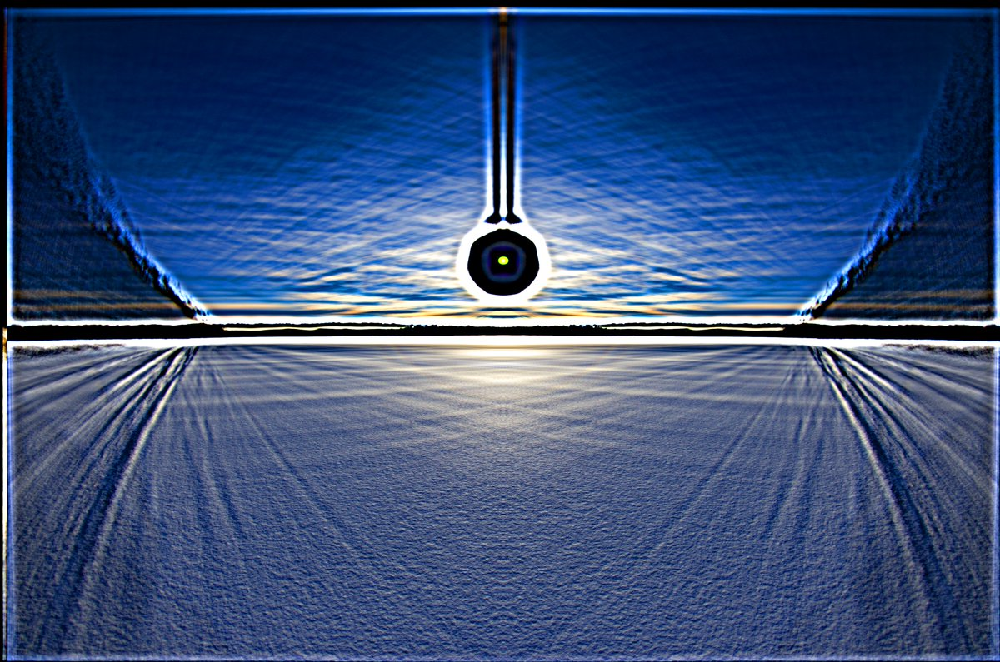
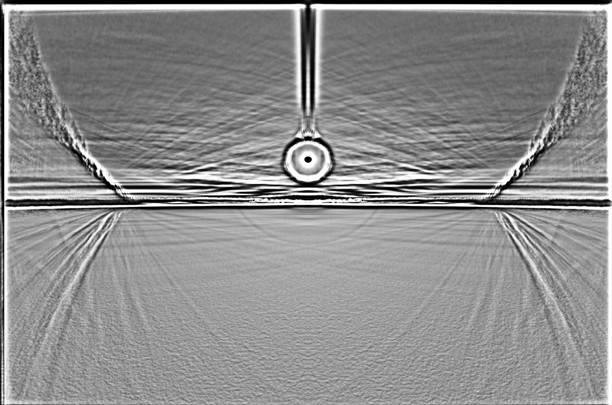
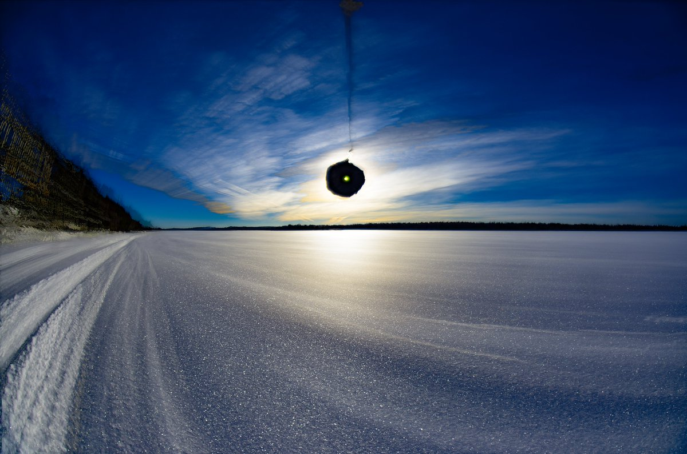

# Thread - 2024-05-31

**Original:** https://x.com/RiikonenMarko/status/1796497047471685772

---

### 1/1 - 2024-05-31 11:00 UTC

I thought I still had one surface display waiting to be stacked but for the life of me couldn't find it – until now. It is a display on 19 February 2024, at Lietesaari, Rovaniemi. A short note on the visual is found in an earlier post (https://t.co/S5KcA7HlgJ) : "The display itself was very poor, it took some time before I could discern 46° halo, about the 22° halo I could not say for sure. But I expect it to come out in the stack." 

Indeed, in the versions of the average stack the 22° halo is clear and also weak 24° halo is present. And the max stack, which is always close to visual impression what comes to the halos that were possible to see, is vague on the 22° halo.

All are versions of a 246 frame stack.

The great majority of the surface displays were odd radii last winter. I need to see at some point what's the final tally.

---

