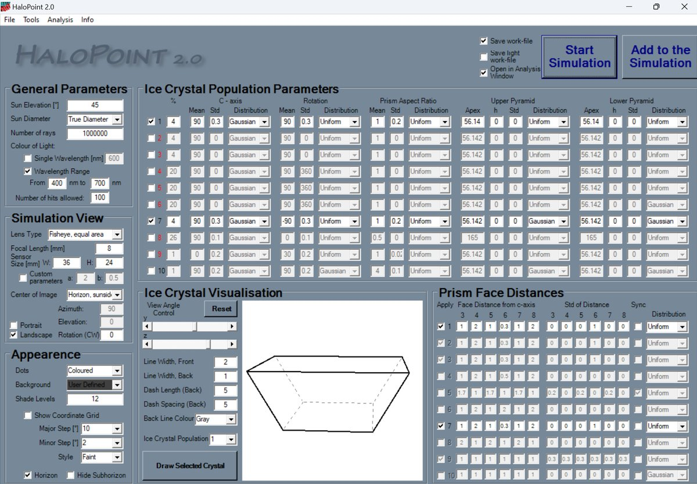
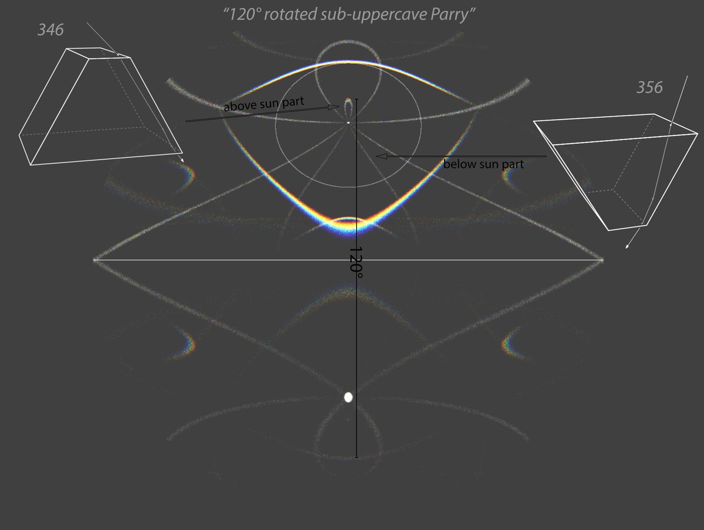
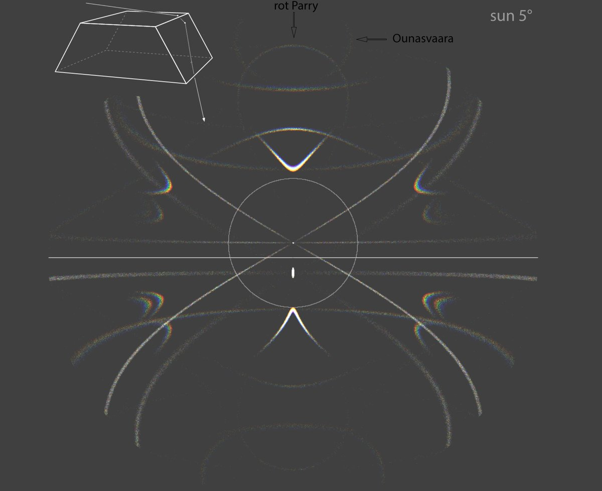

# Thread - 2024-06-05

**Original:** https://x.com/RiikonenMarko/status/1798387995524899163

---

### 1/1 - 2024-06-05 16:14 UTC

Just putting this here for my reference. "120° rotated sup-uppercave Parry".  The above sun part should be possible, actually I am a bit surprised that in Ounasvaara displays we have not yet seen this (3rd image shows low sun situation). The below sun part is made by the same crystals as the above part, but rotated 180 degrees. May be that such orientation is not realistic, that tabulars, just like (semi)triangulars, fall with their blunt end down. This halo is also made by semitriangulars, but less well.

---

