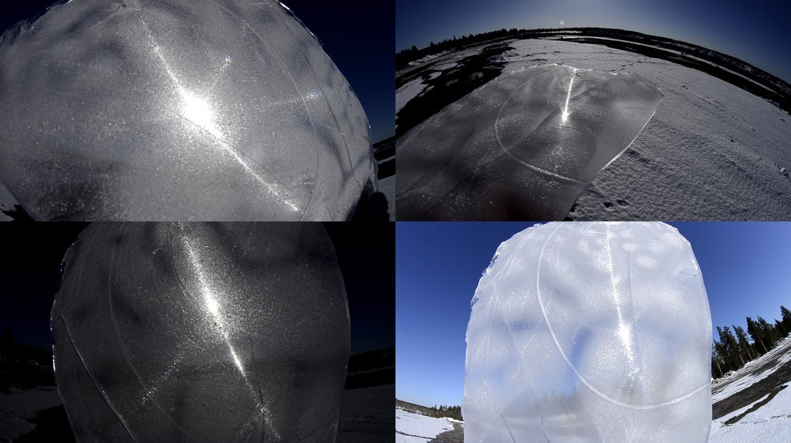

# Thread - 2024-06-06

**Original:** https://x.com/RiikonenMarko/status/1798685318691840369

---

### 1/3 - 2024-06-06 11:56 UTC

Variation on the theme: a plate in which one of the three white arcs dominates (19 April 2024, old snowdump, DSC8328). I think this is the only such plate I got. Video in the next post down.

White arcs may not be regarded as halos, at least in the sense that the colored spots are. Strictly locked crystals don't make these arcs, in HaloPoint you need to employ a separate population of spinning crystals. Con bravura, Martikainen modelled them by scratching straight lines on plastic plate at 60 degree angles: https://t.co/MOXqx2pKi8

But I'd guess it is still at least an partially open question of how white arcs are made in a perfectly regimented crystal growth that has only certain precise angles. There should be only spots. 

In the first video of that post are shown the crystals. It is instructive on the photographing difficulties I have faced. You need to get the light fall on the crystals at a precise angle to light them up, otherwise you see only some vague resemblance of the thing. This season I didn't manage not once to get the growth light up no matter how I was moving the headlight around microscope and got quickly demoralized. But next season the technique must be mastered, it won't do just photograph the plates, we need answers.

In general, there is so much questions. In addition to getting to see what's going on at the crystal level in different plates, we of course need simulations. Even if the HaloPoint has azlock feature, simulations using singular convex crystals take you only so far. But I'd guess bespoke simulations of this stuff isn't nearly the easiest of tasks.

---

### 2/3 - 2024-06-06 11:56 UTC

19 April 2024, old snowdump, DSC8328. Underside first towards the camera, 0:54 towards the sun. From 1:23 reflection configuration (or whatever it should be called).

[🎬 1798685323897049200-ibXdkQs-g8teZbcQ.mp4](media/1798685323897049200-ibXdkQs-g8teZbcQ.mp4)

---

### 3/3 - 2024-06-09 10:52 UTC

Correction, the orientations for DSC8328 are opposite to what I stated, starting with underside towards sun. I did not have that info recorded but it's a pretty robust educated guess.

---

