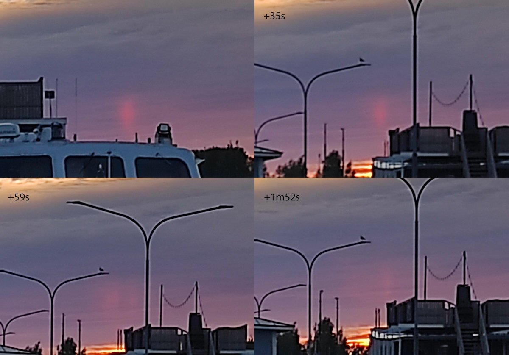
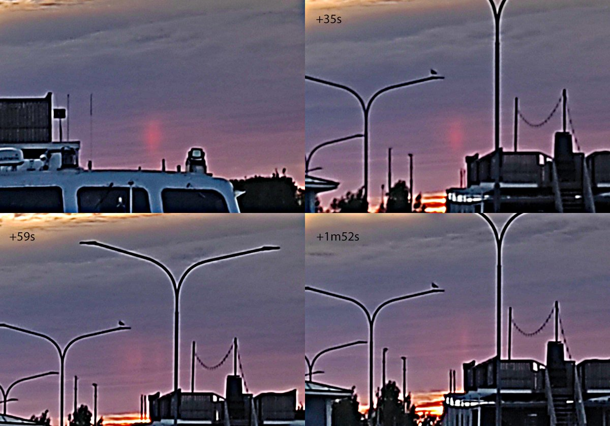
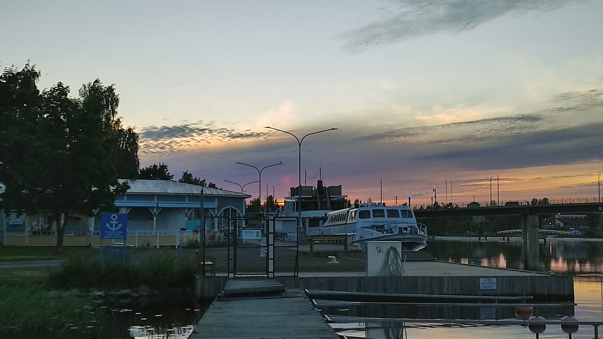
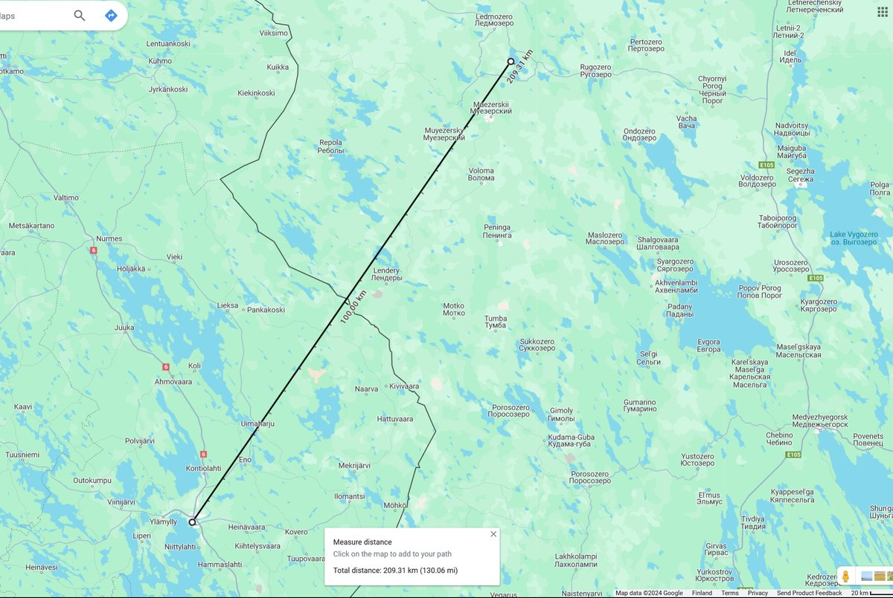
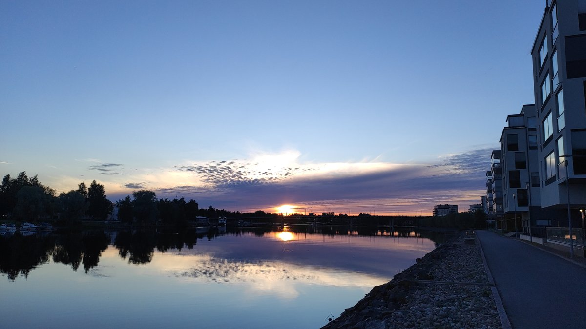

# Thread - 2024-06-25

**Original:** https://x.com/RiikonenMarko/status/1805613936093397081

---

### 1/2 - 2024-06-25 14:48 UTC

Woke up after 3 am and decided to go for a little summer night stroll in the quiet city, the sun having just risen (25 June 2024, Joensuu). Finnish observers are going currently their longest continuous stretch halos and nearing 100 days and I thought maybe there is something to catch for the early worm. There are always days when the continuation of the stretch hangs on one person – or webcam.

It didn't look too promising, but when I arrived by the river, I saw there was indeed a halo: a red reflection subsun!

The collage has a selection of the photos I took during the first 2 minutes, which was the best. Naturell and lightly usmed versions. The third image is an original uncropped photo.

The interval for these was 3:31:29-3:33:21 am, sun elevation 1.22-1.33 degrees. Realistic cloud height? Not an expert on clouds, but looks like there is both Ac and As, as shown by the third image and the image in the next post down (the reflection subsun at this point seven minutes later is just a very faint, narrow spike).

I would not put the cloud base lower than 3 km (sounding data could be consulted for Jokioinen station, #02963, to see where the 0 C level was, but I could not find this information). If we assume this minimum, then the reflection took place, by simple right triangle calculation, 137 km away in Russia. But I rather it was higher. 5 km? Then we are talking 229 km.

As to the stretch, it has traditionally been about solar halos in ice clouds. My personal record is 50 days, on Siquijor island in Philippines. The previous collective Finnish record was 67 days, now we are already 25 ahead.

---

### 2/2 - 2024-06-25 14:48 UTC

25 June 2024, Joensuu. Reflection subsun cloud.

---

