# Thread - 2024-06-29

**Original:** https://x.com/RiikonenMarko/status/1806938621456318912

---

### 1/3 - 2024-06-29 06:31 UTC

I started looking for reflection sunbsuns in Ounasvaara 360 camera of Rovaniemi (https://t.co/QOdwxoQCdX). Reflected cloud rays have already turned up, so there is hope. In a meanwhile, the best catch is this display in northern Finland on 10 June 2023. It has been reported by several observers in Taivaanvahti (https://t.co/vOH5x0hLBR). But no one bagged the Tricker arc which is visible here. In this 3-post thread I have thrown in a motley collection of images, some usmed and flip-stacked.

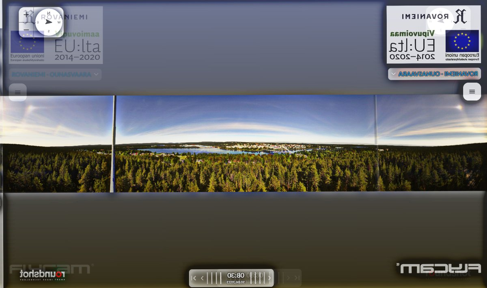

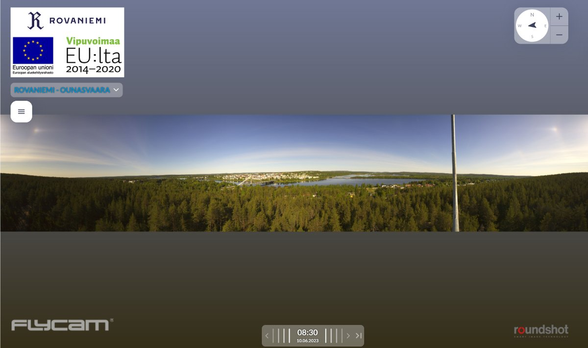

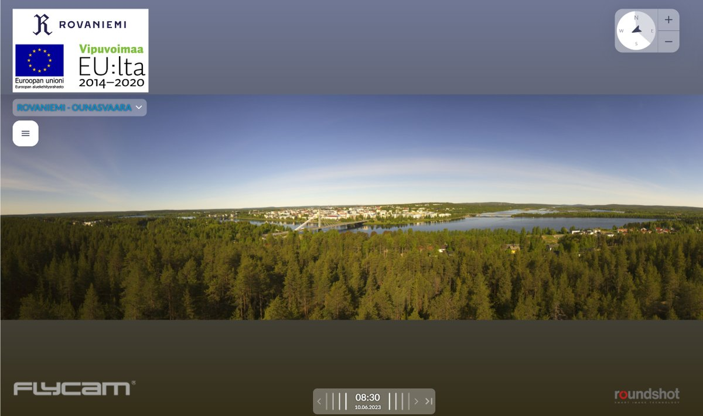

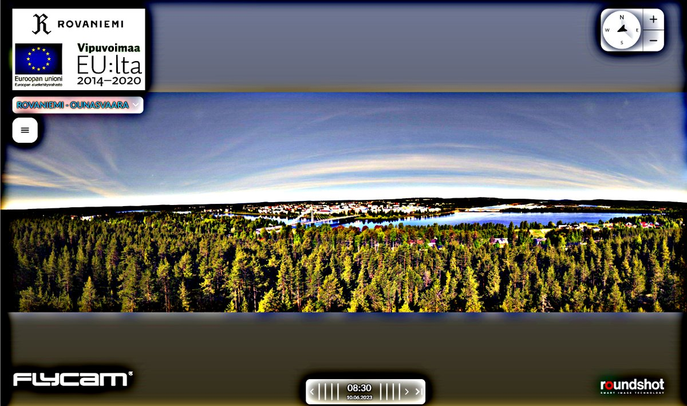

---

### 2/3 - 2024-06-29 06:31 UTC

10 June 2023, Rovaniemi.

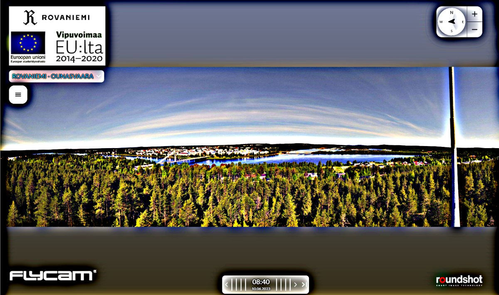

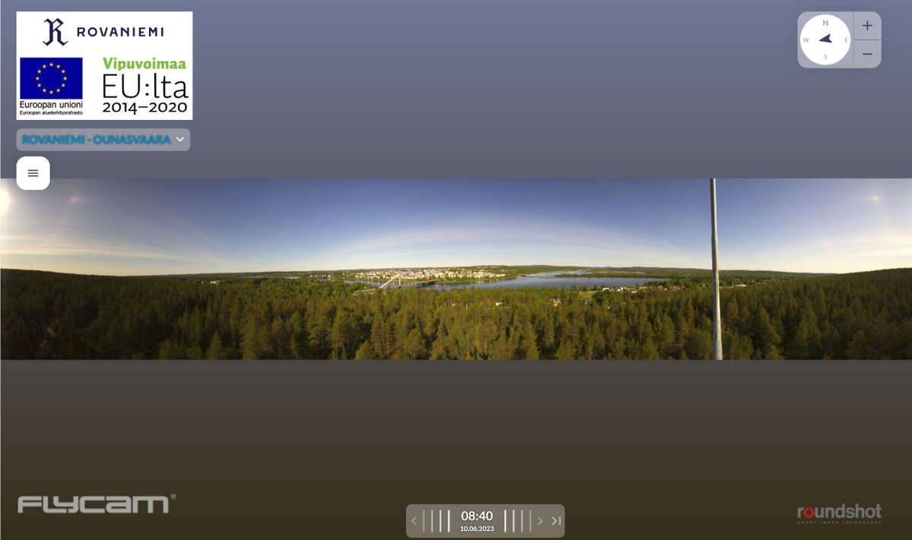

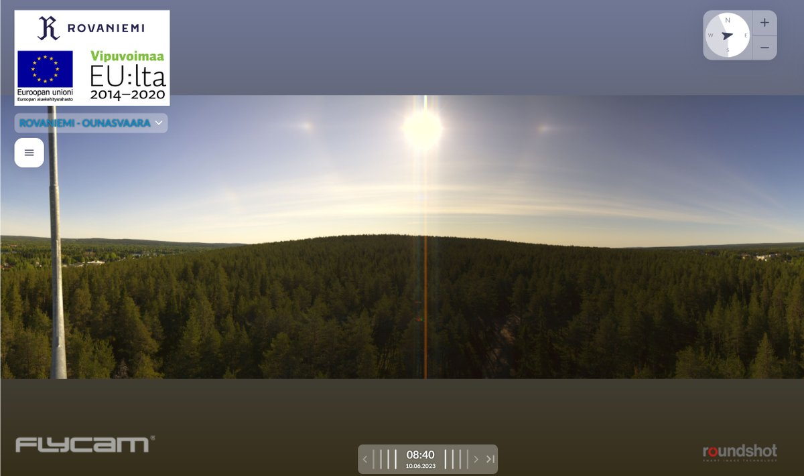

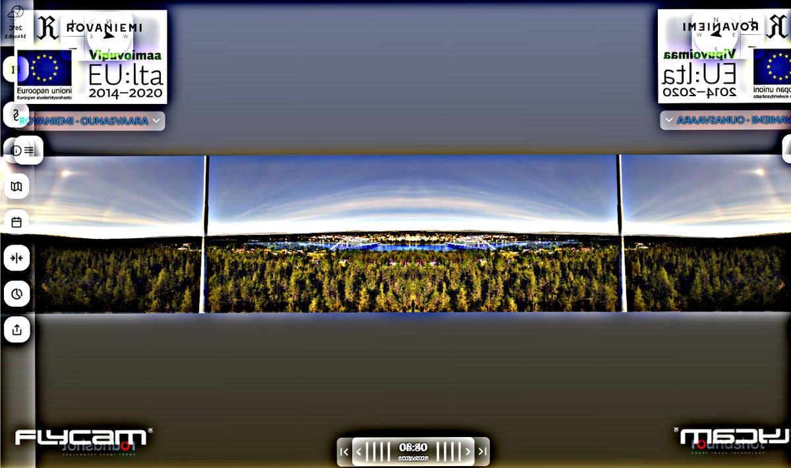

---

### 3/3 - 2024-06-29 06:31 UTC

10 June 2023, Rovaniemi.

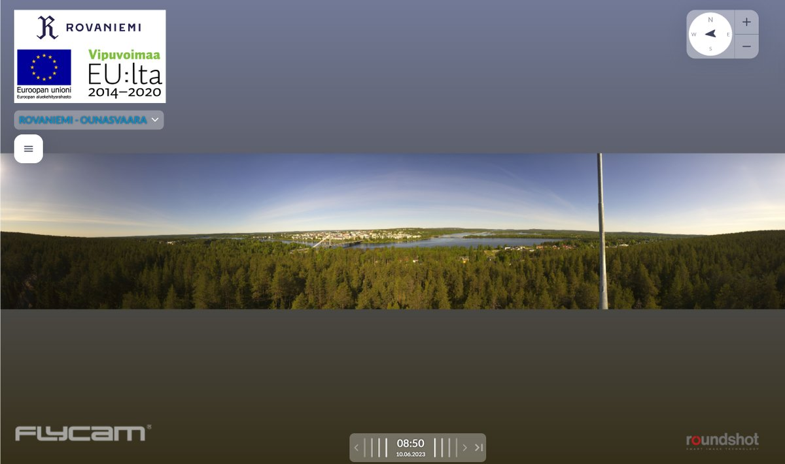

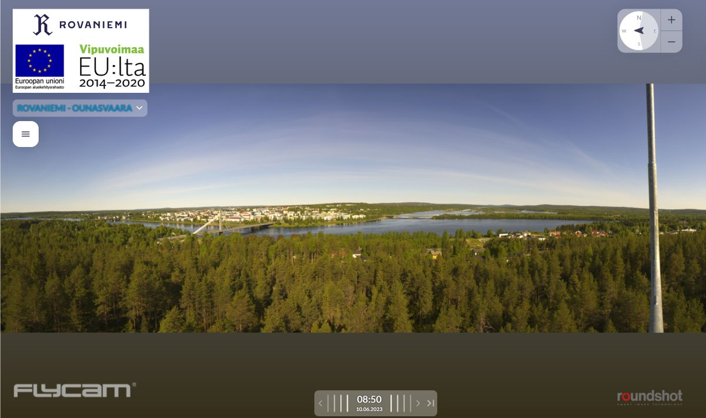

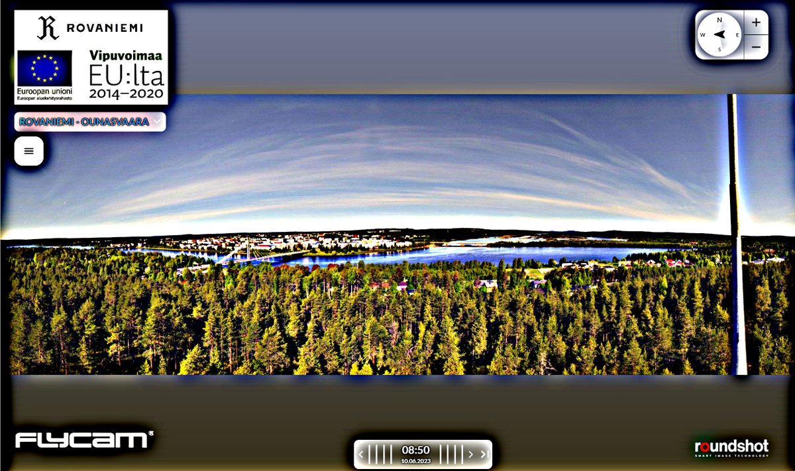

---

