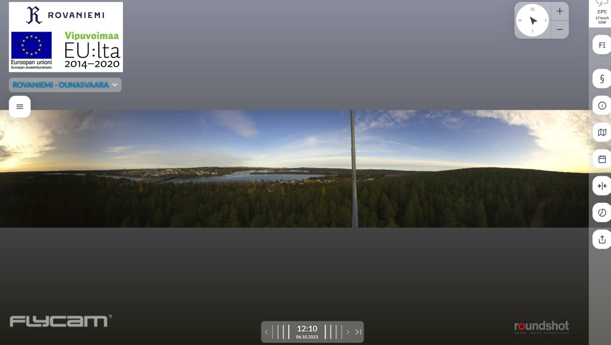
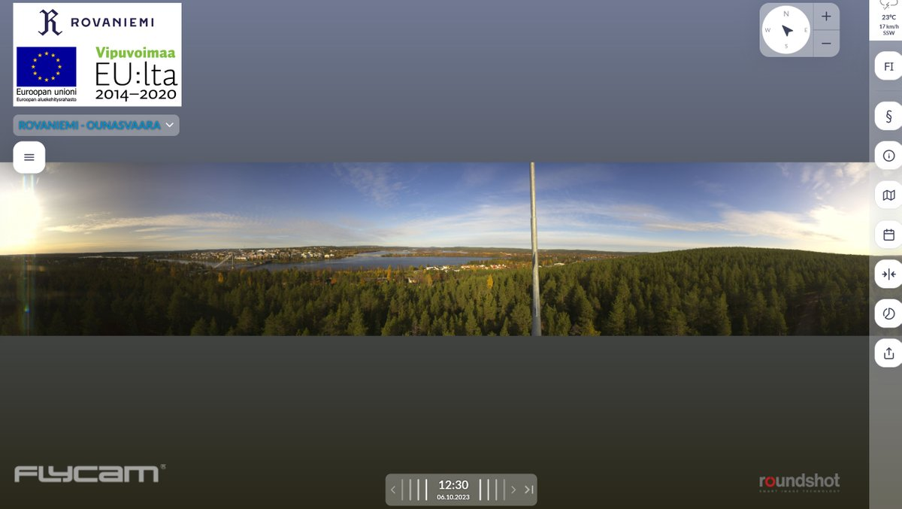
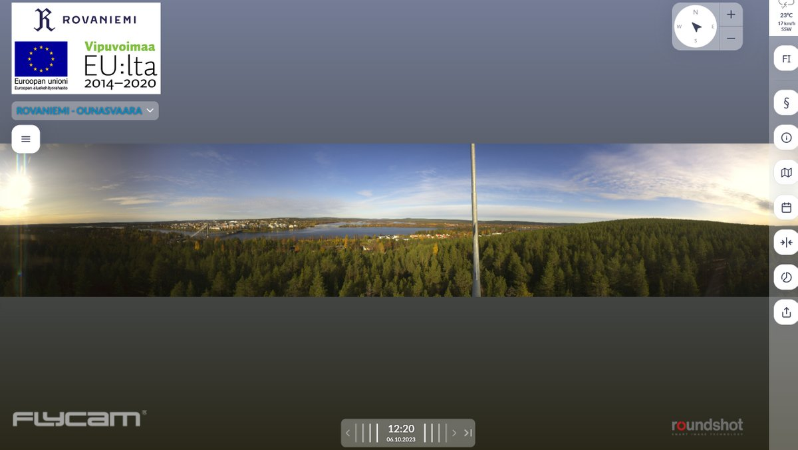
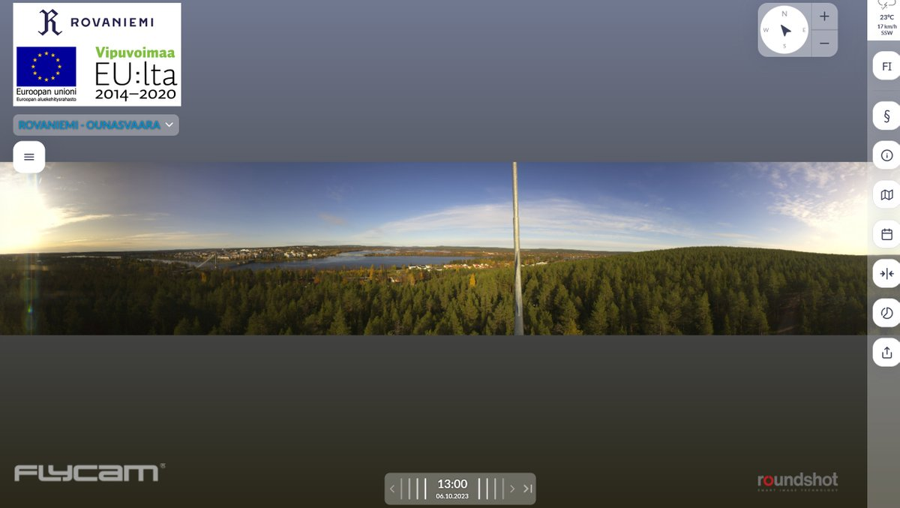
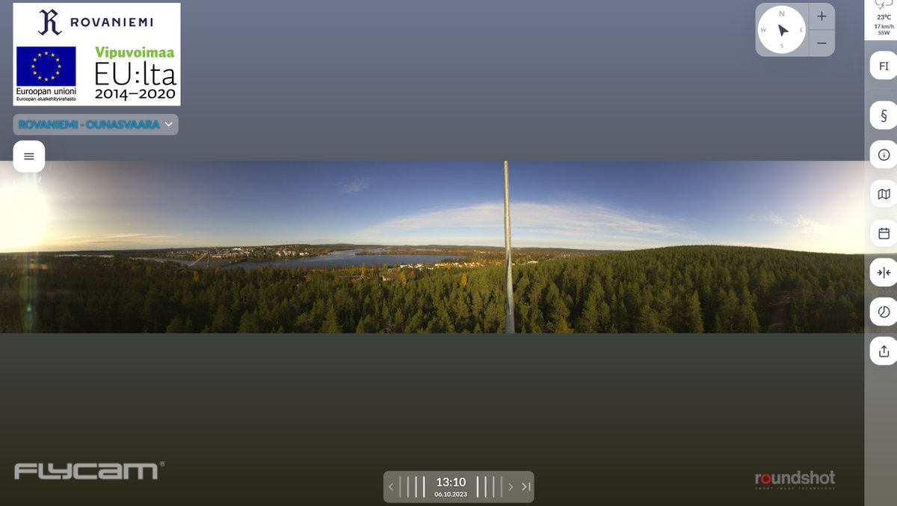
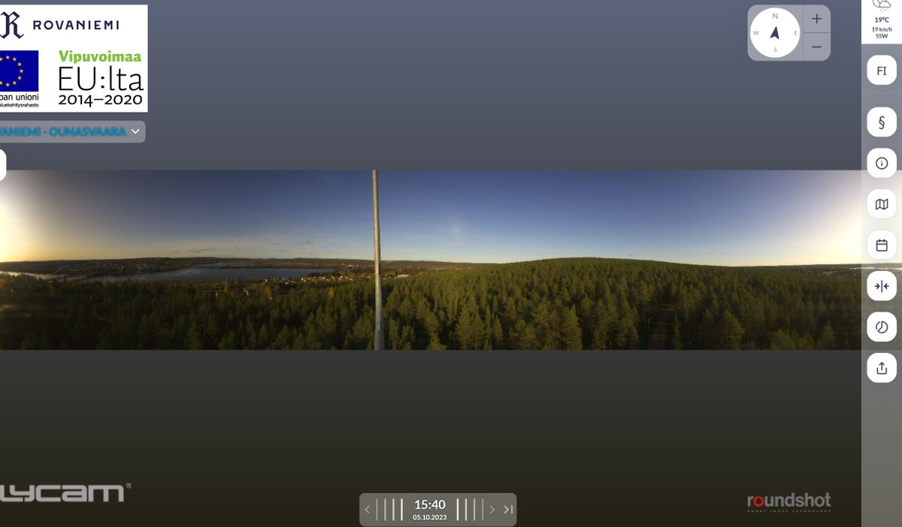
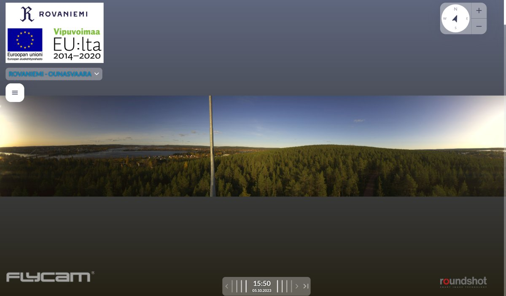
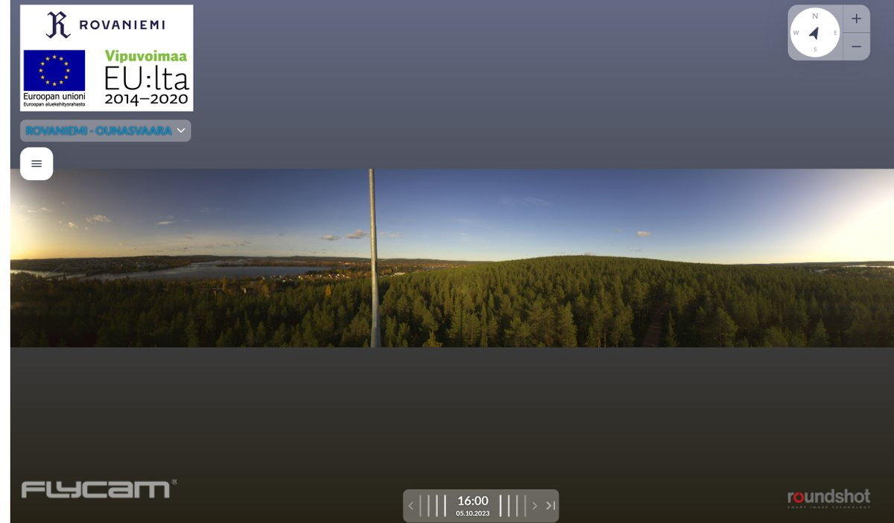
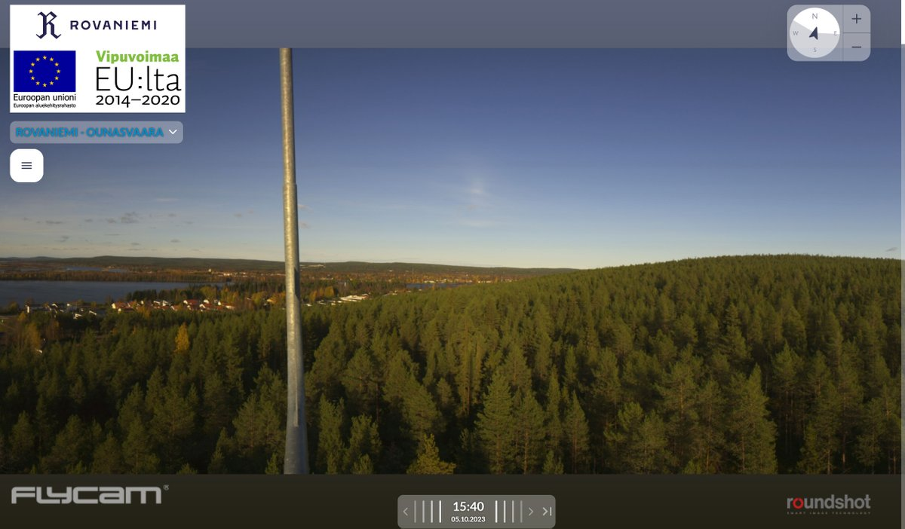
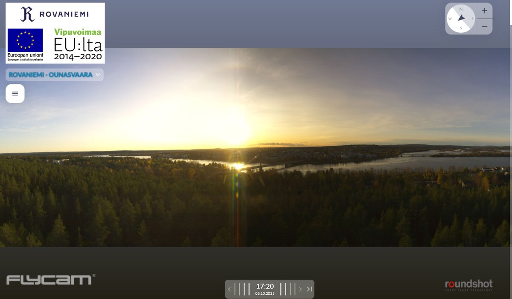

# Thread - 2024-06-29

**Original:** https://x.com/RiikonenMarko/status/1807000558756151342

---

### 1/3 - 2024-06-29 10:38 UTC

A decent number of reflected rays but no reflection subsuns after having pretty much perused 2023. Guess it must be concluded then that the phenomenon is genuinely rare.

But I didn't have to leave empty handed. There was high cloud anthelion on two successive days, October 5 and 6. This would be of course a fine find for any day, but more so in October when high cloud displays are already getting into winter low quality mode.

It is nice to look at these displays in the webcam archive using the slider. https://t.co/QOdwxoQCdX

---

### 2/3 - 2024-06-29 10:38 UTC

5 and 6 October 2023, Rovaniemi

---

### 3/3 - 2024-06-29 10:38 UTC

5 October 2023, Rovaniemi

---

