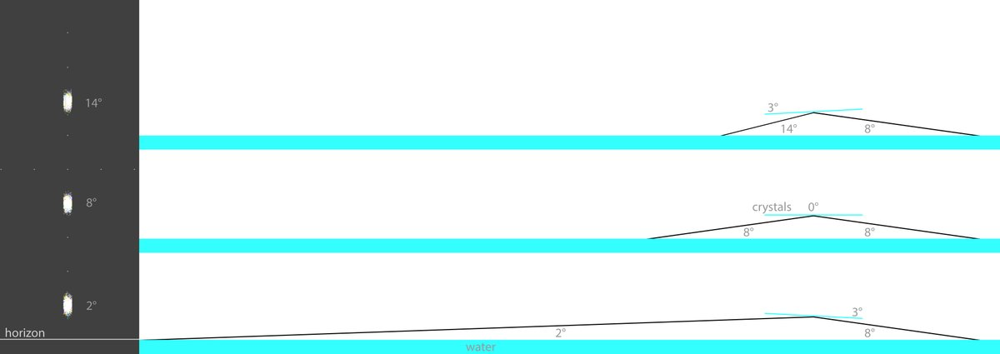
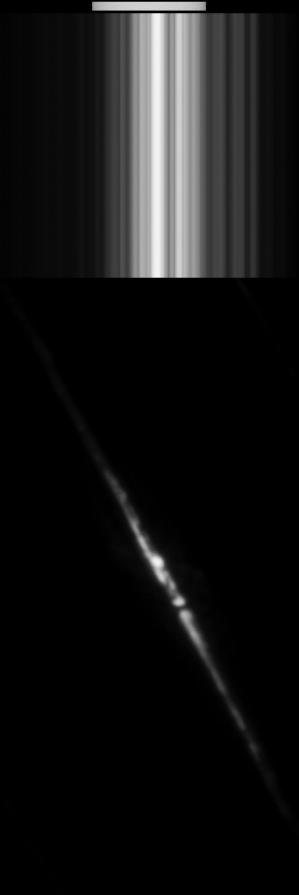
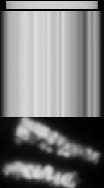
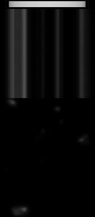
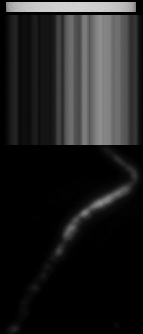
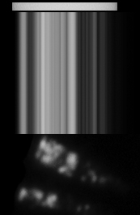
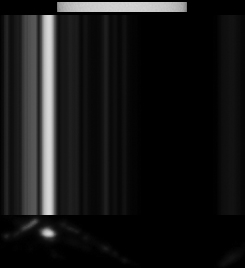
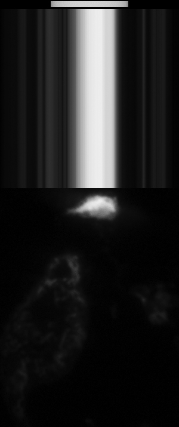

# Thread - 2024-07-04

**Original:** https://x.com/RiikonenMarko/status/1808848539503476927

---

### 1/5 - 2024-07-04 13:01 UTC

Clarifying the reflection subsun for my head. The three simulated reflection subsuns on the left correspond to the each three diagrammed scenarios, light coming from the right, observer on the left. The water reflection is 8 degrees below the horizon, the crystal angles 3 degrees both ways and 0 degrees.

In principle, sun elevation is irrelevant because water reflection can come – when the water surface is not perfectly still – from above or below the subhelic point. That happens the easier the closer to the horizon the sun is: think of the vertically stretched sun or moon image on water. Given the distances involved, only a tiny segment of that stretched water reflection lights up the reflection subsun that the observer sees.

The diagram can be regarded also from left to right: the water reflection coming from three different below-horizon elevations, in each case the reflection subsun appearing 8 degrees above horizon.

The reflection from crystals is also more the easily elongated the closer to the horizon the water reflection is. When you are looking at the reflection subsun you are looking at any section of that pillar, not necessarily the corresponding above-horizon point of the water reflection.

Which all makes it, in many cases, hard to determine from which water body the reflection came.

There would have been other ways to make this diagram. I could have involved the sun rays arriving at a certain angle to the water surface, and then look at different scenarios by having both the water surface and crystals at various orientations.
 
In the next posts down are "reflection subsuns" I crafted from photos of water reflections that I saw from an airplane. I took the brightest pixel in each vertical line of the image matrix and stretched it (the process was not perfect, looking carefully I see the brightest pixel was not always taken for some reason, but on the whole it's good enough). Looking at these, it is easy to see why most reflection subsuns are striated: there are compact little water reflections of varying brightness which in the reflection subsun are stretched by the tilting crystals.

The bar indicates the width of the sun, not location. The reflections look unimpressive because of the heavy underexposure – many were blinding bright. Most are from small water bodies: meandering streams, little reservoirs by the fields. Some are reflections from the lee sides of the Swedish archipelago islands.

Looking from an airplane, it became apparent to me that most water reflections are from small water bodies: that's because they are ubiquitous and because they are less easily disturbed by wind. Typically, I could see blinding reflections from small waters, but only weak ones, if nothing at all, from bigger waters.

I happened to mention moon. Reminds me that reflection submoon is still up for grabs. A true hardcore target for the halo hound.

---

### 2/5 - 2024-07-04 13:01 UTC

---

### 3/5 - 2024-07-04 13:01 UTC

---

### 4/5 - 2024-07-04 13:01 UTC

---

### 5/5 - 2024-07-04 13:01 UTC

---

