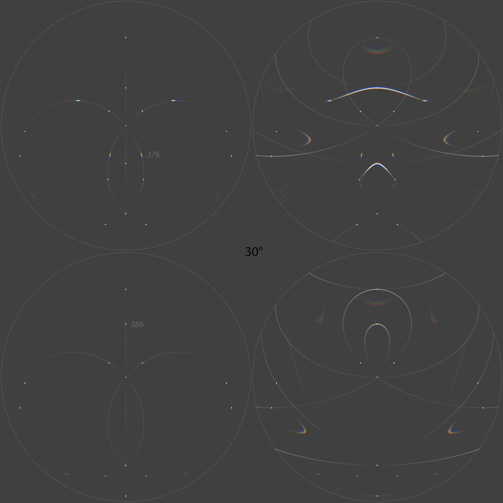
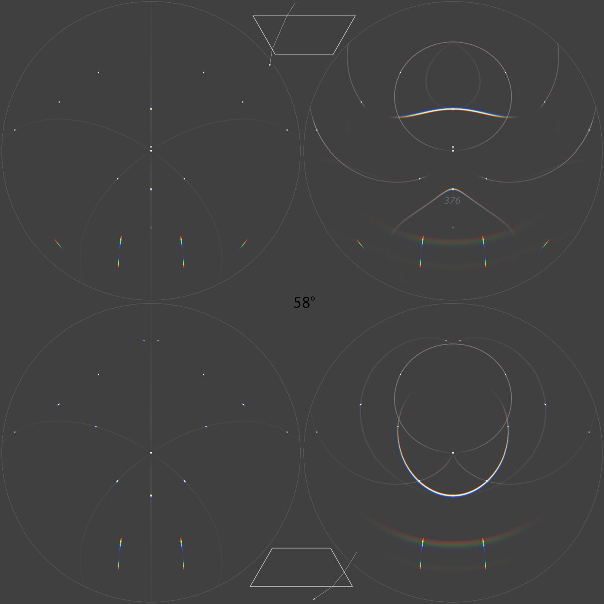
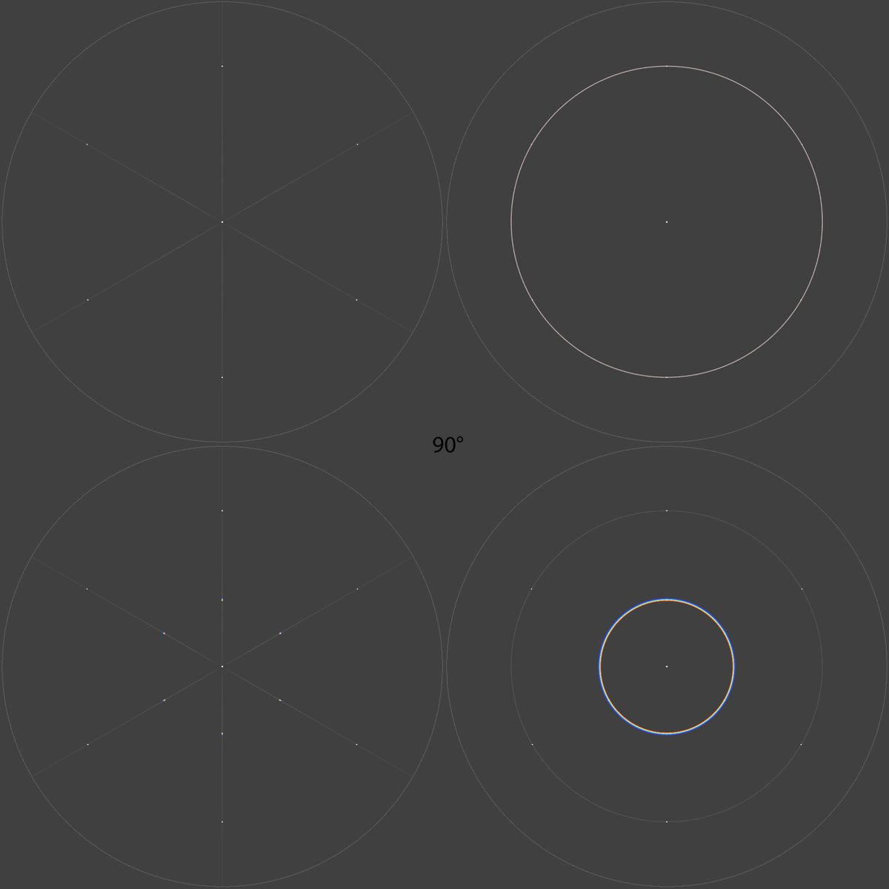
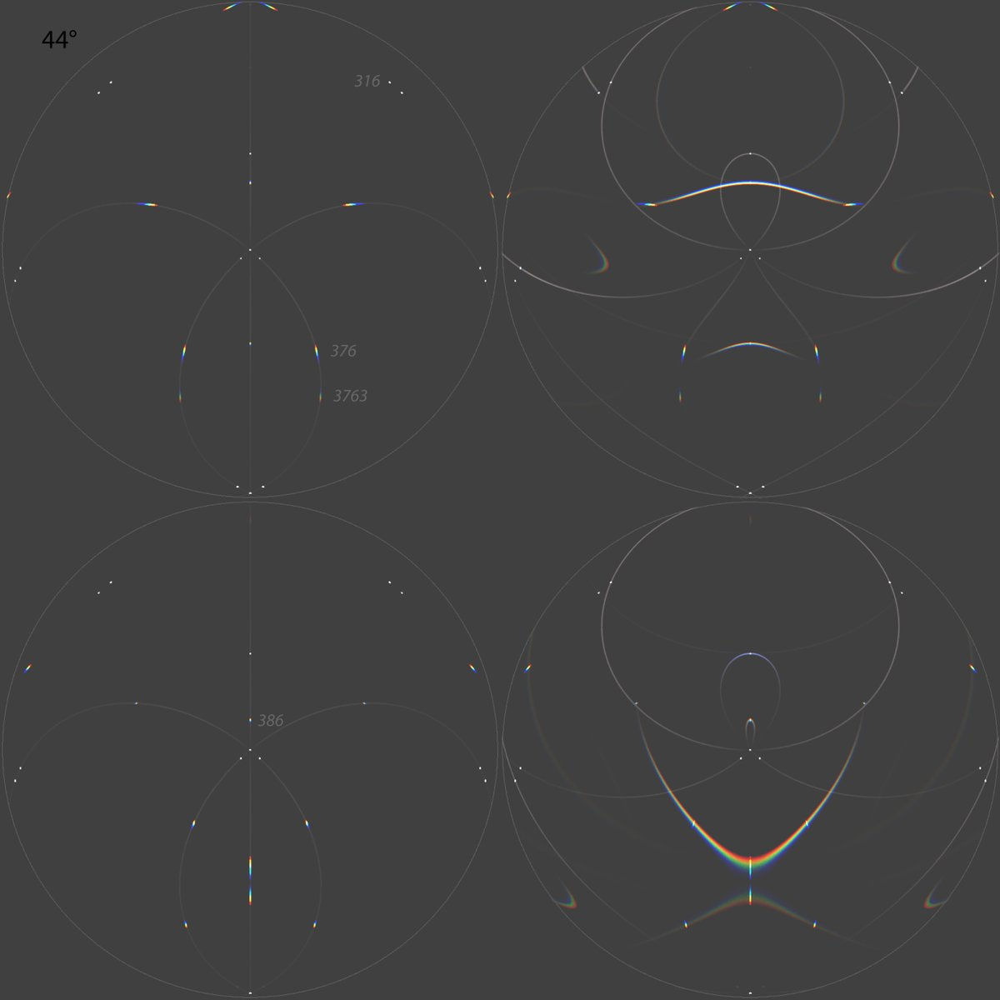
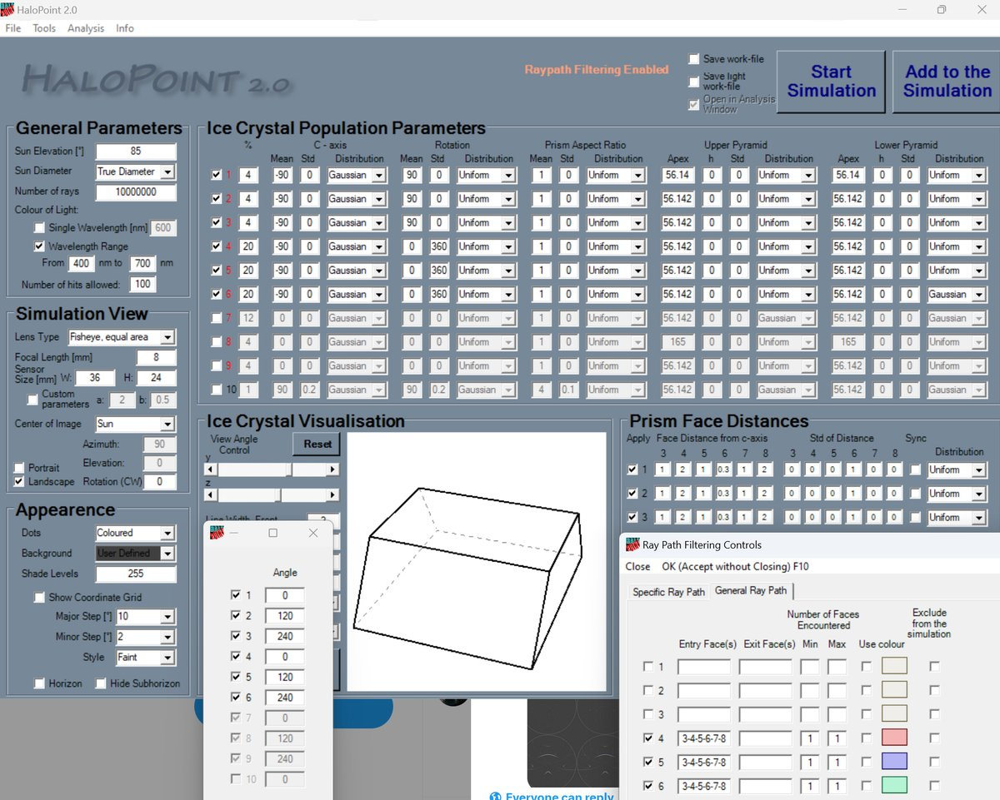
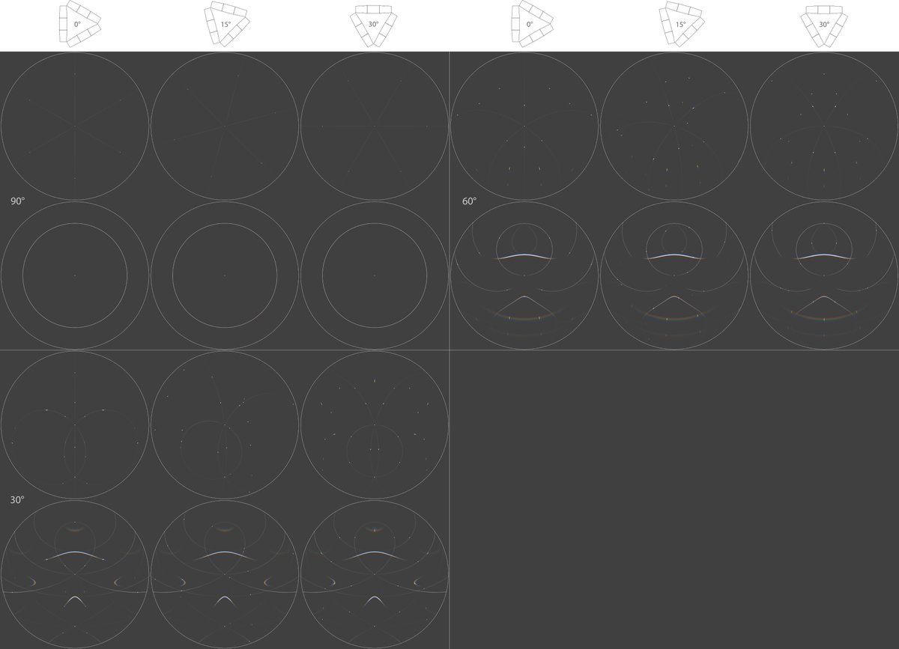
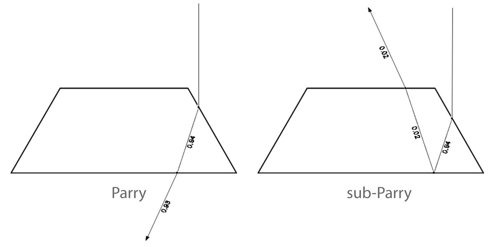
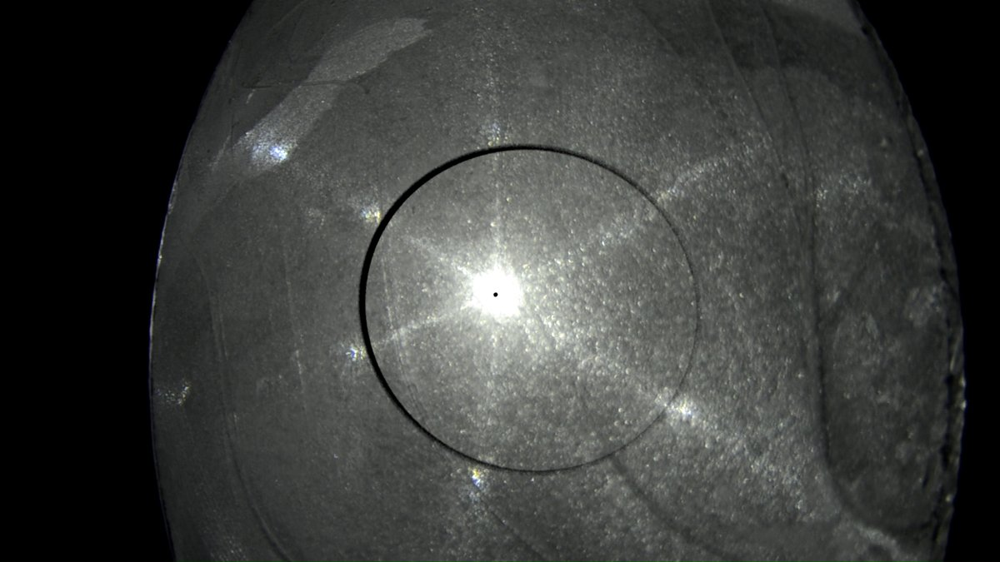

# Thread - 2024-07-07

**Original:** https://x.com/RiikonenMarko/status/1809961720095326296

---

### 1/5 - 2024-07-07 14:44 UTC

When a puddle ice plate with growth only on the underside is held between the observer and light with its plane at right angle to light, there are colored 22° spots when the underside is facing the observer but not so often when facing the light. In the last post of this thread is a video (DSC8908) that shows this well.

The situation can be modeled assuming trapezoid crystals sticking out from the ice plate in Parry orientation, their blunt ends merged to the plate. The four animations here made with HaloPoint start at 90 degree sun elevation and end at ⊙ 30. This equals tilting the plate 60 degrees from right-angled position. I have placed the simulations sideways because that aligns better with my plans for next winter to get a rotating stand on which to place the plates.

The white arcs are made by spinning crystals, only external reflection allowed. 22 and 46° halos added for reference.

The first and second animations imitate, respectively, the underside facing the light and camera. The third animation has both. Fourth animation has plate oriented crystals added to the first animation. This gives the ubiquitous 46° spots on white arcs (which Parry crystals don't make).

In the second animation there are no 22° spots until light goes down to 77 degrees, i.e. when the ice plate is tilted 13 degrees from right-angled position (in traditional displays this would be when the uppercave Parry appears). I have not done ice plate tilt measurements, but the 22° spots in this configuration indeed have tendency to appear only when the plate is tilted somewhat from the right-angled position.

I likely used too long trapezius crystals, they are h/d 1. I was supposed simulate with plate shape which is what I think is the reality, but I found my mistake too late to start it all over again. Anyway, this should affect just the spots' relative intensities, otherwise the collection of the spots should be the same.

In the next post down I have superposed normal Parry simulations with these spots.

[🎬 1809961720095326296-LbWSp9xBniXMcp7N.mp4](media/1809961720095326296-LbWSp9xBniXMcp7N.mp4)

[🎬 1809961720095326296-WfTjxMV1diSpEfOA.mp4](media/1809961720095326296-WfTjxMV1diSpEfOA.mp4)

[🎬 1809961720095326296-YRbyuvQXnUQx27os.mp4](media/1809961720095326296-YRbyuvQXnUQx27os.mp4)

[🎬 1809961720095326296-YTFggUjsS7pcOoMZ.mp4](media/1809961720095326296-YTFggUjsS7pcOoMZ.mp4)

---

### 2/5 - 2024-07-07 14:44 UTC

In these four images the Parry spots are superposed with normal arcs from az-free Parry crystals for four sun elevations, using the same trapezoidal crystals (unlike the animations, these are upright). All spots lie within the arcs and this may suggest how to call them: Parry, helic arc, circumhorizon arc, parhelic circle, etc spots.

Alternatively, if it is taken that each of the white arcs passing through the helic point represents an analogue of parhelic circle, then you might call the spots various parhelia. Starting page 52 in the Green Book, chapter "Column arcs", Tape and Moilanen have written about a related concept: about 22° tangent arc consisting of rotated parhelia which are located on circles passing through helic and subhelic points.

Focusing on the overall pattern and regarding them as segments of halos keeps names familiar, though. In the other approach you would need to call the 46° spots as 46° parhelia, which we are yet to see in airborne crystal displays. The crystal orientations relative to the ice plate plane really have no meaning in this approach.

But it's not really either-or: depending on context, both views have their place. In some situations neutral terms, such as 22° spots and 46° spots, may come handy. 

An obvious weakness in overall pattern naming is that often crystal growth is not in perfect Parry or plate orientation. They grow tilted and whole displays can be off-set. Lot's of funny things going on that I don't understand. But I would say it is still useful to think in terms of Parry and plate orientations in many cases.

Back to those simulations. In the simulation labeled for ⊙ 58, which is actually ⊙ 59, the trapezoid crystals used in the simulations are shown as they would be in the two opposing orientations of the ice plate, light is coming from the top of the image, observer being at the bottom (raypaths for uppercave and lowercave Parry arcs).

Intensities of many spots are saturated, so information on relative brightness is lost. But you can get a sense of relative brightness from the arcs. For some spots there is no corresponding arc at all visible. That's because they are too faint – burning simulation more would have brought them up.

In these simulations az-locked Parry crystals make cha spots but not cza spots, as is evident for the latter from the ⊙ 30 simulations. But just like the fake 120° parhelion spot (explained below), this, too, is a matter of azimuthal direction of the Parry crystals in the ice plate plane, i.e. how the ice plate is rotated. At a certain rotation range the cza spot comes about. In the next post down clarifying simulations are given.

A big elephant in the room is those all spots – both colored and white – that simulations predict in between the white arcs. They don't seem to appear on ice plates, at least not with any regularity that would have made me take note. Many in-between spots have simple raypaths (such as 1 and 13) and they are bright. So where they are? Makes me wonder if I have got this all wrong from the get-go (by the way, the concise "predator spots" that were seen in one of the videos I have published earlier... they turned out to be reflections of the lamp light reflecting from something behind me, most likely the car) .

But at least the white spots predicted by simulations lying on the white arcs seem to be there. The ubiquitous white spot, which proceeds to helic point when a tilted plate is moved to ⊙ 90, is not produced by Parry crystals, but is by plate oriented crystals (the fourth animation), which as a rule are included in these ice plates. In this reading, then, this white spot is the plate orientation parhelic circle spot. 

Another type of white spot on white arcs is that which appears 60 degree from the helic point at ⊙ 90 –  the helic arc spot. When the plate is tilted, helic arc spot instances that are – as seen by the observer – on the plate far side, move towards helic point. These spots would seem indeed to show up in some videos (example in video DSC9008 three posts down), but they are much more furtive than the parhelic circle spots. Considering the both type of spots together, when the plate it tilted, on the near side the parhelic circle spots shoot out from the helic point while on the far side the helic arc spots proceed closer to the helic point (the fourth simulation).

I have marked some raypaths in the simulations. One is 316, a Parry orientation parhelic circle spot that makes fake 120° parhelia in right-side simulations. These spots just happen to be located at this azimuth because of the particular az-lock angle of the crystals. These are one of the in-between spots that do not seem to appear in actual ice plates.

376 and 386 are the "(120°) rotated sub-uppercave Parry", about which I have made a separate post: https://t.co/GJzrVQXTnJ  Both the arc and its spots of are quite bright, but the arc is still unobserved and I doubt if any of its spots are either showing up in my videos. This spot is the parhelion of the helic arc spot and follows in its wake towards the helic point at decreasing light elevation. It would be revealed also by its fast movement relative to the to basic 22 and 46° spots.

In detached plates, I have not seen any sub-Parry spots (actually any spots, for that matter) in "reflection" configuration where the light and the observer are on the same side of the ice plate. Just the white arcs. In this configuration similar arrangement of Parry spots should be visible around the subsun spot as from "transmission" configuration in which the observer and light are on the opposite sides of the ice plate. It is true these sub-Parry or counter-Parry (as I will call them in my maybe upcoming nomenclature system) spots are much fainter because the internal reflection leaks so much. What I quickly looked at lowercave and sub-lowercave Parry spots in HaloPoint, the latter come with only 2% of rays of the former (in the next post down are shown raypath intensities for these at 90 degree elevation). But given the Parry spots in transmission configuration are often blindingly bright that should not be a problem as such. But are they overwhelmed by the white arcs? I think every plate should be always inspected in reflection configuration, both ways, like shown in the collage of images in the next post down. Maybe in some plates the sub-Parry spots will indeed show up.

Original simulation frames (better quality): https://t.co/dB9xaezJK6

---

### 3/5 - 2024-07-07 14:44 UTC

1. Simulations showing how the Parry orientation spots light up different parts of the arcs depending which azimuthal direction the three crystals are pointing, i.e. how the ice plate is rotated (rotations in 15 degree step). Simulations are for ⊙ 90, 60 and 30. The lower the ⊙, the more the rotation patterns differ from each other. The underside of the ice plate is facing the observer, which is why at ⊙ 90 we see only helic arc and its spots (subanthelic arc/spots are overlapping, but at ⊙ 90 it has negligible rays).

2. Comparison of uppercave Parry and sub-uppercave Parry raypaths intensities at ⊙ 90.

3. Here I have superposed ⊙ 70 lowercave Parry with a tilted plate. The pattern of the spots roughly conforms to the arc. It is from the plate which spots had a nice agreement with ⊙ 90 lowercave Parry when the plate was at right-angled position: https://t.co/zXmcyWe6Wo

4. Parameters that model the ice plate underside facing the light.

---

### 4/5 - 2024-07-07 14:44 UTC

Here visible on the right side spikes is the ubiquitous spot behaving like the simulated parhelic circle spot (20/21 April 2024, old snow dump, DSC9008). On the left side spike is a weaker white spot that would seem to go as the the helic arc spot. As the other spot takes distance from the helic point, the other spot nears it.

[🎬 1809961738084762051-RkjCoDyS7PKaBeCf.mp4](media/1809961738084762051-RkjCoDyS7PKaBeCf.mp4)

---

### 5/5 - 2024-07-07 14:44 UTC

This plate agrees well with what is expected from trapezius crystals sticking out in Parry orientation (20/21 April 2024, old snow dump, DSC8908). At first the underside is towards the light and colored 22° spots are visible when the plate is at right-angled position. These would be the lowercave Parry spots. At 0:54 I turn the plate around and now we don't see colored 22° spots at right-angled plate orientation. Only when the plate is tilted do they appear on the near side, moving towards nearer to helic point to their min dev position. These would be the uppercave Parry spots, then.

[🎬 1809961742828515810-yQNO8O98FNCGGrAY.mp4](media/1809961742828515810-yQNO8O98FNCGGrAY.mp4)

---

