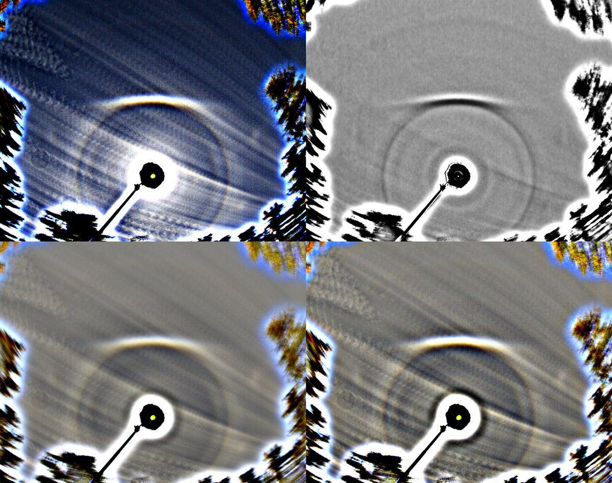
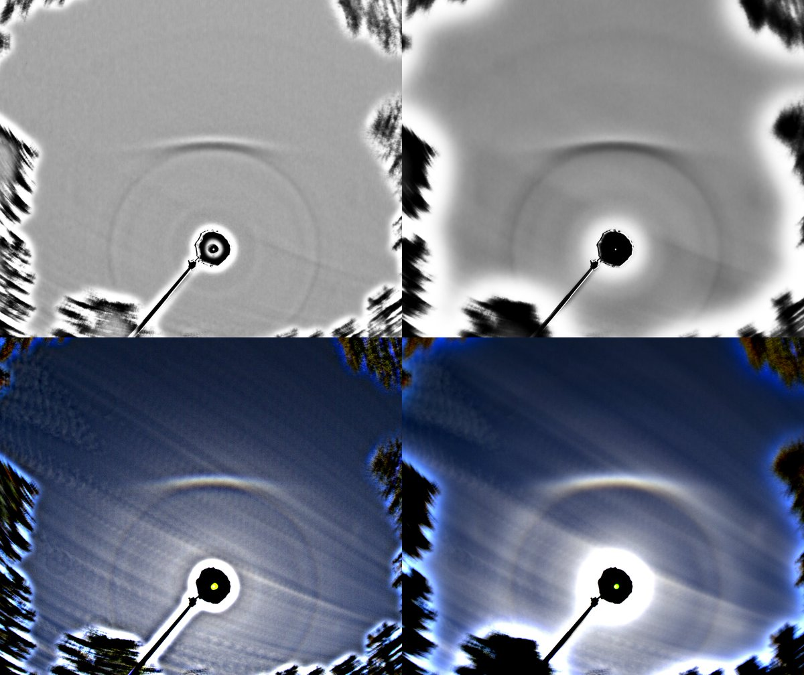
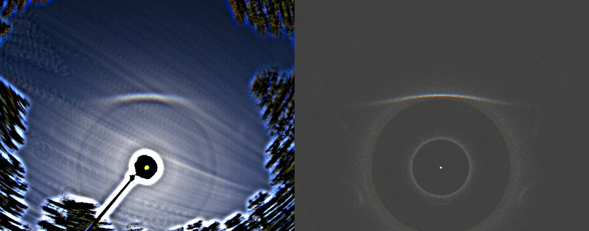
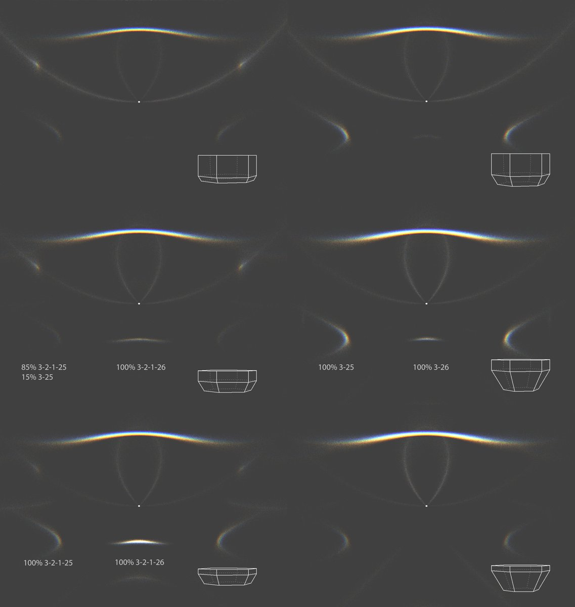
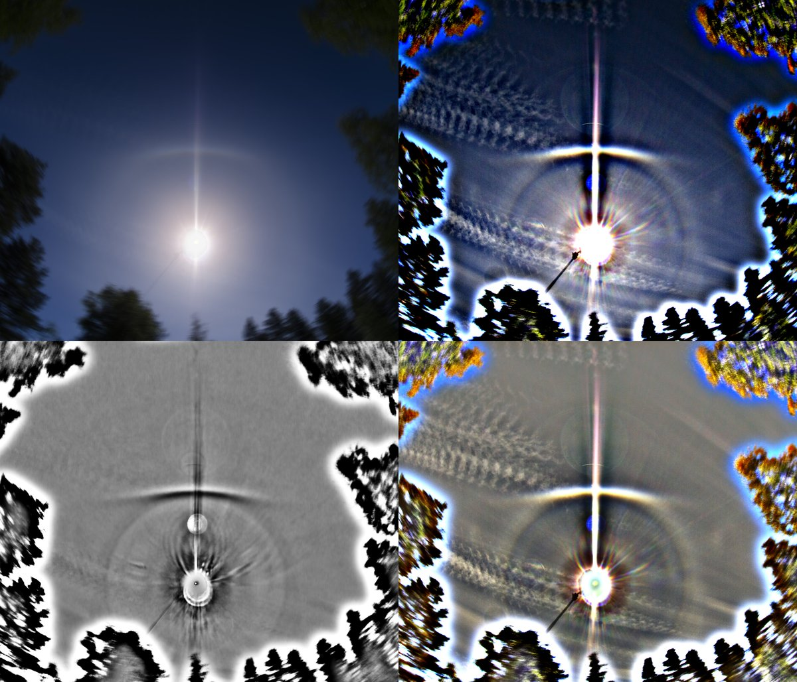

# Thread - 2024-07-11

**Original:** https://x.com/RiikonenMarko/status/1811318464239300668

---

### 1/3 - 2024-07-11 08:35 UTC

Took me a few seconds to realize I had not caught anything exotic when I enhanced the stack (8 June 2024, Kontiolahti). The spot at 4 o'clock is just 24° plate arc. Yet its separation from the 24° halo makes it special for me. We don't have that much separated 24° plate arcs – or 9° plate arcs for that matter. I had earlier asked the Chinese if they have any separated 9° plate arcs. Turned out there wasn't any. Having done the simulations I knew it could be as well separated 24° plate that will be the observed first, but for some reason I was fixated on 9°.

This Skywatcher SolarGuest tracked stack was taken at the midday, 122 images at 7 second interval. Couldn't decide which versions of the stack to publish, so I included them all. Sun elevation practically steady 49.5 degrees. 

What strikes me is how concise the 24° spot is, usually they are fuzzy. But sometimes they are distinct, it's not the first such display.

But could it be an artefact? It doesn't really look like lens reflection. And sensor color artefacts are not quite so spot-like. Given the location matches good with the HaloPoint simulation, I would incline regarding this indeed as 24° plate arc.

Made also some simulations for the display's sun elevation to study the effect of crystal shape. Turned out it affects the arcs in quite in complex ways due to the basal face ping-pong kicking in in thin crystals. In those simulations that don't have raypath percentages marked, the 9 and 24° spots are 100% from direct two hit rays. The crystal shape shown is the average shape, a little variation in the prism and pyramid thickness was allowed. Two degree tilts.

---

### 2/3 - 2024-07-11 10:06 UTC

I am now more confident that it is indeed 24° spot not artefact (8 June 2024, Kontiolahti). I just revisited a shorter stack I had made from photos taken immediately before the stack above. I was not so enthusiastic about this stack because the blocked had slided down. But it shows likewise a spot at 4 o'clock position and it is very much halo like.

This was halo-panic situation. I came out from inside the cottage where I was stacking photos I had taken earlier and was stunned by the fine 23° plate arc having appeared in the sky. Quickly climbed the ladder with tripod in my hand to the roof and set up the machine. The view is cramped but there was no other choice.

---

### 3/3 - 2024-07-11 10:08 UTC

Correction on the date. It is 8 July 2024, not June.

---

