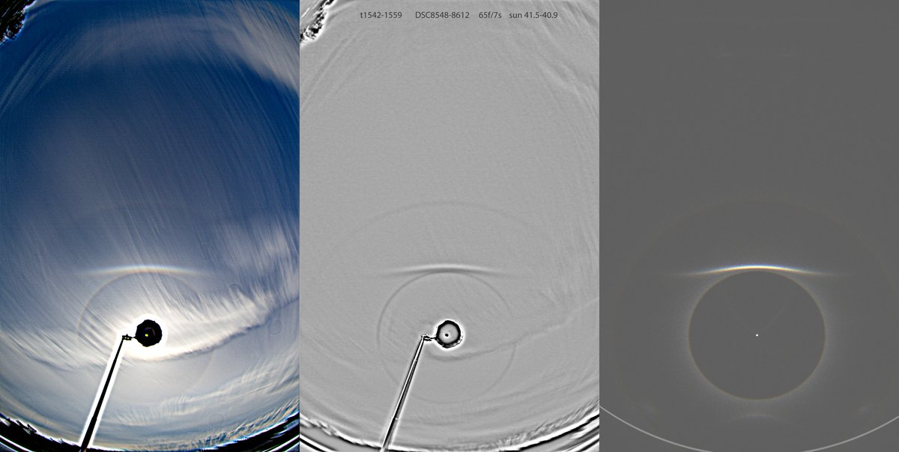
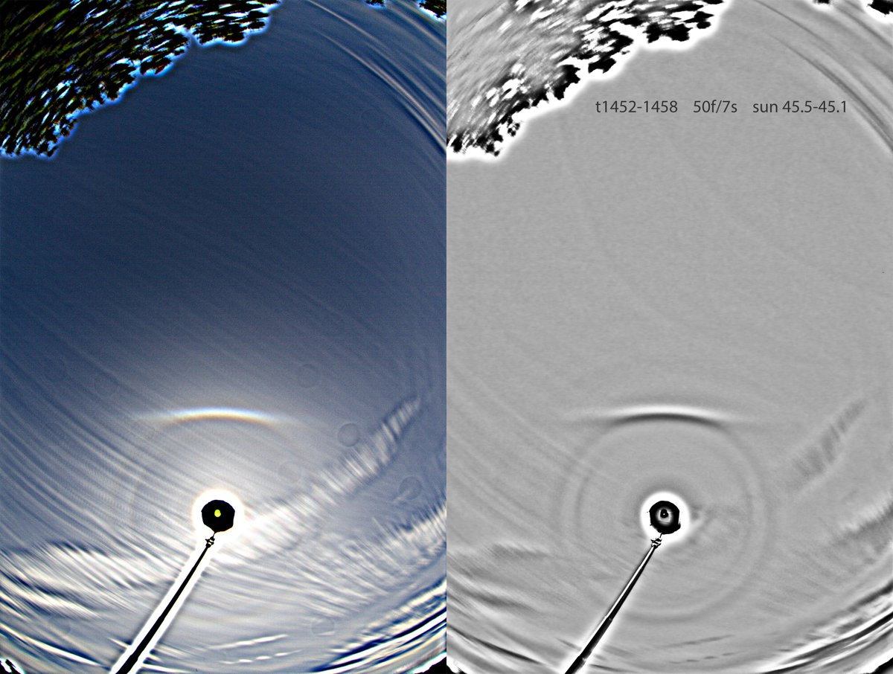
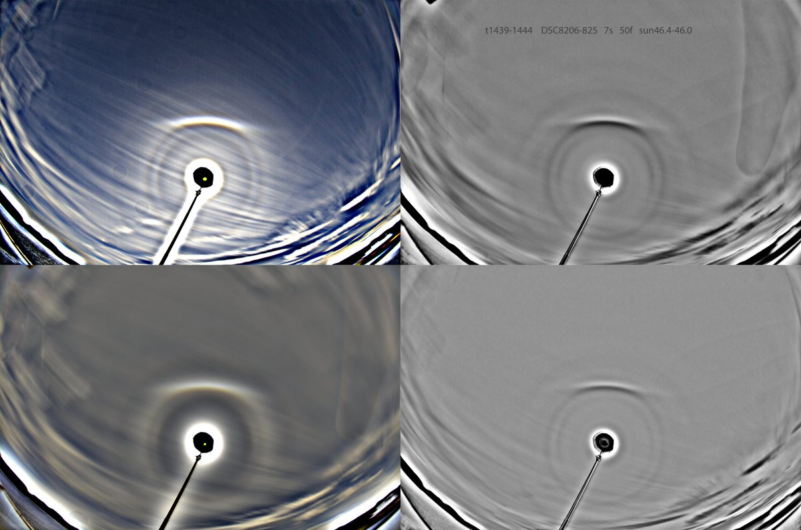

# Thread - 2024-07-14

**Original:** https://x.com/RiikonenMarko/status/1812472154950074837

---

### 1/1 - 2024-07-14 13:00 UTC

Another odd radius display (11 July 2024, Kontiolahti). A decent 23° plate arc in the first stack. I could see its slight upwards curvature with my eyes on the left side, which was quite nice. This was towards the end of the display. What's noticeable in the other, earlier stacks, is the pretty much absent 46° halo, probably signifying that the main halo is not much contributed by 22° halo, but is rather 23+24°.

There is 28° looking action in the br images of the last four image collash, but is that rather an artefact? I seem to incline on that interpretation

---

