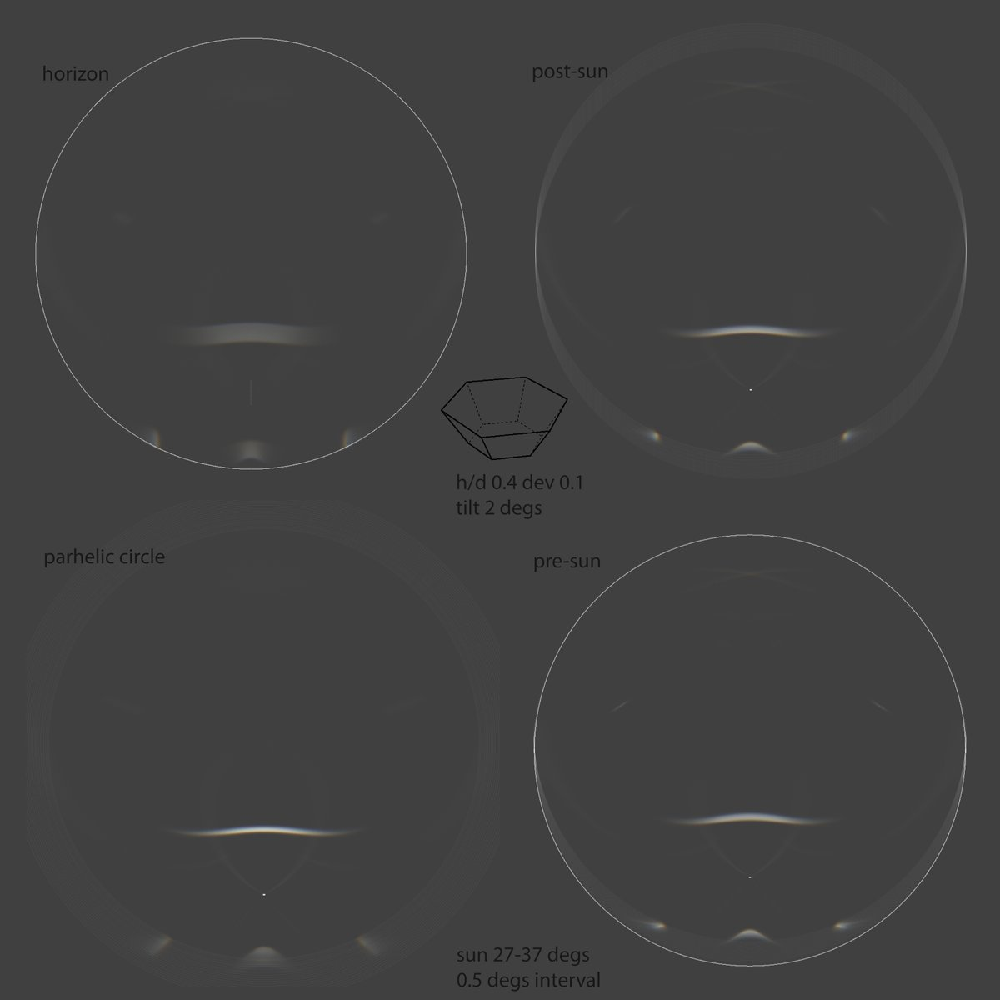
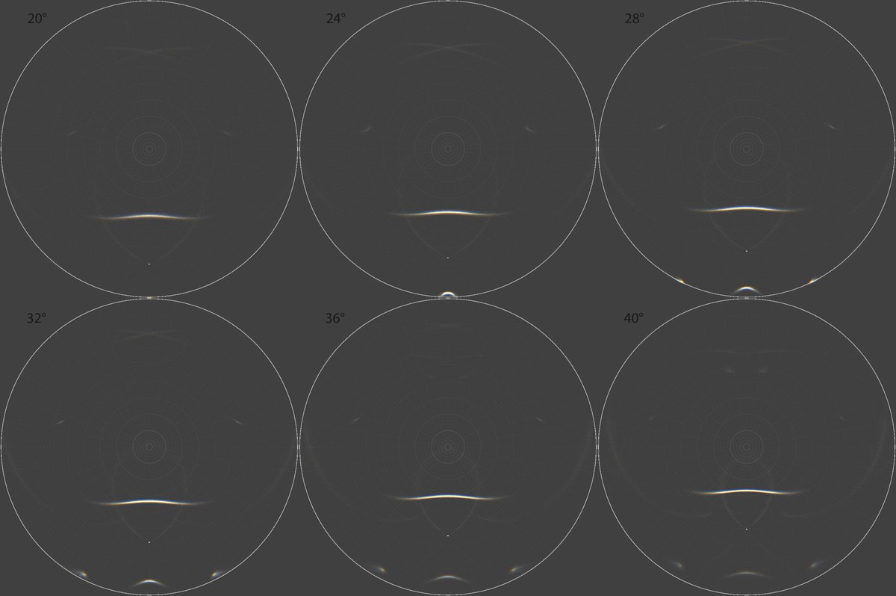

# Thread - 2024-07-16

**Original:** https://x.com/RiikonenMarko/status/1813170174842843293

---

### 1/1 - 2024-07-16 11:13 UTC

It's time to move on. Doesn't make sense photograph the same odd radius plate arcs over and over when there is undiscovered stuff to be had.

To that end, here is a little study about what tracking method would be the best for a stacking series. I chose sun elevation range 27-37 degrees because that's when these distinct arcs at around 105 azimuth from the sun are at about their most intense with the chosen crystal, single pyramid. It is noteworthy that they are brighter than the already observed odd radius helic arc.

I should say that I realize now that 10 degree range is a tad too long, should have rather done 5 degrees, 27-32. But that's what it is now and the message here is not really the range, but the different alignment methods in stacking.

I have named the simulations according to the alignment feature. In the upper left simulation it is the horizon. In the upper right simulation it's the sun, and more specifically as if the alignment would be have been done in post-processing from photos taken with a fixed straight-up pointing fisheye. In the lower-right alignment is also at the sun, but this is as if the camera was on a sun-tracking device, the alignment thus taken care of in "pre-processing". The fourth simulation on the lower left is more a special one: its constituent simulations have been resized so that if there was a parhelic circle, it would have been the same size in each simulation.

Sun's azimuth is fixed in these simulations. The azimuthal movement in real circumstances can be eliminated by a tracking device or digitally in post processing by rotating the images (however, it is good to do also a stack without eliminating as this can enhance some halos). Near the equator, though, the nature pretty much takes care of it as azimuthal movement is small (sun movement wise I think equatorial regions are the best places to observe halos because of the full elevation range, fast elevation change and steady azimuth. If you have a big and steady all-sky display, observing get whole another exciting dimension as you can follow from simulations what to expect next. I envy all those people in tropics who are not yet observing halos).

So, concerning the white arcs and also the other undiscovered arcs in these examples, the definite winners are the "post-sun" and "pre-sun", the latter being slightly better. And although the "parhelic circe" does not perform well here, it is mighty good when there is 120° parhelia, anthelion or Liljequist parhelia in the display. It is quite good also for some other halos, like Wegener arc crossing at the anthelic point.

Should there some day be a fixed automatic all-sky halo cameras in use, the sofware should have various alignement options for stacking, also 120° parhelion and anthelion alignement. Also it wouldn't hurt if simulation software would have such options. 

As to the projection, it happened to be equidistant. Equal area might have been closer to real lenses, even if in my experience they are never exactly either.

As to the unobserved arcs in the simulations, the white arcs at 115 azimuth are from 23-1-27-26-25 and the colored cross from 1-23-1-28-27-26 raypaths (interestingly, the latter raypath sequencing does not look good if the basal face reflection was placed second in sequence as is the convention). I don't know how to characterize these. Possibly the latter is a rotated 23° plate arc. The former is also colored, but much less conspicuously.

Can these two arcs actually be observed? While they are on par or even brighter than the odd radius helic arc, they have also much more complex raypaths – odd radius helic arc is formed of only an external reflection. But they are no more complex than, say, (sub-)Liljequist parhelion. We can only try and see if they pop up one day.

In the second image are single simulations for 20-40 degrees. Simulations made with HaloPoint.

---

