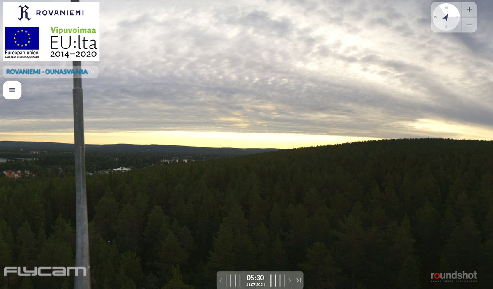
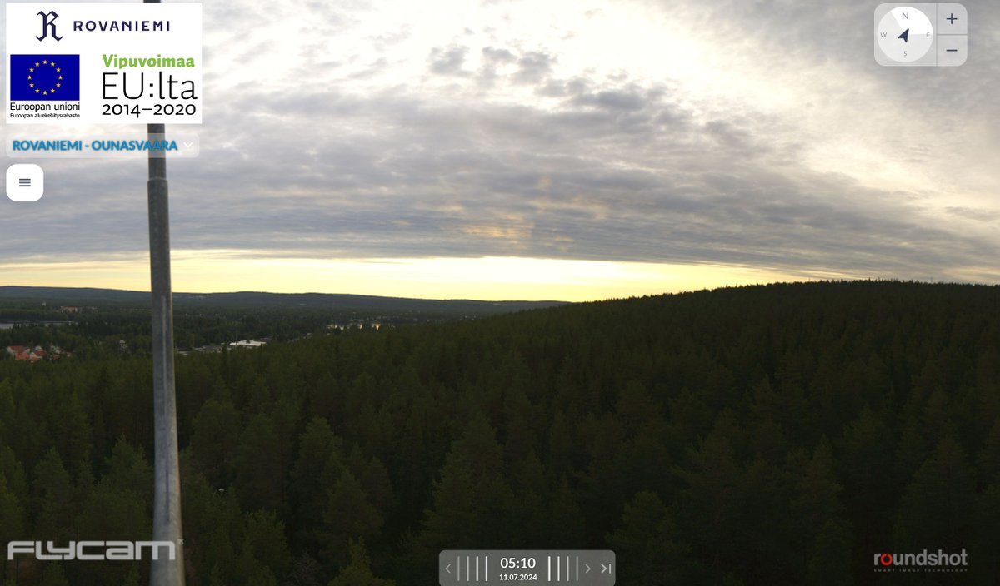
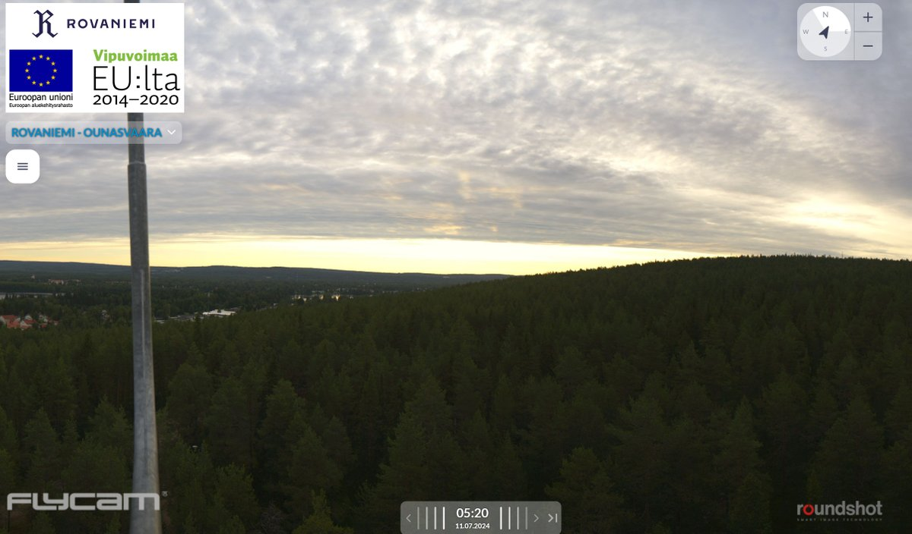

# Thread - 2024-07-18

**Original:** https://x.com/RiikonenMarko/status/1813843713581523455

---

### 1/1 - 2024-07-18 07:50 UTC

Here is just one example from Ounasvaara 360 camera of how reflection subsuns are not taken for granted. Reflected rays, such as here on 11 July, are not that rare, but so far they have not been accompanied by reflection subsun in this automatic camera images.

---

