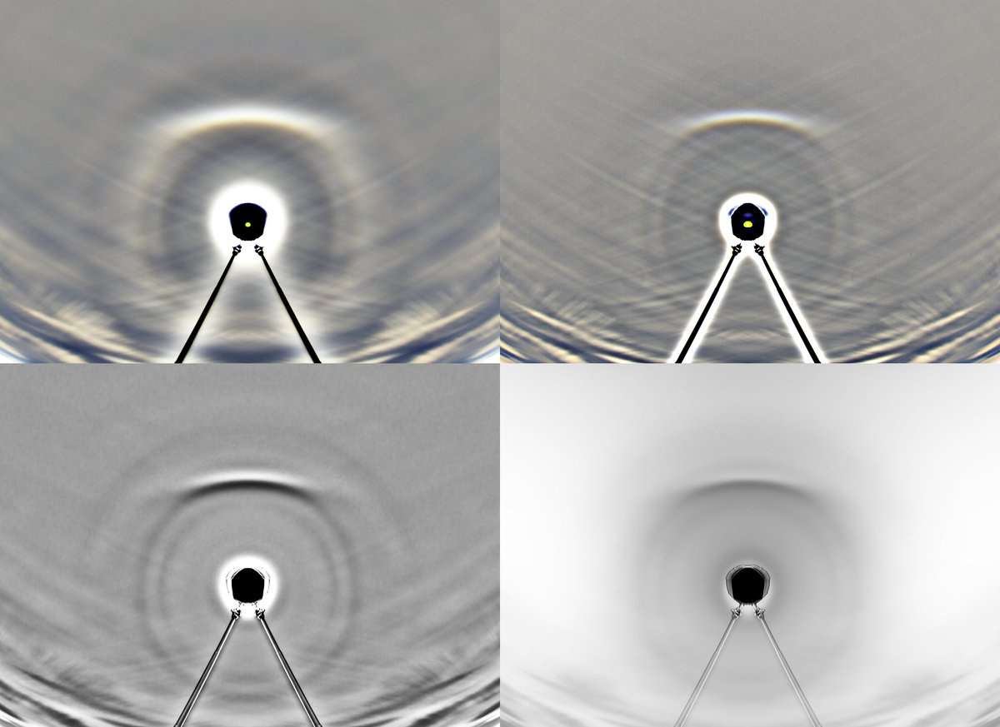

# Thread - 2024-08-15

**Original:** https://x.com/RiikonenMarko/status/1823980557321052411

---

### 1/2 - 2024-08-15 07:10 UTC

@Michaelbundles Sorry, had missed your reply. I am a bit nervous if a feature shows up only on br. I did a flipped stack – shown here as 4 versions – but it doesn't bring extra information. 28° halo requires separate crystal from basic pyramids, you can just add it in your simulation.

---

### 2/2 - 2024-08-15 07:25 UTC

@Michaelbundles Forgot that according to Lefaudeux model there is also the option of a mixed crystal. One half of which is normal pyramid, the other which is exotic pyramid.

---

