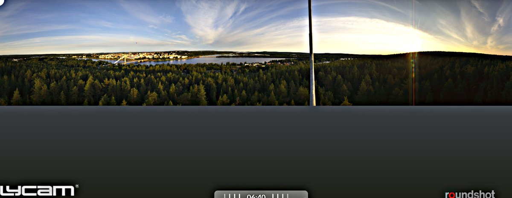
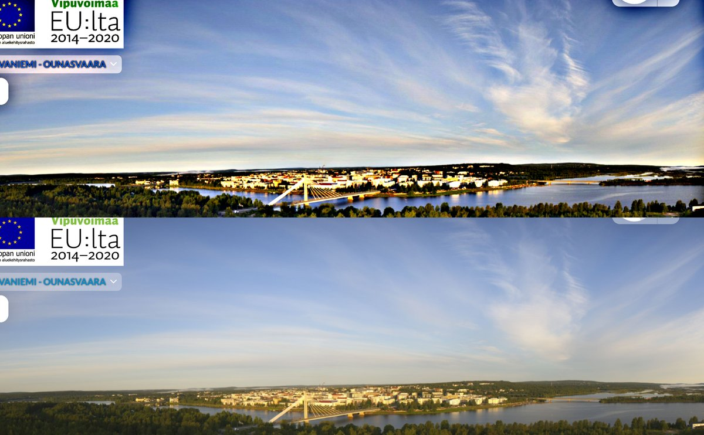
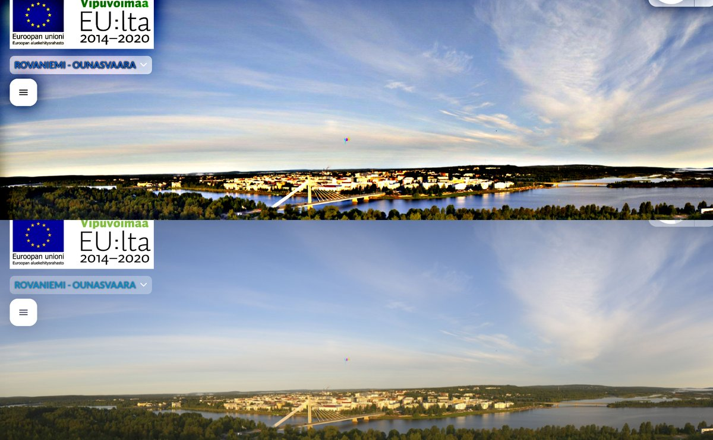
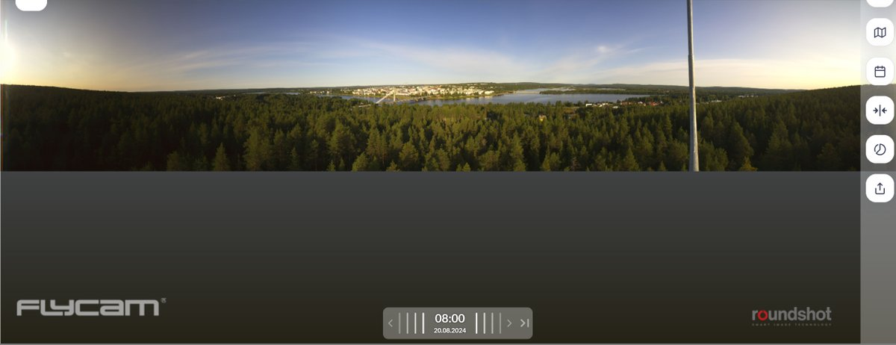
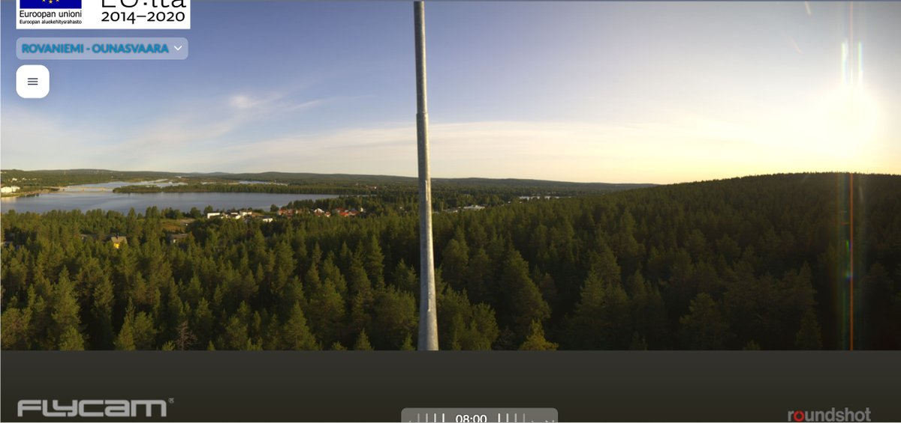

# Thread - 2024-08-20

**Original:** https://x.com/RiikonenMarko/status/1825818428831060228

---

### 1/2 - 2024-08-20 08:53 UTC

Looks like anthelion this morning 20 August 2024 in Rovaniemi in Ounasvaara camera. Weakly at 06:30 (second image), better at 06:40 (first and third image). Would be impossible catch by traditional observing. Automatic halo cameras must be the future. https://flycam.roundshot.com/rovaniemi-1/#/

---

### 2/2 - 2024-08-20 14:42 UTC

I had missed 120° parhelion which flashes by at 8:00. 20 August 2024 in Rovaniemi.

---

