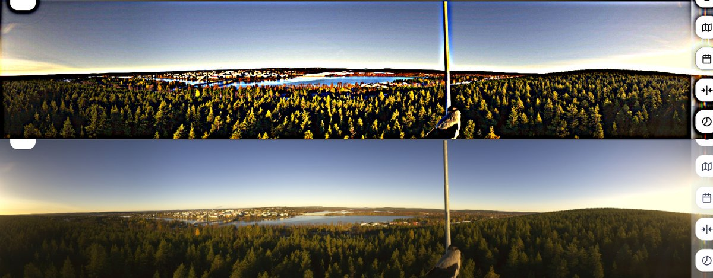
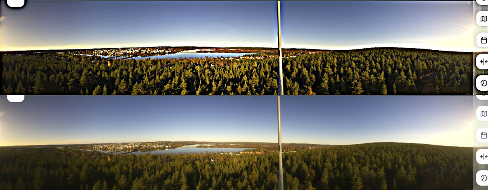
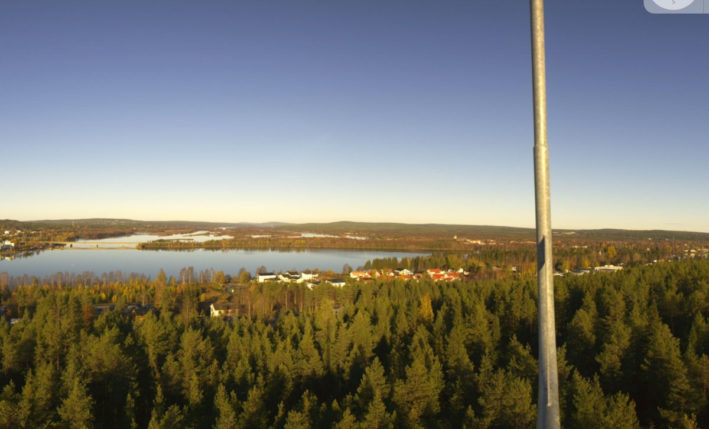
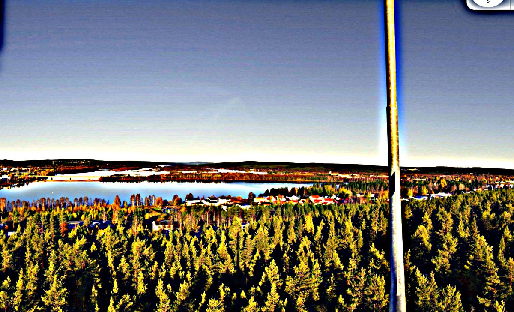
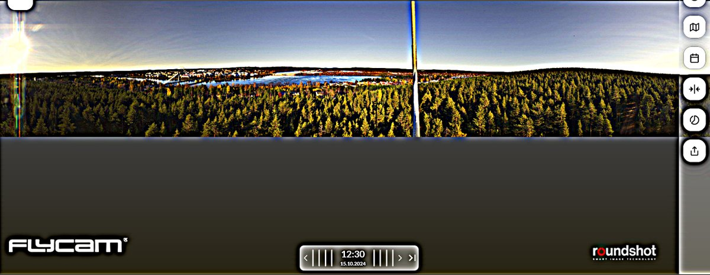
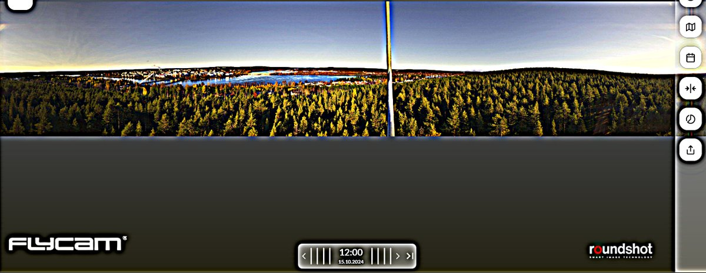

# Thread - 2024-10-19

**Original:** https://x.com/RiikonenMarko/status/1847598431730077862

---

### 1/2 - 2024-10-19 11:19 UTC

Something ghosty opposite to the sun for three hours or so in the Ounasvaara 360 camera https://flycam.roundshot.com/rovaniemi-1/#/. Turned out upon usming as reflected antisolar rays. First image at 1020, others 1140. Rovaniemi 12 October 2024.

---

### 2/2 - 2024-10-19 11:29 UTC

Also on 15 October 2024.

---

