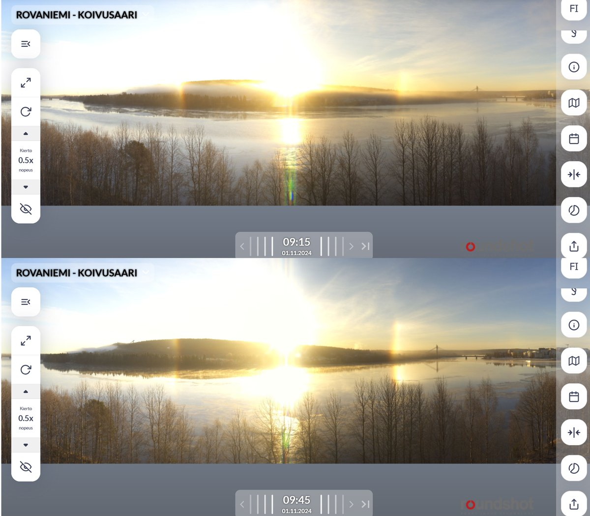
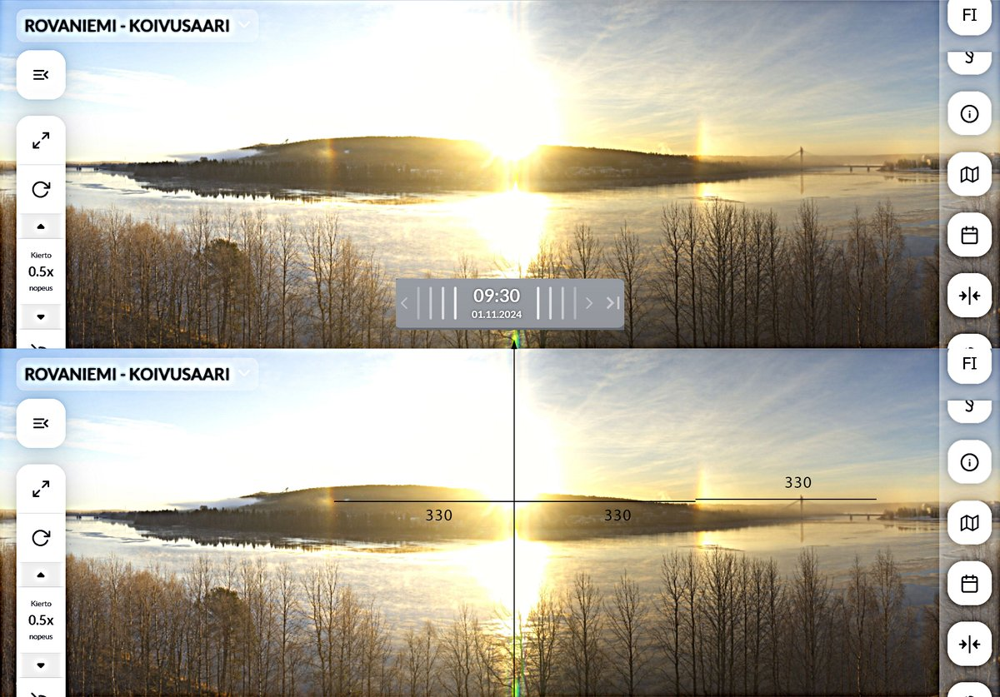
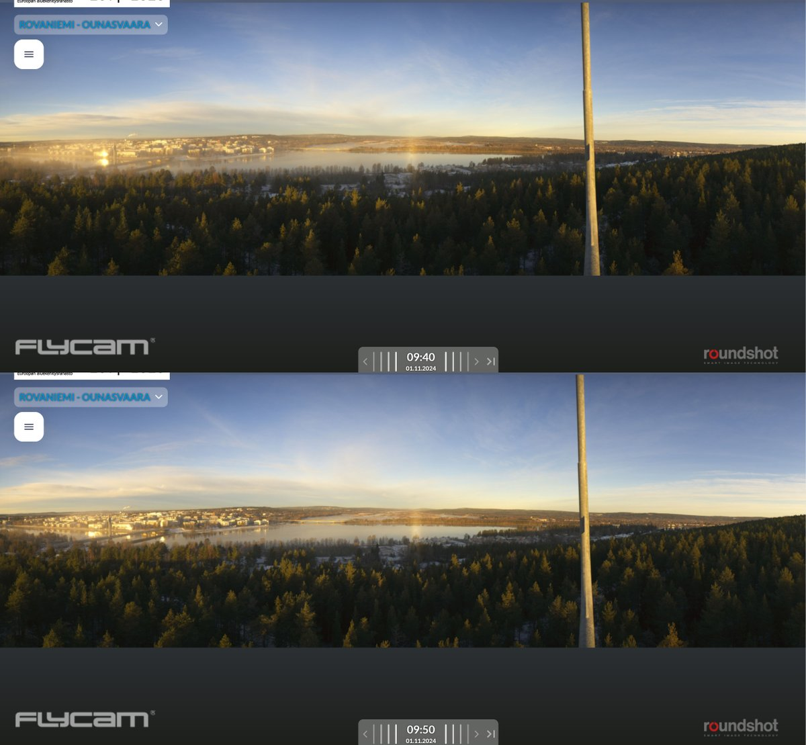
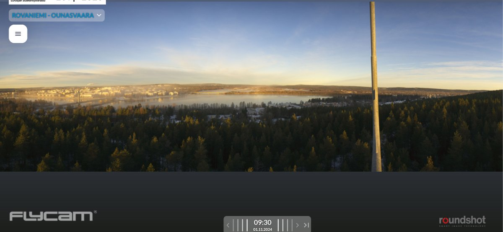

# Thread - 2024-11-01

**Original:** https://x.com/RiikonenMarko/status/1852336106848567644

---

### 1/4 - 2024-11-01 13:05 UTC

Eats man. Got alarm off at 3 am but didn't go because inversion has not set in yet. But the graphs show soon afterwards it did and of course the daytime view from webcams attests to that. I had plans for bagging some new halos this night would have been good occasion for that.

---

### 2/4 - 2024-11-01 13:09 UTC

I was unable to chase daytime. Anyway, there is interesting glory+pillar in the Ounasvaara 360 camera. Judging by the Koivusaari 360 camera in the above post, not much at all colums in the air, only plates, so the pillar is "Mikkilä's Soul" rather than diffuse arc.

---

### 3/4 - 2024-11-01 13:12 UTC

One more view from the Ounasvaara camera showing only very weak glory. In the first post above I have measurements (330 pixels) to check the distance of the outer stuff. Not 44° parhelion.

---

### 4/4 - 2024-11-02 08:12 UTC

There was tanarc in this display https://www.taivaanvahti.fi/observations/show/128977 which is good for it explains the faint 46° on the side. But it calls back the question on the identity of the antisolar pillar. Could be diffuse arc, though I still lean on Mikkilä's soul for the weakness of the 46° stuff.

---

