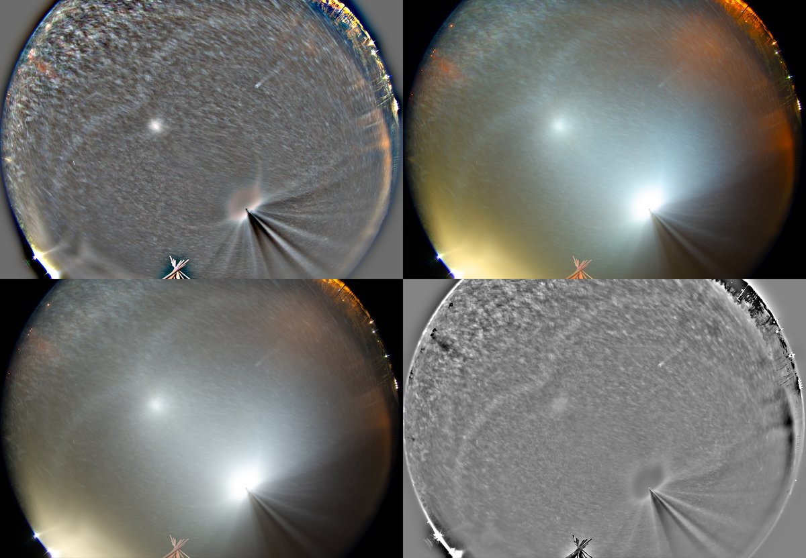
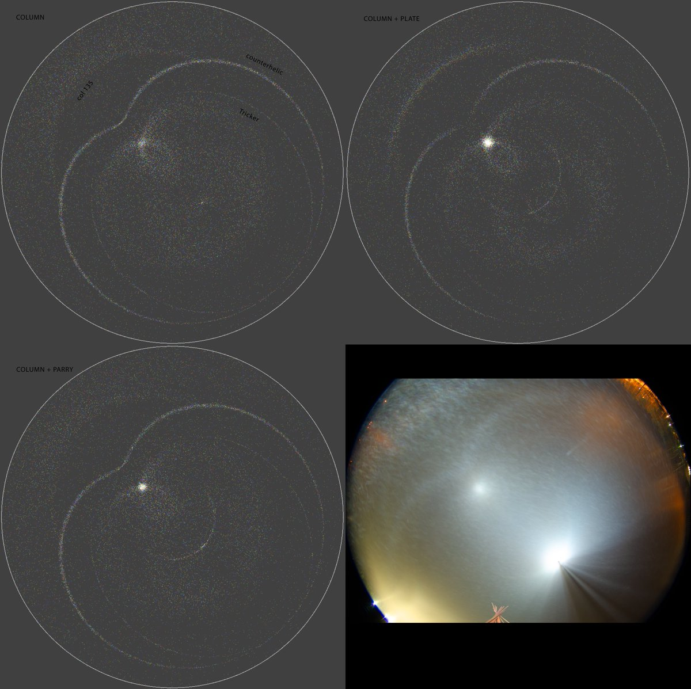
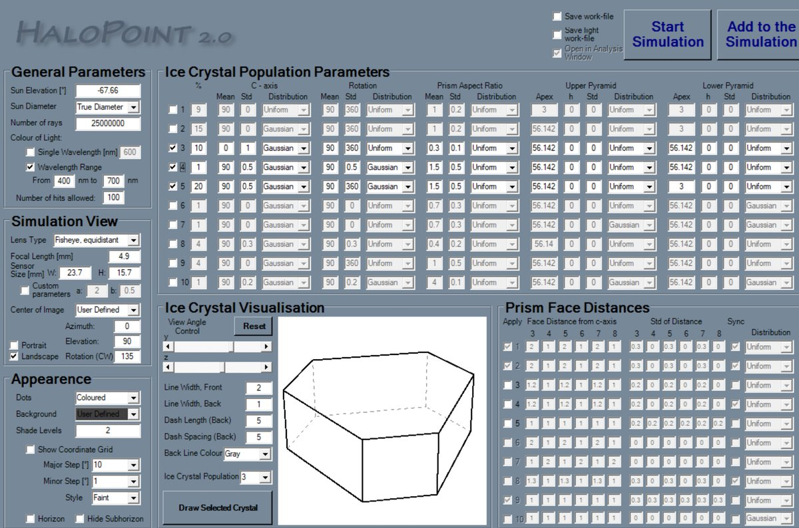
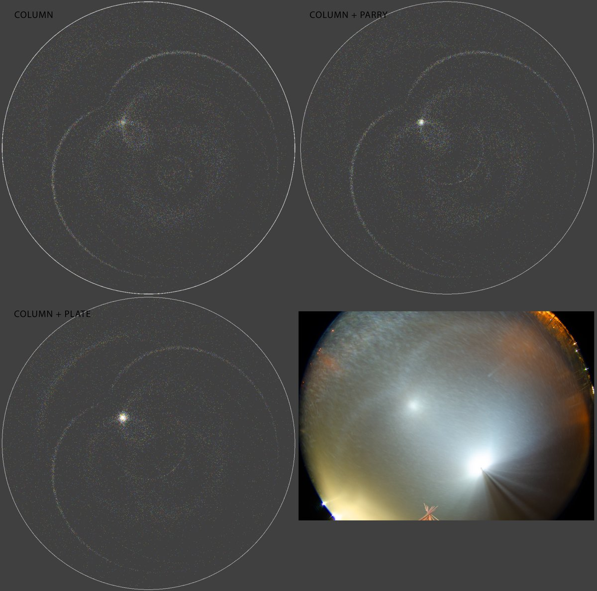
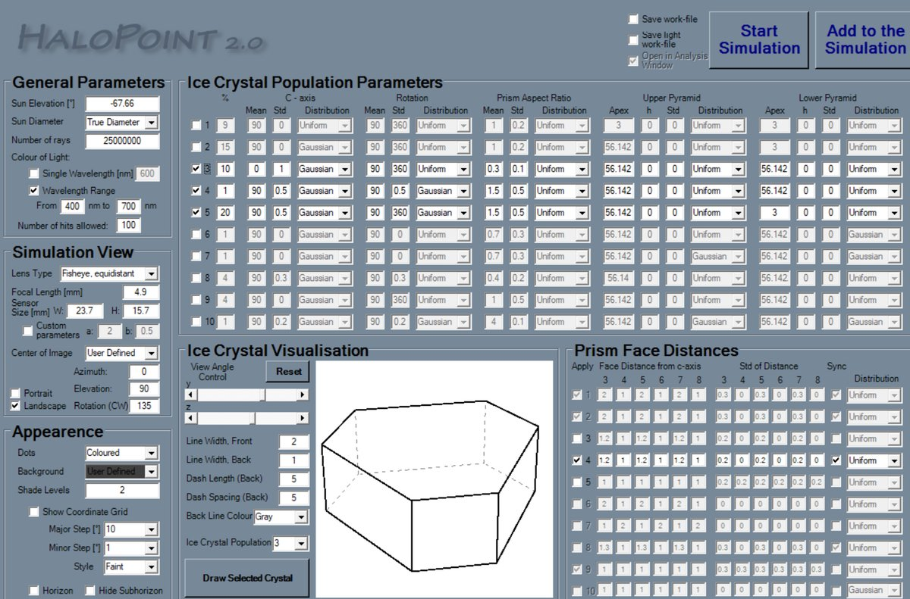

# Thread - 2024-11-05

**Original:** https://x.com/RiikonenMarko/status/1853817676793029025

---

### 1/6 - 2024-11-05 15:12 UTC

Last night conditions developed and this time I arrived on the spot maybe only just a little after the action got going (4/5 November 2024, Rovaniemi, Ounasvaara). My aim is this winter to bag those below-horizon light circumhorizon and countercircumhorizon arcs and their extensions that are undiscovered.

The location amenable for this is the two bridges at the Ounasvaara ski center. Except for the lights on the flanks for the snow gun operators, so far they have shut down ski center lights for the night. But we'll see whether that bliss will last when the ski season gets properly going. 

I botched the seasons start night which would have pretty certainly brought a result. And this night the plate orientation seemed to have been completely nonexistent so that no any kind of cha or their extensions were seen.

Yet I didn't have to come empty handed. Got a detached counterhelic arc (subhelic arc), the first I know photographed. There seems to be also Tricker and column 135, which is the 46° infra like arc on the opposite side of the horizon. Simulations in next post down.

---

### 2/6 - 2024-11-05 15:12 UTC

Perhaps the most interesting thing is the counterparhelic circle segment. It is formed by Parry and plate but not column orientation. The simulations would seem to favour Parry origin, the plate scenario make the 46° stuff too strong by having col 135 enhanced by plate 312, which is another one of the two countercircumhorizon arcs. Parry explanation would also be in line with what I did not see in the center lights: I never saw the horizontal stripes of parhelia. Crystal sample would have been nice but I was utterly disorganized for this first chase.

If this is indeed Parry subparhelic circle, it would be the first solitarily occurring one photographed. I am becoming inclined on counting halos from different raypaths as different halos even if they draw similar looking effect. So pillar from columns is different halo to that from plates (Lefaudeux was of that opinion already long time ago, but I was not yet ripe for such radical thinking). And cza from Parry is different to cza from plate. And so on.

The temperature upon arrival after eleven in the evening was -9 C in my car thermometer. When I left after ice fog died around 2 am due to clouding up I think it was -7 C.

Now it is turning warm and 15 day forecast say its going to stay that way.

---

### 3/6 - 2024-11-05 15:12 UTC

Parameters for column, Parry and plate populations.

---

### 4/6 - 2024-11-05 16:07 UTC

Made some little mistake in simulations. Here is corrected version.

---

### 5/6 - 2024-11-05 16:07 UTC

And corrected parameters.

---

### 6/6 - 2024-11-05 16:16 UTC

Lamp elevation was maybe a little closer to horizon, around -65 degs instead of 67-68 degs. But it does not change the result what I just quickly checked.

---

